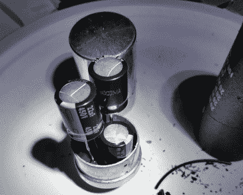

# 恢复老式试管测试器昔日的辉煌

> 原文：<https://hackaday.com/2021/06/09/restoring-a-vintage-tube-tester-to-its-former-glory/>

现代人可能很难理解 20 世纪 60 年代或更早时期的电子产品。在点对点焊接、古怪的元件和被放大到滑稽比例的熟悉的无源器件之间，比如来自*“亲爱的，我把孩子们缩小了”*的被拒绝的道具，即使是有经验的硬件黑客也可能发现自己很难理解一个电路在做什么。但这并没有阻止[【猫迷】花时间深情修复这台 Hickok Cardmatic KS-15874-L2 试管测试器](https://imgur.com/gallery/28WgFPe)。

好消息是，这台机器几乎所有的原始部件都有，包括电源中的 Hickok 牌电子管。不幸的是，看起来这些年来试图进行一些繁重的修理，一窝新的电线和组件与[Cat0Charmer]实际上想要保留的东西混杂在一起。机器的各个部分的前后镜头特别有启发性，尽管如此，如果你仍然不能理解清理后的版本，也不要感觉太差。

Hiding new capacitors inside of the old ones.

正如你对这个时代的机器的期望，许多原始组件都远远超出了规格。自然，电容器被枪杀，但即使是碳成分电阻器是毫无价值的，毕竟这些年来；其中一些测量值偏离其原始公差 60%。

我们特别喜欢[Cat0Charmer]如何挖空旧电容器，并在其中安装新的现代电容器，从而保留了测试仪的复古外观。这个技巧并不总是可行的，但在它被应用的地方，它看起来肯定比看到一个现代电容器漂浮在 60 年代的硬件海洋中要好。

在取消笨拙的维修，更换无用的组件，并安装一些新的旧库存管后，测试仪焕发了新的活力。由于周围进行的所有辅助维修和改变，测试器的电压调节系统使用的先前不可操作的内部氖灯发出明亮的光。使用根据旧海军手册中的示意图构建的 DIY 校准单元，[Cat0Charmer]将测试仪拨入，并为其漫长而传奇的职业生涯的下一阶段做好准备。

我们喜欢看到旧硬件得到修复。这不仅仅是因为[将有用的设备排除在废品堆之外](https://hackaday.com/2018/07/15/incredible-atari-800xl-case-restoration/)，还因为[融合了新老技术](https://hackaday.com/2019/10/30/amstrad-portable-gets-a-modern-lcd-transplant/)总是会带来那种[创新性的问题解决方案这个社区就是建立在](https://hackaday.com/2018/05/25/bringing-a-vic-20-back-from-an-oily-grave/)之上的。