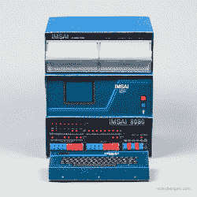
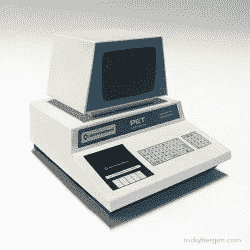
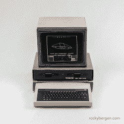

# 纸做的复古电脑

> 原文：<https://hackaday.com/2021/08/06/retro-computers-from-paper/>

想开始收集自己的复古电脑，免费的？平面设计师[洛奇·卑尔根]收集的纸艺模型可能是答案。[Rocky]设计了十几款旧电脑，包括 IMSAI 8080、Commodore Pet 和 BBC 微电脑等经典产品。

IMSAI 8080

Commodore PET

BBC Micro

这些模型的完整尺寸没有提到，但检查随机选择的 Commodore C64 模型的 PDF 文件显示，它打算打印在 A3 纸上(297 x 420 mm，或者大约为 11 x 17 ANSI C 页的大小，如果你认为英寸更好)。这仍然没有给我们一个模型的最终尺寸，但一位收藏家在[Rocky]的网站上发帖称，当他将其缩放到 A4 纸时，最终的计算机与常见的 1/6 比例娃娃和玩具屋(也称为 playscale)完全匹配。当然，图案以计算机 PDF 文件的形式存在，你可以把它缩放到任何你想要的大小。

我们在过去报道过一些纸工艺品项目，包括[这些很酷的自动装置](https://hackaday.com/2019/02/02/simple-automata-extravaganza/)，一个来自起重机游戏的[爪子](https://hackaday.com/2011/07/05/paper-craft-claw/)，甚至[一个真正旋转的陀螺仪](https://hackaday.com/2011/03/26/papercraft-gyroscope/)。看看下面的视频，看看[洛奇]组装苹果二代纸工艺模型。感谢[CollegeCop]将此内容发送到我们的举报热线。

 [https://www.youtube.com/embed/urQG4KiXCx0?version=3&rel=1&showsearch=0&showinfo=1&iv_load_policy=1&fs=1&hl=en-US&autohide=2&wmode=transparent](https://www.youtube.com/embed/urQG4KiXCx0?version=3&rel=1&showsearch=0&showinfo=1&iv_load_policy=1&fs=1&hl=en-US&autohide=2&wmode=transparent)

