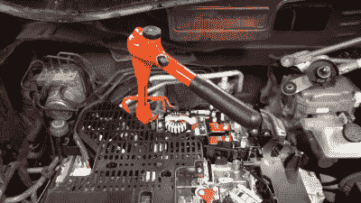

# 尼桑 Leaf 电动车快速充电改装

> 原文：<https://hackaday.com/2021/06/28/retrofitting-fast-charging-to-a-nissan-leaf-ev/>

电动汽车已经出现了一段时间，因此它们开始像其他汽车一样被分解和改装。[Daniel ster]就是这样一个做这项工作的人，[最近发布了他为一辆没有配备快速充电功能的基本型日产 Leaf 改装快速充电的努力。](https://www.youtube.com/watch?v=1kyR5omOQu8)

【丹尼尔】为了安全起见，在电动汽车上工作时使用特殊的高压绝缘工具。

这是一个复杂的互换，需要更换几个零件，并在布线织机上进行手术。组件成本仅为 700 欧元，但更换需要 20 个小时的人工。有问题的车辆是早期型号的 Leaf，已经安装了升级的 40 千瓦时电池，车主希望升级到 CHAdeMO 快速充电，以更好地使用更大的电池组。

交换需要更换配电装置，并在汽车前部安装 CHAdeMO 端口。车辆控制模块(VCM)也必须打开，以便将电线连接到继电器，从而激活快速充电子系统。最后，电线必须连接起来，让汽车和快速充电器之间的一切都很好地发挥作用。

[Daniel]受益于高质量的论坛资源和已经有 CHAdeMO 参考的日产 Leaf，这帮助很大。一天结束时，快速充电器第一次工作了，这让丹尼尔松了一口气。我们以前也报道过他的作品。休息后的视频。

 [https://www.youtube.com/embed/1kyR5omOQu8?version=3&rel=1&showsearch=0&showinfo=1&iv_load_policy=1&fs=1&hl=en-US&autohide=2&wmode=transparent](https://www.youtube.com/embed/1kyR5omOQu8?version=3&rel=1&showsearch=0&showinfo=1&iv_load_policy=1&fs=1&hl=en-US&autohide=2&wmode=transparent)

