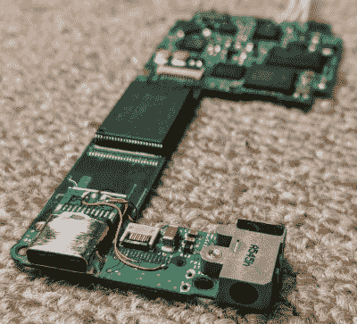

# 给 IPod Nano 改装 USB-C

> 原文：<https://hackaday.com/2021/01/18/retrofitting-usb-c-to-an-ipod-nano/>

一些黑客服务于关键需求，而另一些只是为了挑战或乐趣。我们怀疑后者是[大卫·布坎南] [将第一代 iPod Nano 从原来的 30 针连接器转换成 USB-C](https://www.youtube.com/watch?v=Lwv82l3Gsd0) 的真正原因。

USB-C mounted

[David]买 iPod 时电池没电了，所以当他打开 iPod 取出旧电池时，他注意到有足够的空间来安装 USB-C 连接器。最初的苹果 30 针连接器通过四个针运行 USB 2.0，因此[David]使用最初的 USB 电缆，并用连续性测试仪识别适当的针和迹线。连接器被用偏口钳破坏性地拆除，在这个过程中除了一个焊盘之外，所有的都被撕掉了。一个热空气站可能会让事情变得更容易，但我们认为他手头没有。USB-C 连接器是从一个便宜的 USC-C 转 USB 微型适配器中取出的，通过将外壳直接焊接到 PCB 的接地层来安装。其余三个端子用漆包线焊接到走线。

安装了新电池后，[David]确认充电和数据传输都正常。处理按钮和滚动垫的 IC 稍微干扰了新的连接器，所以他锉掉了一些多余的 IC。靠近新连接器的任何开放焊盘都用 Kapton 胶带覆盖，以避免短路。外壳中用于 30 针连接的大洞部分用五分钟环氧树脂填充。最终组装的产品看起来几乎是工厂生产的，并且工作正常，所以我们称之为胜利。

在过去的两年里，在各种电子设备中改装 USB-C 连接器已经成为一种流行的做法。从[的 ThinkPad](https://hackaday.com/2020/07/24/usb-c-where-it-was-never-intended-to-be/)到[的烙铁](https://hackaday.com/2019/12/26/adding-usb-c-to-the-ts100-but-not-how-you-think/)，我们已经在各种产品上看到了这一点。

 [https://www.youtube.com/embed/Lwv82l3Gsd0?version=3&rel=1&showsearch=0&showinfo=1&iv_load_policy=1&fs=1&hl=en-US&autohide=2&wmode=transparent](https://www.youtube.com/embed/Lwv82l3Gsd0?version=3&rel=1&showsearch=0&showinfo=1&iv_load_policy=1&fs=1&hl=en-US&autohide=2&wmode=transparent)

