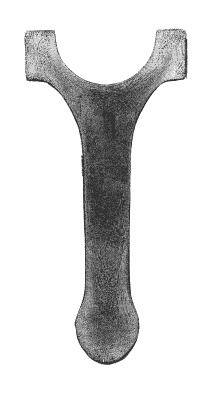

# 逆向技术:在封闭模具中锻造

> 原文：<https://hackaday.com/2020/09/04/retrotechtacular-forging-in-closed-dies/>

我们的*retro techatacular*系列通常专注于一项已经过时但普通读者仍然感兴趣的技术，因此现在推出一项仍然与我们息息相关的技术可能是不寻常的。落锤锻造是一种在巨大的压力下在模具中形成热金属的技术，虽然它仍然是一种当前的技术[我们正在放映的 20 世纪 50 年代的教育电影](https://www.youtube.com/watch?v=A7ayuF4v_EU)绝对是复古的。

An automotive connecting rod, sectioned and acid treated to show the grain structure. ([CC BY-SA 2.5](https://commons.wikimedia.org/wiki/File:ForgedConrodShowingEtchedSection-s.jpg))

如果你看过[我们关于锻造的不定期系列](https://hackaday.com/2019/03/07/blacksmithing-for-the-uninitiated-what-is-a-forge/)，你会熟悉金属成型的过程:将金属加热到一定温度，使其具有足够的延展性，可以在压力下变形，然后用锤子在铁砧上成型。这一过程不仅使金属成形，而且形成其内部晶粒晶体结构，这样，通过仔细管理，锻造过程可以赋予成品显著的抗疲劳性。可以把落锤锻造想象成手工锻造过程的自动化，具有相同的冶金优势，但成品是在一系列模具中成型的，而不是由铁匠的锤子成型的。它在过程中失去了铁匠的手艺，但提供了极其一致的结果以及高生产周转率。

我们放在插播广告下方的这部电影以非常时期的风格深入介绍了该行业，并介绍了当时汽车、航空航天和国防工业的零部件。它带领观众通过不同类型的新闻和审查模具的设计，生产阶段所需的纹理结构和形状。

特别令人感兴趣的是关于镦锻的部分，镦锻是一种技术，在这种技术中，一块钢原料是从端部而不是从上面锻造的。组件本身使视频值得一看，因为我们看到了从喷气涡轮叶片到生产中的医用镊子的一切，以及内燃机的许多部件。显示的最小零件是一个微小的化油器零件，而最大的零件是一个巨大的航空母舰弹射器零件，需要一种特殊的车辆将其装载到压力机中。

由于压力机的大小，模锻通常是大型金属加工厂的专利。但是，考虑到一个装备良好的黑客空间或铁匠铺的资源，这并不完全超出我们社区的能力。我的父亲制作简单的锻模，在打磨到他的要求并进行热处理之前，先将焊接的基本形状和钢块组装起来。安装在大型旋转飞压机上，用于装饰性铁制品的重复小规模成形和成型任务，我记得在我十几岁的时候，它们是从红色的热钢筋上撞出来的。

这是在我们的社区中了解这些有用的技术之一，因为虽然制造大量装饰性铁器的需求可能不会经常出现，但如果你需要它，仍然值得拥有这种能力。与此同时，休息时间下面的视频应该为你提供足够的重型机械享受，照亮你的一天。

 [https://www.youtube.com/embed/A7ayuF4v_EU?version=3&rel=1&showsearch=0&showinfo=1&iv_load_policy=1&fs=1&hl=en-US&autohide=2&wmode=transparent](https://www.youtube.com/embed/A7ayuF4v_EU?version=3&rel=1&showsearch=0&showinfo=1&iv_load_policy=1&fs=1&hl=en-US&autohide=2&wmode=transparent)

感谢[伊恩萨默斯]的提示。