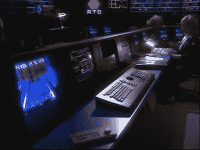
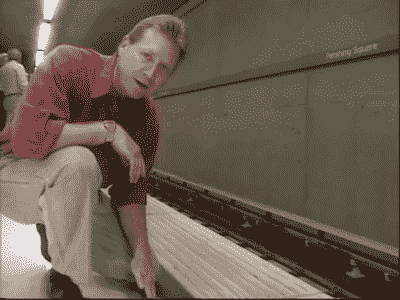
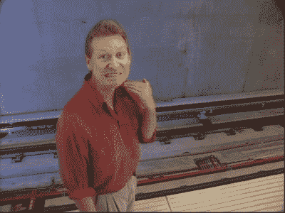

# 1992 年洛杉矶热闹的地铁安全电影

> 原文：<https://hackaday.com/2021/08/13/retrotechtacular-las-hilarious-subway-safety-film-from-1992/>

地铁！它们已经存在很长时间了。信不信由你，几乎和现代铁路一样长。19 世纪的人认真地进行了地下建筑，他们开始建造车站网络，以使居民能够快速有效地在城市中出行。

当你从 1992 年开始观看这个辉煌的视频时，你应该记住这个事实。[“洛杉矶地铁——极致安全”](https://www.youtube.com/watch?v=eFvnhM2A2Ok)是加州人的指南，旨在向居民介绍次年开通的新 B 线地铁。这段视频表现得好像地铁是一个新奇、神秘的东西，也有一些令人困惑的古怪瞬间。如果你是一个交通爱好者或对怪异的公共电影感到兴奋，这是给你的。

 [https://www.youtube.com/embed/eFvnhM2A2Ok?version=3&rel=1&showsearch=0&showinfo=1&iv_load_policy=1&fs=1&hl=en-US&autohide=2&wmode=transparent](https://www.youtube.com/embed/eFvnhM2A2Ok?version=3&rel=1&showsearch=0&showinfo=1&iv_load_policy=1&fs=1&hl=en-US&autohide=2&wmode=transparent)

很快，一个穿着红色衬衫的活泼、充满活力的男人迎接了我们，他显然是来给我们一些新的时尚的独家新闻的。“十八分钟后联合车站到好莱坞和藤蔓路！你说不可能？嗯，再也不会了！”他说。他向观众挑战，指出“不，斯科特不会把你传送到那里，它也不是直升机。”那是什么？“是地铁！”

Cutting edge in 1992.

这种乐观、有趣、随心所欲的语调是这个视频中常见的，它旨在传递大量信息，同时也吸引观众。制作过程简单、流畅、干净，有着精心制作的镜头和直白的信息。它也没有花哨的过渡和刺耳的音乐，这在这种类型中很少见。这证明了制作这部电影的团队的技能。

这部电影可能会让许多观众感到奇怪，因为它似乎对待观众就像他们从来没有听说过地铁一样。鉴于著名的纽约地铁是美国文化的重要特征，以及美国和世界各地的许多其他系统，这可能会令人困惑，为什么这甚至是必要的。

然而，和往常一样，语境决定一切。1989 年洛马普列塔地震对 1992 年的许多洛杉矶人来说记忆犹新。在旧金山，地震导致海湾大桥上层可怕的坍塌，数千人受伤，63 人死亡。因此，很容易理解为什么这个城市的居民不愿意深入地下，因为害怕在另一次地震中被困。

事实上，这部电影花了大量的时间来缓解这些担忧。它指出，尽管洛马普列塔地震强度很大，但对 BART 地铁系统的破坏很小，其建设是我们的另一个系列的重点。经过适当的安全检查后，这些线路在事故发生后的几个小时内又恢复了运行。事实证明，[地铁站实际上是地震中相对安全的地方](https://la.curbed.com/2019/1/16/18178979/subway-tunnels-earthquake-fault-lines)，通常比摩天大楼或其他地上建筑更安全。

“Stand behind the rippling.”
The host’s expression leaves no room to argue.

对安全的关注是，嗯…极端的，正如你可能从标题中猜到的。还探讨了系统的先进性。人们讨论了高水平的技术集成，并看了现在复古未来主义的中央控制设施，或 CCF，一排排的计算机和墙壁显示器使它看起来像美国宇航局任务控制的远亲。CCF 被描绘成一个仁慈、慈爱的上帝，时刻守护着地铁和乘客。

CCF 的工作人员甚至指导警察帮助一位老太太找到她的眼镜，我们不确定这项服务在 2021 年是否还会提供。当主持人跨过平台边缘的那条线时，他会立即被一个无形的声音警告，指示他离开。看起来，CCF 管理的很严格，他们的地铁里不会有任何愚蠢的行为。

值得注意的是，地铁依赖于检票闸机上的荣誉系统。“我们知道荣誉系统是有效的，”主持人说，“因为地铁蓝线 98%的乘客都是付费的！”又是那个睁大的眼睛，友好的微笑。这部电影对另外 2%的人的命运只字未提。

Enough said.

主持人详细讲解应急程序，一步一步地指出如果出了问题会发生什么。亮点是建在地铁隧道中的人行道，这样乘客就不必在事故中走在轨道上。还有一点值得特别注意的是明亮的照明和宽阔的双扇门，这大大减轻了人们对地下幽闭恐惧症的担忧。当主持人走出通向人行道的紧急出口时，这一序列结束。正是在这里，他表达了整部电影中最伟大的一句台词。“晚上好！我想介绍一下我自己，”他大胆地宣布，给人一种可信的吸血鬼的印象。“我叫 Count Safety，这是我的地铁！”然后，他在狂笑中迷失了自己。

抛开所有的笑话不谈，这真的是一条很棒的公共信息，自从去年第一次发现它，我已经看了十多次了。我确信它在让洛杉矶居民适应他们闪亮的新地铁系统方面做得很好。

这部电影的拷贝来自多萝西·佩顿·格雷运输图书馆和档案馆。作为洛杉矶联合电气铁路的一部分，它于 1895 年首次建立，一直维护至今，保存着南加州及其周边地区的交通信息目录。图书馆的目录可以在网上找到，方便那些渴望寻找更多像这样的珍宝的人。

该视频是洛杉矶县交通委员会自己的内部视频制作设备制作的。制片人 Erica Goebel 负责将该项目整合在一起，这是她在该组织受人尊敬的职业生涯中制作的许多伟大的公共电影之一。可悲是，内部部门在 1993 年被关闭，未来的工作被外包。鉴于这段视频的质量，我们认为你会同意这个决定是一个巨大的耻辱。无论如何，这是那个时代的美好遗迹，整个团队应该为他们取得的成就感到骄傲。毫无疑问，他们让这位作家脸上露出了笑容！