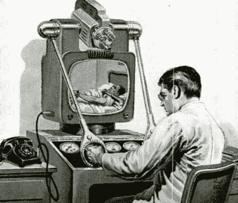
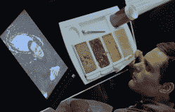

# 逆向技术:刚刚错过的预测

> 原文：<https://hackaday.com/2019/08/13/retrotechtacular-predictions-that-just-missed-it/>

很少有职业比预测未来更充满危险。如果你是一名科幻小说作者，这可能无关紧要，但如果你正试图设计下一款改变游戏规则的硬件，风险就更大了。

看起来，在很大程度上，即使你设法得到了一些正确的想法，但形式往往是错的。典型的例子:远程医疗。今天，你可以用电话或电脑通过视频会议看医生，治疗许多常见疾病。一个新想法？不完全是。早在 1955 年，雨果·根斯巴克就在《无线电电子学》中写到了这一点。

根斯巴克写道:

> 今天的普通医生都是超负荷工作且短命的。世界上不断增长的人口永远没有足够的医生。许多病人死亡是因为医生不能及时找到他们，尤其是在晚上和偏远地区。
> 
> 他白天只能看几个病人。随着交通越来越拥挤，许多医生拒绝打私人电话——除非在紧急情况下。即使这样，他们也常常来得太晚。由于远程医生的出现，这种困境在不久的将来将不复存在。

根斯巴克设想医生使用我们现在称之为 Waldos 的东西，类似于人们用来操纵放射性物质的东西。由于内置触觉，这些超级机械手(Gernsback 的话)将允许医生开处方、倒液体，甚至给婴儿换尿布。

奇怪的是，Gernsback 的设想包括以每天 3.5 美元的价格从药店租一个远程医生。通过这种方式，医生可以给你打电话，然后继续跟进。药店会送来这台机器，它会——听着——连接到你的手机上:

> 将带有电话插头的电线连接到 teledoctor 仪器上，然后插入电话上的特殊插孔。未来的电话将配备这一设施。电视信号和电传电子信号等。都将通过闭路电话线路传输。

在一个脚注中，Gernsback 指出，你不能在当前的电话线上发送 525 线的电视信号，但 250-350 线的图像是可能的，这就足够了。

有远见？在某些方面，也许吧。这个基本想法今天就要实现了，尽管医生不太可能很快在家给你做手术或远程注射。这种特殊的电话插头算是实现了，但已经过时了。顺便说一句，这些图像是《无线电电子学》杂志上的原始文章附带的。

## 其他预测

许多新事物似乎都被当权派当成了时尚:汽车、电力、电视、智能手机和电话都被某个足够出名的人认为是站不住脚的。例如，显然，亚历山大·格拉姆·贝尔以 10 万美元(在 1876 年是一大笔钱)的价格向西部联盟的总裁提供了电话专利。据报道，总统关于这个问题的内部备忘录说，“这个想法表面上看很愚蠢。当一个人可以向电报局发送一个信使，并向美国的任何一个大城市发送清晰的书面信息时，为什么会有人想使用这个笨拙而不切实际的装置呢？”为什么真的。

 另一方面，科幻小说家爱德华·贝拉米(Edward Bellamy)在 1888 年就预言了借记卡(以及普遍收入)。罗伯特·波义耳(了解气体工作原理的化学家)在 17 世纪晚期预言了器官移植。如果你仔细看《2001:太空漫游》,你会看到他们用平板电脑阅读新闻和家信。今天看，好像完全不起眼。

然而，在大多数情况下，预测是偶然的。甚至在 2001 年:《太空漫游》预测到 2001 年会有月球基地和航天飞机，但这并没有发生。下面的视频聚焦于 2000 年的时尚——好像是在 1939 年。大部分的预测都是错误的，但是我们确实欣赏到了最后那个看起来很不寻常的男人，他戴着电话和收音机。

 [https://www.youtube.com/embed/NvtxFFj6eDY?version=3&rel=1&showsearch=0&showinfo=1&iv_load_policy=1&fs=1&hl=en-US&autohide=2&wmode=transparent](https://www.youtube.com/embed/NvtxFFj6eDY?version=3&rel=1&showsearch=0&showinfo=1&iv_load_policy=1&fs=1&hl=en-US&autohide=2&wmode=transparent)

## 过去几十年

如果你回顾过去几年，在你看到它之前有什么会让你惊讶？几块钱一台内置 WiFi 的 32 位电脑？语音识别的效果好到足以成为消费品？有多少被称为大热门的东西是真正的时尚(比如赛格威)，又有多少时尚是真正的大热门(手机摄像头)？现在展望下一个 20 年。很难想象。

我们已经看过电影中的坏预测[。我们还思考了 20 世纪 30 年代的](https://hackaday.com/2015/10/21/the-inaccurate-predictions-of-back-to-the-future/)[吸烟机器人](https://hackaday.com/2019/04/12/televox-the-pasts-robot-of-the-future/)的命运。