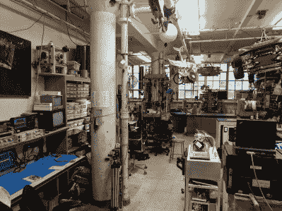
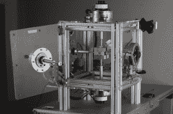
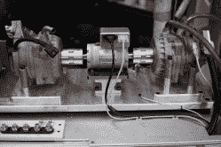
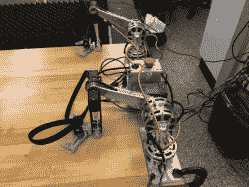

# MITERS 杂志的回报

> 原文：<https://hackaday.com/2019/09/25/return-of-the-miters-journal/>

经过长时间的中断，麻省理工学院电子研究学会(更为人所知的名称是 MITERS)发布了他们的 MITERS Journal 的 2019 年夏季版，正式名称是第 43 卷第 1 期。

最新版本的特点是追溯到 1976 年出版的第一本杂志，表明有些事情永远不会改变:

> “什么是 MITERS？MITERS 是麻省理工学院电子研究协会，这是一个为麻省理工学院 EE 黑客设立的非营利性学生实验室。该协会提供工作空间、工具、低成本零件和资讯给任何数量的麻省理工学院社群。我们有一些好的望远镜，各种各样的测试设备，大量的电源，还有贝莎，我们心爱的 PDP-7 电脑。(请不要吃花生馆的士力架。伯莎非常敏感。)我们还有校园里最不可思议的战利品。"
> 
> *–1976 年期刊 1 第 1 期*

该空间仍然是一个会员经营的项目空间和创客商店，为麻省理工学院社区提供工具、知识和建设项目的空间。

虽然该杂志最初是作为通过会议记录、笔记和专题项目促进社会内部交流的一种方式，但该杂志后来经历了一些变化，主要用作向成员通报更新和项目的指南，以及与 MITERS 校友网络分享最近的新闻。每学期都有计划的问题，集中在促进成员项目，宣布新的设备或工具，广告即将到来的演示或活动，以及任何其他有趣的话题或成员的故事。

目前，MITERS 在他们的 [door Twitter](https://twitter.com/MITERS_DOOR) 上发布他们的营业时间，并吹嘘不断变化的商店空间，电动汽车挂在天花板上，疯狂的装置散落在工作台上，黑客整晚都在研究想法。

最新一期着重介绍了由 MITERS 成员[本·卡茨]和[贾里德·迪·卡尔洛]制造的打破世界纪录的魔方求解机器人，用于测量电机机械功率输出的内部测力计，[安德鲁·伯克尔]制造的数控加工木制工程工具箱，以及[欧阳南希]制造的反作用轮倒立摆。

最值得注意的是，这一期详细描述了上钩拳，最新的 [战斗机器人](https://battlebots.com/robot/uppercut-2019/) [团队](https://www.facebook.com/UppercutBattlebot/)从太空中出来。该团队完全由大学生组成，他们继续参加了最新一季的比赛，其中有 250 磅的机器人在一个大型聚碳酸酯竞技场中互相摧毁。

该机器人由一个 50 磅 AR500(耐磨钢)垂直旋转叶片组成，转速为 3000 rpm，叶尖速度为 200mph。容纳电池、驱动电机、电机控制器和驱动轮的铝外壳是数控铣削的，而容纳武器和楔子的前部是由钢焊接而成的。

我们对来自太空的未来项目感到兴奋，并看到 MITERS journal 的持续遗产继续下去！