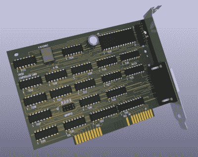

# 对 ISA 卡进行逆向工程以恢复一个古老的光盘驱动器

> 原文：<https://hackaday.com/2022/10/04/reverse-engineering-an-isa-card-to-revive-an-ancient-cd-rom-drive/>

如果你喜欢向你的朋友炫耀新的小玩意，成为早期采用者是很棒的。但任何新技术也带来了在格式战中站在错误一方的风险:只要问问 15 年前致力于 HD-DVD 的人就知道了。另一方面，如果你是在 20 世纪 80 年代中期 CD-ROM 首次发行时投资的少数人之一，那么在存储媒体方面，你肯定做出了正确的选择。然而，当[Tech Tangents] [设法得到第一代 CM100 驱动器](https://www.youtube.com/watch?v=0W1t2_EJG9w)时，他发现将 CD 驱动器连接到计算机的接口有点不同。(视频，嵌在下面。)

这项 1985 年的技术并不比它被设计用来连接的 IBM PC 小多少，它最初带有自己的 CM153 ISA 接口卡。但是，尽管大多数易贝卖家认识到了一个开创性的 CD-ROM 驱动器的历史价值，附带的 PC 通常是一毛钱一打的型号，被扔掉了，里面还有罕见的接口卡。即使在到处寻找了一年多之后,[Tech Tangents]能够找到的关于这张卡的唯一信息是一个九年前的 YouTube 视频，它展示了这个东西的样子。

 幸运的是，那段视频的制作者愿意拍摄这张卡片的高分辨率照片，这使得【科技切线】能够弄清楚它是如何工作的。事实证明，该卡完全由标准 7400 系列逻辑芯片和 8251 USART 制成，这意味着只需遵循电路板上的所有迹线，就可以设计出替代产品。[技术切线]开始工作，经过几周的逆向工程，他在 KiCAD 中准备好了完整的原理图和布局。

在 PCB 制造完成并组装好元件后，是时候用旧驱动器测试新卡了。这也不是一个简单的过程:任何试图让晦涩的硬件在 MS-DOS 下工作的人都会告诉你，这涉及到无数个小时的尝试不同的驱动程序版本和在 CONFIG.SYS 中设置记录不良的开关。然而，最终驱动程序正确加载，古老的 CD-ROM 驱动器适时地传输存储在 Wolfenstein 3D 磁盘上的文件。

如果你足够幸运，拥有一台 CM100 或那个时代的类似硬盘，你会很高兴地知道，在 GitHub 上可以获得 CM153 克隆版[的所有设计文件。这不是第一次有人不得不仅仅从图片中重新创建接口板:我们已经看到了一个类似的项目，涉及](https://github.com/AkBKukU/CM153-Repro)[合成器的 SCSI 卡](https://hackaday.com/2014/11/22/cloning-a-board-from-pictures-on-the-internet/)。感谢提示，[hackbyte]！

 [https://www.youtube.com/embed/0W1t2_EJG9w?version=3&rel=1&showsearch=0&showinfo=1&iv_load_policy=1&fs=1&hl=en-US&autohide=2&wmode=transparent](https://www.youtube.com/embed/0W1t2_EJG9w?version=3&rel=1&showsearch=0&showinfo=1&iv_load_policy=1&fs=1&hl=en-US&autohide=2&wmode=transparent)

