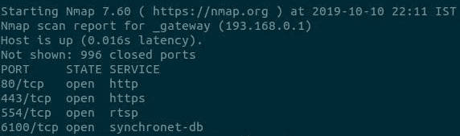

# 逆向工程解放了 Dash Cam 视频

> 原文：<https://hackaday.com/2019/10/15/reverse-engineering-liberates-dash-cam-video/>

如果你在过去几年里购买了一件消费电子产品，你很有可能被迫使用一些专有应用程序(可能在移动设备上)来解锁其全部功能。这是现代技术令人沮丧的现实，除非你愿意推出自己的硬件，否则这很难避免。但[Krishna 793]决定走另一条路，并对他的 DDPAI dash 相机进行了逆向工程，这样他就可以从它那里获得实时视频流，而无需使用配套的智能手机应用程序。

像许多现代小工具一样，DDPAI 相机创建了自己的 WiFi 接入点，您需要连接到该接入点进行配置。通过将计算机的无线网卡置于监控模式并运行 Wireshark，[Krishna 793]能够看到智能手机正在使用某种 REST API 与相机进行通信。在观察了一段时间的明文交流后，他不仅发现了一些默认的用户名和密码，还发现了配置摄像头和启动视频流所必需的命令。

 用正确的 REST 消息点击后，`nmap`扫描确认设备上启动了几项新服务。不幸的是，当他向 VLC 指出可能的端口号时，他没有得到任何视频。此时[Krishna 793]查看了相机 Hi3516E SoC 的数据表，发现它支持 H.264 编码。通过在调用 VLC 时手动将其指定为视频编解码器，它能够从端口 6200 播放视频流。过了一会儿，他发现端口 6100 正在提供现场音频。

从技术上来说，这是他首先想要做的，因为他希望将视频输入 OpenCV 用于其他项目。但是当他在这个地区的时候，[Krishna 793]也决定找到相机固件的下载 URL，并通过 binwalk 运行它，看看他能找到什么。毫不奇怪，整个设备的安全性相当松懈，所以他能够收集一些对未来项目有用的信息。

当然，如果你宁愿选择第一个选项，构建自己的定制 dash 相机，这样你就不必为了获得可用的视频流而经历这么多麻烦，[我们有一些好消息要告诉你](https://hackaday.com/2016/12/06/homebrew-dash-cam-enables-full-suite-of-sensors/)。