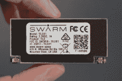
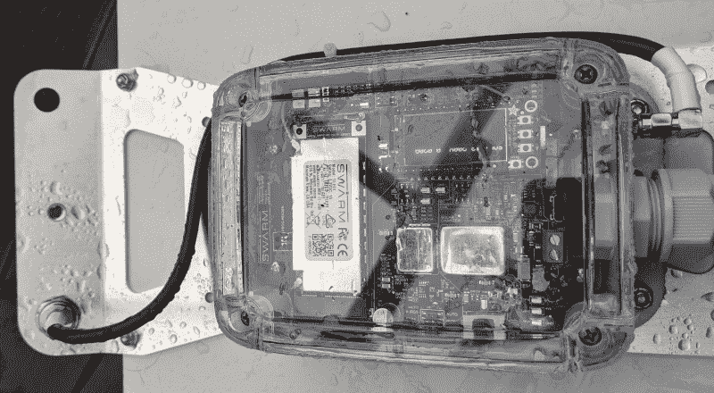
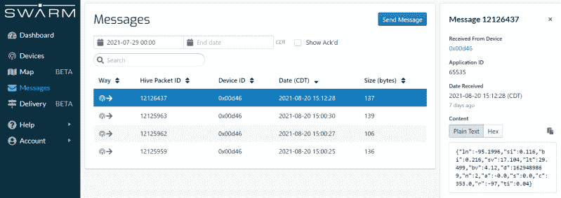
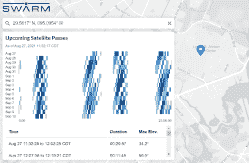

# 回顾:Swarm 卫星网络评估套件实践

> 原文：<https://hackaday.com/2021/09/07/review-hands-on-with-the-swarm-satellite-network-eval-kit/>

如果您在现场有设备，您可能希望与它们连接。曾几何时，这很难做到，需要电话线或专门的无线电设备。现在手机数据很普遍，但是手机也不是无处不在。如果你有现金，你可以付钱给一些卫星公司来传输你的数据，但这通常很昂贵，也有其自身的挑战。

卫星星座的时代正在改变这一点。当然，现在每个人都听说过 Starlink，它通过许多比传统电信卫星小得多的卫星提供卫星互联网。但他们不是镇上唯一来的人。

一家名为 Swarm 的公司已经在低轨道上建立了一个由 1/4U 立方体卫星组成的星座。他们提供使用全向天线的地面站和少量数据的订阅接入程序。他们给我们[派了一个小组来审查](https://swarm.space/swarm-eval-kit/)，虽然我还没有在真正的项目中使用过这个系统，但是这个工具包给我留下了非常深刻的印象。

## 关于蜂群

The Swarm Tile is made to mount on a PCB

Swarm“tile”是一种微型无线电，可以与低地球轨道上的小型卫星进行双向通话。这个小单元安装在 PCB 上，可以控制其功耗，并通过标准的 3.3V UART 连接与您的系统对话。然而，它确实需要一个小天线，甚至可能需要一个更小的天线用于它的 GPS 模块。小，在这种情况下，大约是一个中型便携式对讲机天线。有一种半波天线不需要接地层，还有一种较短的天线需要接地层。

该系统可以摆脱小天线，因为卫星在低地球轨道。然而，这也意味着你不总是有一个卫星开销。该公司声称他们最终会有更多的覆盖范围，但即使这样，瓷砖可能会保留你的数据，直到它找到一个卫星。所以对于实时数据，这很可能不是你的答案。

由于这些设备是为进入现场而制造的，电池寿命通常是一个问题。根据手册，该设备在发射时使用高达 1A，在接收时使用高达 35mA。在待机模式下，功耗降至 022mA。

瓷砖本身的价格刚刚超过 100 美元。然后是服务。一年 60 美元，你就可以每月每台设备获得 750 个数据包。每个数据包最多可容纳 192 个字节。即使是最长的几个月，每天两包也足够了。当然，如果你需要更多的数据或者你需要更频繁的访问，那就是另外一回事了。您可以在一台设备上堆叠多达 4 个数据计划，因此每月 20 美元可以让您每月获得 3000 个数据包。

也不是所有的数据包都是平等的。您每天最多可以有 10 个下行数据包，每月最多分配 750 个中的 60 个。所以如果你真的需要双向，你应该仔细考虑一下。显然，这不是一个合适的服务，比如说，一个远程控制储罐液位的系统，它需要在一个小时内多次实时双向交换命令和数据。但是，一个每天检查一次，当它响起时发送一个包，并接受一个不频繁的命令，例如改变警戒/解除警戒时间的警报系统可能是一个很好的选择。

## 竞争

你通常看到的通过卫星连接设备通话的方式是通过一个带有 2-3 英尺碟形天线的 VSAT(甚小孔径终端)。这些往往是昂贵的，他们是挑剔的设置。好处是卫星不会移动，所以一旦你设置好了，就是这样(除非你的天线在移动)。你总是能接触到卫星。当然，延迟也很重要。

A VSAT antenna (public domain).

然而，你几乎可以在任何地方找到 VSAT。例如，商店用它来保持销售终端的连接。许多彩票机也使用 VSAT。电力设施和天然气管道使用 VSAT 从远程位置收集数据。

然而，VSAT 看起来并不像是真正的群居竞争。如果你需要真正的网络连接，你不能真的使用 Swarm。但是如果你只需要少量的非频繁数据，Swarm 可能比 VSAT 终端便宜得多，也更容易部署。在我们看来，真正的竞争对手是廉价的蜂窝调制解调器，当然，蜂窝调制解调器对你在大洋中的数据收集浮标没有任何好处。所以 Swarm 并不适合所有人，但是对于某些项目，它可能非常值得一看。

还有一些其他公司试图成为物联网应用的首选卫星提供商。有 [OqTec](https://www.oqtec.space/) 、 [Orbcomm](https://www.orbcomm.com/) 、[开普勒通信](https://www.keplercommunications.com/)和[舰队](https://fleetspace.com/)以及毫无疑问的其他竞争者。StarLink 可能也会成为这一领域的参与者，但迄今为止，它在提供互联网连接方面大放异彩。还有许多传统品牌，如 Hughes、GlobalStar 和 Iridium，已经在市场上推出了一些物联网产品，或者至少已经宣布推出。然而，与其他一些选择相比，Swarm 似乎对黑客相当友好。

## 评估套件

The back of the Swarm eval kit

评估套件异常坚固，采用防水(IP68)外壳，配有电池、太阳能电池板和 ESP32 主机。还有一个坚固的三脚架。500 美元的价格并不便宜，但质量很好，而且感觉不应该更便宜。如果你想了解这个过程的更多细节，这里有来自公司的[安装视频。](https://www.youtube.com/watch?v=MUYoFgZL6Qs)

有一个橡胶圆顶开关来打开这个东西，有机发光二极管显示器显示一些初始数据。显示器和红色 LED 上的信噪比数字告诉我，室内的噪声太大，无法与卫星成功通信，但坐在外面的院子里，灯变成了绿色。我没有安装三脚架，这似乎没有问题。

然而，绿色 LED 并不意味着该设备实际上正在与卫星通话。幸运的是，通过预报显示我离卫星通过还有将近两个小时。该公司表示，到 2022 年，他们计划让所有 92 颗卫星都运行起来，这将为它们提供“几乎不间断”的覆盖。不过，一旦我头顶上有了卫星，一切都如你所料。

## 软件

评估套件具有适用于 ESP32 的串行连接，但由于它处于防水外壳中，因此更易于使用 WiFi。我们注意到 WiFi 的覆盖范围是有限的，可能是为了减少卫星接收器的噪音。

Data appears in a web interface or readable via JSON.

这个盒子定期发送它的 GPS 位置和一些其他数据，使用网络接口，你可以发送一封简短的电子邮件，尽管很明显，这最终会耗尽你的数据计划。默认情况下，数据显示在网站上，您可以从 web 服务获取 JSON。你也可以在地图上看到 GPS 数据，这只有在你移动的时候才有意思。

This map shows the satellite passes over the Johnson Space Center.

当然，一切都要暂停，直到你头顶上有一颗卫星。您可以在网站中输入您的位置，查看即将到来的通行证何时适合您。

如果你直接与瓷砖通信，你会发现它使用 NMEA 式的通信字符串，就像 GPS 一样。很明显，有[几个不常见的命令](https://swarm.space/wp-content/uploads/2021/07/Swarm-Tile-Product-Manual.pdf)，但是数据格式是一样的。

## 你会用它做什么？

当你第一次开始考虑你可以用卫星数据做什么时，你的想象力会天马行空。那么，当你意识到你必须严格限制你的数据，你甚至不能指望它接近实时时，你就必须回到现实中来。

我有一种感觉，卫星数据是那些听起来比大多数应用更好的东西之一。如果你在蜂窝网络的范围内，那么[可能比你想象的](https://www.digikey.com/en/resources/iot-resource-center/iot-cellular-data-plans)更便宜。然而，对于那些手机信号发射塔以前没有去过的地方的应用，如果你能在它的限制范围内生活，Swarm 可能是一个答案。