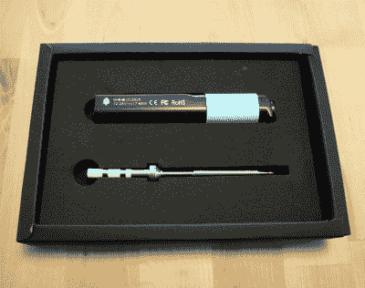
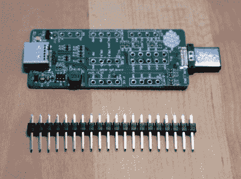
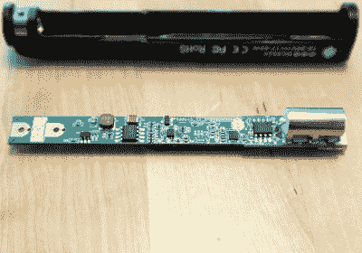

# 复习:Pine64 Pinecil 烙铁

> 原文：<https://hackaday.com/2021/01/05/review-pine64-pinecil-soldering-iron/>

曾经有一段时间，质量不错的烙铁是很重要的事情，焊接站有一个包含电子设备的笨重的底座和一个轻便的手持烙铁。随着新一代微处理器控制的轻型手持熨斗的出现，这种情况发生了变化。一家我们更多地将其与开源手机、笔记本电脑和单板电脑联系在一起的公司出现了一个新成员，Pine64 生产了[Pinecil](https://pine64.com/product/pinecil-smart-mini-portable-soldering-iron/?v=0446c16e2e66)。这是一个重量轻的手持熨斗，具有一些创新功能，价格有吸引力，但它是否足以提高竞争水平？

我对 Pinecil 进行了测试，尽管这个设备是完全开源的，但最好还是把它拆了。剧透:这是我的新宠。

## 这个新来的孩子能和冠军较量吗？

The Pinecil and its default tip.

熨斗一上市，我就下了订单，并及时收到了来自香港的令人满意的圣诞礼物。里面有一个智能包装，里面装着售价 24.99 美元的熨斗和默认小费，还有一个类似的包装，里面装着我也订购的售价 24.99 美元的小费。打开它，我有一个手柄，里面有电子设备，尖端，以及一个 USB-C，I/O 和 JTAG 分线板，供实验人员使用。

手柄遵循与 Miniware TS100 和其他类似熨斗类似的格式，因为它是一个大约 112 毫米长、17 毫米高、13 毫米宽的模制黑色塑料管，一端有 USB-C 和桶形插孔，另一端有一个适合尖端的配件。在下侧的顶端有一个模制突起，如果您没有支架，可以让熨斗的顶端悬在空中。顶部是一个小的有机发光二极管显示屏和两个按钮，与任何竞争对手不同的是，它有一个蓝色的硅橡胶套，用户可以将手指放在上面。这些尖端似乎与 TS100 使用的尖端相同，相同的陶瓷部件支撑着插入手柄的导体，一个小的固定螺钉将它们固定在适当的位置。在安装了默认尖端的情况下，整个熨斗的重量为 32.5 g，握在手中很舒服。这种熨斗可以从 12 V 到 24 V DC 运行，提供 17 W 到 65 W 的功率。与竞争对手不同的是，它可以从桶形插孔或 USB-C 插座获取功率。我用一个通用的 USB-C PD 笔记本电脑电源和一个传统的桶形插孔笔记本电脑电源进行了测试，没有问题。作为测试，我还连接了一个 5 V 的 Raspberry Pi USB-C 电源，熨斗认为它电压过低，拒绝工作。

## 表现如何？

The Pinecil breakout board.

通电后，屏幕上出现两个图标，分别对应两个按钮。一个是烙铁，你可以想象它可以打开烙铁，另一个是扳手，带你去设置菜单。正是在这里，我们发现了一些使这种铁与众不同的特征，因为很明显，它有着重要的思想。一个不错的触摸是一个锂离子电池大小的选择选项，允许熨斗在没有电压的情况下关闭，以及一个带有熨斗功率限制选择的菜单。对我来说，最大的特点是每个菜单选项都有一个帮助字符串来解释它的作用，如果这个选项被搁置一会儿，它就会滚过去。

短按烙铁图标旁边的按钮，开始烙铁头加热，温度显示在屏幕上。我测了一下它从室温加热到 320 摄氏度的时间，大约是 9 秒钟，虽然没有一些高端熨斗那么快，但肯定不会太慢。

在使用中，正如这种类型的熨斗所预期的那样，重量轻，易于操作。没有沉重的提示集，我不能评论其在更大的工作表现，但我预计与 65 W 在手，它会应付以及其竞争。将 USB-C 端口插入计算机意外地显示没有找到设备，但在快速查看了 Pine64 wiki 之后，发现它必须通过按下一个按钮来打开其固件升级模式。这款 iron 还可以作为 RISC-V 开发板，带有 GD32VF103TB 微控制器，因此无疑会有大量开源第三方固件为其生产。[原理图和其他文件](https://wiki.pine64.org/wiki/Pinecil#Pinecil_board_information.2C_schematics_and_certifications)都与[设备数据表](https://wiki.pine64.org/wiki/Pinecil#Datasheets_for_components_and_peripherals)一起提供，显示它有加速度和位置传感器，大概是为了检测它与其他部件一起使用时的情况。

## 该拆了

It’s clear that a lot of thought has gone into the design of this iron.

在对熨斗进行了外部检查和测试之后，是时候拆机看看是什么让它运转了。Pine64 Wiki 提供了有用的[拆卸和重装](https://wiki.pine64.org/wiki/Pinecil#Disassembly_steps)指令，虽然有时有点复杂，但足够简单。电子设备位于一个细长的 PCB 上，一侧主要是无源器件和模拟器件，另一侧是隐藏在显示器下的处理器。这是一款设计精美的设备，在这方面与同类产品不相上下。

很明显，在这一类别中要击败的是分别用于 DC 和 USB-C 电源的迷你软件 TS100 和 TS80。我们还看到，即使是我们发现的这种最便宜的烙铁也能很好地证明自己是一个烙铁，那么，当“成为烙铁”和它的竞争对手拥有相同的尖端已经是板上钉钉的事情时，这种新的烙铁又是如何区分自己的呢？

Pinecil 的外壳比 TS100 略大，重量也略重，但结构坚固，不像廉价的 SanErYiGo iron 那样脆弱。它的 9 秒预热时间比竞争对手快得多。硅胶手指套确实触感非常好，给熨斗带来了良好的使用感。很明显，有些人已经考虑到让箱子不仅仅是一个把手，这些模制的支架突起使它在热的时候可以安全地放在长凳上。

我们已经习惯了 TS100 风格的技巧，它们当然很容易改变。另一方面，拥有 USB-C 和桶形插孔电源使这种熨斗比 Miniware 熨斗更有用，如果这种灵活性很重要的话。我怀疑我将获得一个新的 USB-PD 电源和一套用于各种 DC 源的适配器电缆，以便随身携带我的 Pinecil。在软件方面，它提供了大量的选项，即使是最苛刻的用户也能满意。我特别喜欢锂离子电池的电池保护，以及那些辅助字符串。最后，作为一个完全开源的设计，它提供了更多好奇的用户为他们自己的目的修改它所需要的一切。

总之，我真的找不到任何我不喜欢这个熨斗的地方。它在价格和功能上击败了竞争对手，同时在可用性上超过了他们，而且它完全可以被黑客攻击。迷你熨斗是很好的工具，仍然是非常明智的购买，但现在它们开始反映它们的年龄。这款熨斗代表了 2020 年末手持熨斗的技术水平；它采用相同的前提，只是做得更好。我会经常使用我的烙铁，如果你在找烙铁，我只能建议你看一看。很明显，我并不是唯一一个这样做的人，因为在我写这篇文章的时候，这本书已经卖完了，但是如果这种需求持续的话，我相信还会有下一次的抢购。留意，有条件的时候买一个。