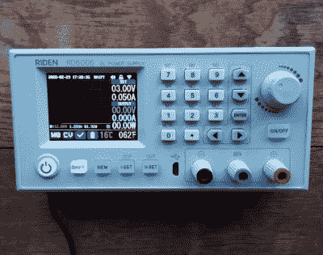
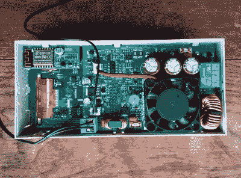
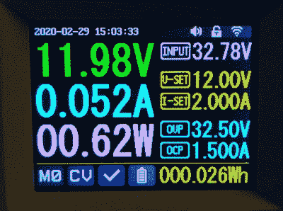
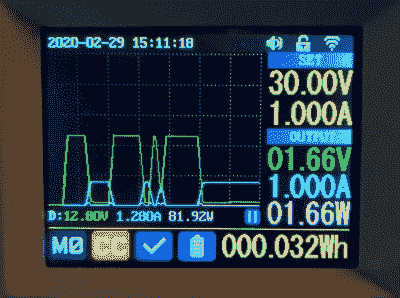
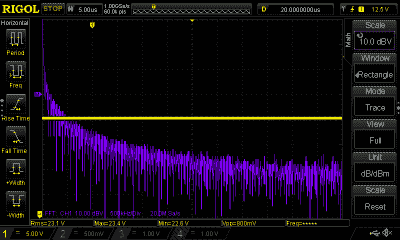
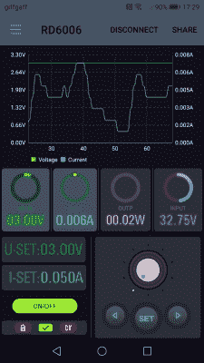

# 查看:Riden RD6006W DC 电源模块

> 原文：<https://hackaday.com/2020/03/16/review-the-riden-rd6006w-dc-power-supply-module/>

你可能已经见过来自中国的瑞登系列可编程电源模块:小型且相对便宜的开关模式降压转换器，具有微处理器控制和带有大型彩色有机发光二极管屏幕的前面板。给定 30 伏左右的电压，它们可以提供任何更低的电压，并有额外的电流限制。它们在上市后的几年里非常成功，甚至衍生出了自己的中国复制品，以及无数的黑客项目，例如在 [DPS300X](https://hackaday.com/?s=dps3) 和 [DPS500X](https://hackaday.com/?s=dps5) 模型上的项目。

去年年底，瑞登公司推出了一款新模块，Riden 品牌的 RD6006 将之前模块的基本理念与极其灵活的前面板相结合，前面板带有完整的键盘和旋转编码器，创造了一个类似于体面的台式电源的前面板，但没有附带的电源。我点了一个，等它通关，拿到我的板凳上，审核。

## 五十块钱作为电源给你带来了什么？

The front panel, with the display in graph mode.

它很好地包装在一个坚固的盒子里，有一个泡沫内壳，另外还包括一个插入式温度传感器，一套压接扁平端子和一个备用保险丝。我订购了稍微贵一点的带 WiFi 连接的“W”版本，所以我的 38(49 美元)也有一个小的插入式 PCB，里面有一个 ESP8266 模块。

没有纸质手册。取而代之的是一张卡片，指引用户在瑞登网站上下载 PDF 格式的文件，这份文件中英文都写得很好，很容易理解。

该装置本身是一个灰色的矩形塑料盒，其前面板约为 165 毫米 x 81 毫米(6.5 英寸 x 3.2 英寸)，深约 50 毫米(2 英寸)。前面板配有按钮和编码器、对角线为 6.25 毫米(2.5 英寸)的有机发光二极管屏幕和一组输出终端。它被设计成一个模块，位于一件设备中，而不是一个独立的设备，因此背面没有被覆盖，印刷电路板完全可以访问。温度传感器和 WiFi 模块的插座在左手边，很容易安装。

The rear of the unit, with the WiFi module on the top right.

电源输入是通过一组可插拔的螺丝端子板进行的，可以接受 6 V 到 70 V 之间的任何电压。我没有一个方便的 70 V 电源，但正如许多有垃圾箱的人一样，我有一个来自惠普打印机的电源，它以 1.5 A 的电压提供 32 V 的电压。我把它连接起来，然后用开关给设备通电。

使用过之前瑞登模块之一的人都会对基本界面很熟悉。有三个输出电压、电流和功率的主显示器，在它们的右边是一组显示系统参数的较小显示器。输入电压、输出电压和电流限制以及过压和电流设置都在这里，而底部是温度显示和一组状态标志。要设置值，有一组按钮用于选择要更改的值，然后有一个数字键盘或旋转编码器用于选择值。还有一个电池供电的时钟。

## 使用起来是什么样的？

The default screen, with voltage and current readings.

除了基本功能之外，该设备还支持多达九种常用电压的存储设置，最有趣的是，它还提供了一个图形显示选项，可以查看一段时间内的电流和电压。该图可以是默认屏幕，启用时，输入和输出电压和电流显示会以较小的字体显示在右侧。但它有一个缺点，那就是它似乎不会自动更新它的轴，这使得它很难跟随小电流。似乎没有禁用此功能的菜单选项。

功率输出来自三个 4 毫米插座/螺丝端子组合，正如你对其他电源的期望。有通常的正极和负极端子，在它们之间有第三个端子用于铅酸电池充电功能。

Graph mode, showing a load being turned on and off.

乍一看，这是一个功能强大且易于使用的小电源。按下“V-set”或“I-set ”,输入一个值，就可以开始了。编码器下方有一个“开/关”按钮，可以实现输出；按下这个使果汁流动。我在各种负载下测试了电源，从大型线绕电阻到电机和其他电子器件，甚至在电源上短接一根 4 mm 电缆来测试限流器。作为一个直接的 DC 电源，它以这种方式完美地运行，从来没有错过一拍，并提供测量电压和电流，正如它所声称的那样。

然而，DC 电源不仅仅是 DC，因为只有教科书上理想的 DC 才是频域上的 DC。所有电源都包含一些噪声，甚至电池也是如此，由于 Riden 是开关模式电源，因此它的一些开关频率有可能会传到输出端。对于廉价的开关模式电源，如一元店手机充电器，这有时甚至会在普通示波器上表现为高频纹波。在 Riden 的例子中，看不到这样的波纹。

An FFT spectrum of the Riden’s output.

如何描述电源的噪声输出？在这种情况下，我认为我们应该感兴趣的是寻找特定频率下的任何峰值，而不是总噪声，例如开关频率的谐波倍数。我唯一合适的工具是我的示波器，它有 FFT 功能。它是频谱分析仪的普通替代品，但它很乐意显示用于校准的方波的谐波，因此它将满足我们的目的。将 Riden 连接到一个线绕加热元件作为负载，并使用我可信赖的 Rigol 1054z 施加一些电压，我就能够调出它的输出光谱。正如我所料，噪声频谱较宽，但不会明显高于连接到线性电源时的频谱，我很高兴地看到，即使在高频范围内也没有明显的峰值。他们似乎在监管和过滤方面做得很好，但如果没有更好的测试设备，我们只能做到这一步。

## 但这是 W 版，那是怎么回事？

The Riden app, showing the variation in current over time drawn by a colour changing LED.

这次审查还有最后一个部分:WiFi 模块。它看起来很像一个插入主 PCB 的 ESP8266 转串行模块，但你如何使用它呢？本质上，它提供了与 iOS 或 Android 应用程序的连接。有一个选项可以启用 WiFi 连接，然后应该在运行 Riden 应用程序的手机附近重新启动电源。据猜测，它会设置一个应用程序连接的接入点，并要求您提供无线网络的凭据，仅此而已。然后，您可以用手机连接电源。

乍一看，它只是复制了一些前面板控制，如果你需要从你的扶手椅上改变你的电流限制，方便，但进一步检查有一点点更多。该应用程序中的图形功能远远优于设备上的图形功能，轴可以根据问题中的读数进行缩放，并且可以选择保存读数日志。这将手机变成了一个强大的扩展单元，在我看来，这是值得的额外几英镑。值得指出的是，除了 WiFi 之外，前面板上还有一个 USB 串行端口，如果我们更广泛的社区中没有人对相关的 API 进行逆向工程，并开发一些开源软件来利用这一设施做更多的事情，我会非常失望。

总之，Riden RD6006(W)似乎延续了之前 Riden 模块的质量，并以合理的价格提供了非常有用的电源，大量功能让您目不暇接。它没有自己的主电源，所以要考虑到价格因素。然而，正如我所发现的，有很多现成的供应品可以使用，即使它们不能提供该单元所能提供的全部范围。当你寻找电源时，这是很值得考虑的。