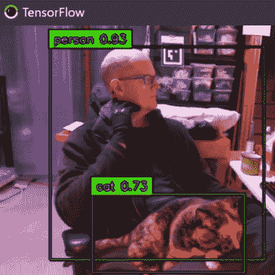
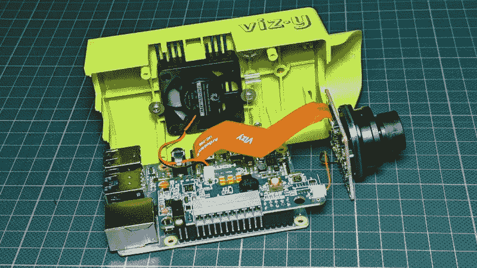
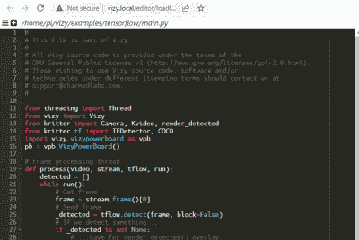

# 回顾:Vizy Linux 驱动的人工智能相机

> 原文：<https://hackaday.com/2022/04/11/review-vizy-linux-powered-ai-camera/>

Vizy 是一款基于 Linux 的“人工智能相机”，基于 Raspberry Pi 4，使用机器学习和机器视觉来实现一些巧妙的技巧，并以可攻击性为中心进行设计。我发现启动并运行起来非常简单，做出自己的改变并开始获得想法也同样简单。

Out of the box, Vizy is only a couple lines of Python away from being a functional Cat Detector project.

我在几分钟内运行了用 Python 编写的预装示例，并在大约 30 秒多的时间内编辑了完全相同的代码。更好的是，我没有安装开发环境，甚至没有离开我的网络浏览器。我不得不说，这对黑客来说是一次非常友好的体验。

Vizy 来自魅力实验室的人。这并不是他们第一次尝试智能相机，这一点显而易见。他们还创造了 [Pixy](https://hackaday.com/2013/08/21/a-fast-and-easy-to-use-vision-sensor/) 和 [Pixy 2](https://hackaday.com/2018/11/09/pixy2-is-super-vision-for-arduino-or-raspberry-pi/) 相机，而我恰好拥有其中的几台。我总是渴望任何让机器视觉更容易实现、更容易集成到项目中的东西，所以当 Charmed Labs 好心地向我提供他们最新的设备时，我渴望看到有什么新东西。

我发现 Vizy 是一个高度完善的平台，具有许多真正有用的硬件和软件特性，并专注于可访问性和易用性，我真的希望在未来的嵌入式产品中看到更多。让我们仔细看看。

## 向内看

Vizy 基于 Raspberry Pi 4，这使它与大多数其他嵌入式机器视觉平台有所不同。像许多其他平台一样，Vizy 的所有代码和视觉处理都在本地运行。然而，在 Raspberry Pi 4 上运行也意味着可以访问熟悉的 Linux 环境，这一功能带来了一些好处，我们稍后将对此进行探讨。

Vizy is by default an indoor device, but for more demanding environments, there is [an optional outdoor enclosure](https://docs.vizycam.com/doku.php?id=wiki:outdoor_enclosure_getting_started).

在箱子里面是一个 Raspberry Pi 4，一个风扇，镜头组件和摄像头(使用与 Raspberry Pi 高质量摄像头相同的索尼 IMX477 传感器)，以及一个小型电源和 I/O 管理板，连接到 Pi 的 40 引脚 GPIO 头的顶部。该板处理电源的开启和关闭，控制可切换的红外滤波器，接受 12 V DC 输入，通过蜂鸣器和 RGB LED 提供反馈，并具有一个带螺纹端子的 I/O 接头，便于与其它器件接口。

Vizy 几乎可以被认为是树莓 Pi 的一个摄像头形状的外壳，因为它提供了对树莓 Pi 4 的所有端口的完全访问，所有端口都如人们所预期的那样工作。人们可以插入显示器和键盘，看到 Linux 桌面环境，添加蜂窝无线连接等功能就像插入和配置 USB 蜂窝调制解调器一样简单。由于能够使用熟悉的界面和方法，与其他系统或硬件接口(智能相机的预期任务)变得更加容易。

## 黑客友好的功能

在探索 Vizy 的过程中，我最喜欢的一点是，由于内置的 web 终端接口，我甚至不用离开 web 浏览器就可以快速地开始修改示例代码。示例和应用程序都是用 Python 编写的，虽然当然可以使用任何方法来编辑 Python 代码并将更改推送到设备，但在新的浏览器选项卡中启动编辑器也非常简单。

Clicking ‘Editor’ launches a Python editor in a new tab, loaded with the currently-running code.

Code can be edited and tested without leaving the web browser.

以下是我在 Vizy 中发现的一些更有趣的特性，每一个都提供了一些有用的东西。优秀的文档增强了它们的实用性。

#### 硬件功能

**软件控制、可切换的红外滤光器**，它独立于镜头本身。大多数镜头通常内置红外滤光片，因为它可以提供更好的照片。然而，有时不带红外滤光片也是可取的(例如，照相机在晚上不带红外滤光片会看得更清楚。)Vizy 允许通过简单的软件命令启用(或禁用)IR 过滤器。

**镜头支架兼容 M12 和 C/CS。**大多数相机都接受这种或那种类型的镜头，但 Vizy 允许使用任何一种(尽管建议使用不带 IR 滤镜的镜头，因为 Vizy 提供了自己的镜头。)

**带螺丝端子的 I/O 插头**为摄像机提供了一种直接连接其他硬件和设备的方式。这些引脚支持鲁棒的数字输入和输出，包括串行通信，软件可切换的 5 V 和 12 V 高电流输出可用于控制外部设备([)更多引脚排列详情请点击此处](https://docs.vizycam.com/doku.php?id=wiki:pinouts)。)

**常见的相机标准已经出现**，例如三脚架、相机配件安装座和可选的室外外壳。

所有常见的 Raspberry Pi 接口都是公开的,这意味着 Vizy 不会妨碍 Raspberry Pi 通常能够做的任何事情。甚至可以插上键盘和显示器(或者通过 VNC 连接[，在普通的 Linux 桌面环境下运行 Vizy。](https://docs.vizycam.com/doku.php?id=wiki:connect_over_vnc)

#### 软件功能

**简单设置。**启动和运行或配置设备以连接到本地网络几乎不需要任何时间。Vizy 的每一部分功能都可以通过网络浏览器访问。

内置的应用程序和例子很容易修改。预装了两个应用程序和一些例子，随时可以运行: [Birdfeeder](https://docs.vizycam.com/doku.php?id=wiki:birdfeeder_app) 自动检测和识别不同种类的鸟类， [MotionScope](https://docs.vizycam.com/doku.php?id=wiki:motionscope_app) 检测移动物体，测量每个物体的加速度和速度，并将数据显示为交互式图形。例子包括像 [TensorFlow 对象检测](https://www.tensorflow.org/hub/tutorials/object_detection)这样的东西，它在本地运行并为项目提供一个简单的框架。

**开发可以完全在浏览器**中完成，任何示例或应用都可以在 Python 编辑器中的新浏览器标签中启动，只需点击几次，无需单独的开发环境(尽管 Vizy 也允许在本地网络上基于 [SMB/CIFS 的文件共享](https://docs.vizycam.com/doku.php?id=wiki:file_access))。)

**从个人网络外部访问的远程网络共享**是一项方便的功能，它创建了一个自定义 URL，用户可以通过该 URL 远程访问设备。以这种方式生成的 URL 仅在一个小时内有效，但已建立的远程会话不会被终止；生成的 URL 不再有效。所有常见的功能都可以通过[网络共享](https://docs.vizycam.com/doku.php?id=wiki:remote)访问——包括基于网络的终端窗口和文件编辑——并且系统可以优雅地处理多个用户的同时访问。

## 给摄像机供电

Vizy 名义上由附带的 12 V 墙壁适配器供电，但[有许多为设备](https://docs.vizycam.com/doku.php?id=wiki:powering_vizy)供电的选项，这为典型的黑客提供了一些灵活性。例如，可以通过向 USB-C 连接器施加 5 V 电压来为设备供电，尽管这样做意味着 I/O 连接器上的 12 V 输出不起作用。说到这里，12 V 输出也可以作为输入，允许从外部 12 V 电源应用于正确的螺丝端子来为相机供电。[以太网供电(PoE)](https://docs.vizycam.com/doku.php?id=wiki:poe_getting_started) 也是一种选择。

功耗反映了设备的 Raspberry Pi 4 内部结构，消耗大约 3 W 到 5 W，取决于它正在做什么。空闲时，我在 5 V 下测量了 500 mA 和 600 mA 之间的电流，在相机视图中积极传输 TensorFlow 对象检测的结果时，电流跳到 1 A 左右。

## 浏览器内…一切

能够在浏览器中观看实时视频或更改硬件参数是一回事，但更好的是能够直接从浏览器选项卡中编辑 Python 代码，并完成应用程序控制台输出。这是一个巧妙的系统，它让修改或编写相机代码变得更加容易。需要创建新文件，甚至打开一个终端窗口到 Pi 本身？也可以在新的标签页中启动。

当然，人们可以使用任何希望在设备上开发的方法。文件共享、`ssh`和远程桌面(通过 VNC)都是选项，只需插入键盘和显示器即可。

## 热爱这个方向

我很快就用 Vizy 启动并运行了，默认应用程序是一个鸟类喂食观察器，它可以检测鸟类，识别它们的种类，并将它们的照片上传到谷歌相册。然而，它能做的不止这些。想知道开发自己的应用程序需要什么吗？这里有一个关于滚动你自己的宠物伴侣的教程，包括治疗分配器。

Vizy 附带了许多有用的示例，可以随时修改，开发只需要一个 web 浏览器。这有助于使它更容易访问，同时为普通黑客提供了一个在项目中实现诸如对象检测之类的东西的良好开端。事实上，由于预装了 TensorFlow 示例，Vizy 距离成为像这个一样的功能性 [Cat 检测器只有几行代码的距离。](https://hackaday.com/2021/03/06/is-that-a-cat-or-not/)

Vizy 有一个完善的水平和一套功能，我真的希望在未来的产品中看到更多这样的功能。像这样的设备是否给了你新项目的灵感，或者给旧项目注入了活力？我们当然想听听，所以请在评论中告诉我们。