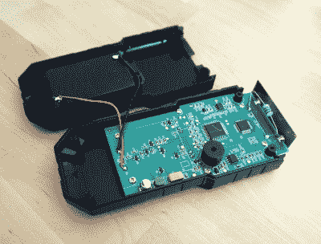
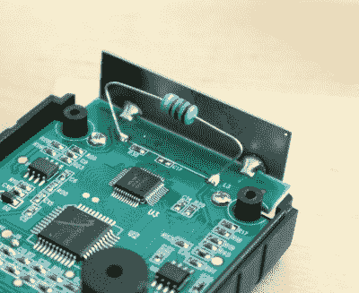

# 回顾:电磁辐射测试仪到底是什么，我为什么需要它？

> 原文：<https://hackaday.com/2021/04/07/review-what-on-earth-is-an-electromagnetic-radiation-tester-and-why-would-i-need-one/>

巡回生活的乐趣之一是定期与沿途发送给黑客空间或朋友的各种订单的成果重聚。这些来自远方的匿名包裹包含了各种各样的奇迹，还有额外的期待元素，因为忘记了到底订购了什么。

今天的主题 Mustool MT525 电磁辐射测试仪也是如此。成本不超过 10 英镑(13.70 美元)，这是好奇心驱使下的冲动购买；这些设备声称可以测量磁场和电场，但它们真正测量的是什么？我对这些事情的兴趣在于无线电方向，但我从来没有检查过这样的仪器。是时候让它接受黑客待遇了。

## 谁知道一切都这么有害！

从盒子里拿出一个智能手持设备，有三个按钮和一个液晶显示屏，还有一张说明书。在后面的情况下是一个电池舱，这需要三个 AAA 电池。它声称可以测量从 1 V/m 到 1999 V/m 的电场，以及从 0.01 μT 到 99.99 μT 的磁场，带宽从 5 Hz 到 3500 MHz。打开说明书，可以清楚地看到，这是为了人类安全的目的而用于监测电磁场，并列出它们可能导致的从白血病到失明的各种情况。

Open it up, and here’s what we find.

当放在这个非常普通的房子的自由空间中时，给它通电会给出两个测量的零读数，当放在各种电子设备附近时，读数会显著增加。特别令人担忧的是，当任何一个级别被认为是有害的时，它就会发出声音，这是在包括笔记本电脑键盘和触控板在内的数量惊人的物品附近进行的。不出所料，运行中的微波炉的门封会产生特别高的读数，宝丰手持收发器在 430 MHz 频段满功率时也是如此。遗憾的是，我的 CRT 电视目前还在储存中，但我预计这也会产生很高的读数。

The sensors for magnetic and electric fields.

该蜂鸣器的报警阈值分别为 40 V/m 和 0.4 μT，考虑到它会对我的键盘这样的普通东西发出警报，我不得不质疑这意味着什么。[阅读关于典型安全暴露水平的主题](https://www.who.int/news-room/q-a-detail/radiation-electromagnetic-fields)很明显，警报设置得太低了，我不得不怀疑这是否会给一个出于个人对电磁场水平的关注而购买该设备的人带来不必要的担忧。幸运的是，长按一个按钮就可以关闭嘟嘟声。

在描述了它的功能之后，箱子里面有什么呢？背面有四个小螺丝，拧开这些螺丝，它就会分成两部分，露出电路板。该单元的业务端是传感器、用于电场的金属板和用于磁场的线端电感，它们的输出分别馈入各自的 [TI TLC27M2 双通道运算放大器](https://www.ti.com/lit/ds/symlink/tlc27m2a.pdf?ts=1617104164944&ref_url=https%253A%252F%252Fwww.google.com%252F)。这些反过来又馈入一个 [Weltrend WT56F216 微控制器](http://www.weltrend.com/upload/website/product/WT56F216_Data%20Sheet_EN_V3.0.pdf)，它拥有一个 8052 内核和模拟输入，通过一个 [Holtek HT1621 LCD 控制器](https://www.holtek.com/productdetail/-/vg/ht1621)驱动 LCD。它看起来设计良好，传感器符合我对测量这些属性的设备的期望。

## 它有用处吗？

Mustool MT525 电磁辐射测试仪。这似乎是一个精心设计的仪器，它做了它声称的事情，并测量振荡电场和磁场的存在和强度。但是它是一个有用的工具吗，我应该相信它吗，它在我的工作台上有位置吗？首先，我对它的校准很好奇，虽然我很难期望从这么便宜的东西得到任何可追溯的校准证书，但是 V/m 和μT 数字甚至在正确的范围内吗？我还担心它和类似设备以健康为目的的销售方式，我担心可能会有人被它的“有害”呼叫器逼得不必要的担心，而实际上他们并不需要。就我自己而言，我可以报告说，这是一种在近距离检查磁场的便捷方式，它可以在普通的业余无线电频率上工作，尽管我不能真正声称它作为一种台式仪器有多大用处。不过有一点它非常方便，它可以比传统的金属探测器类型的电线探测器更可靠地检测埋在墙内的带电电源电缆，也许这就是我会使用它的地方。不过，为了你们自己，我买了一个，这样你们就不用买了。