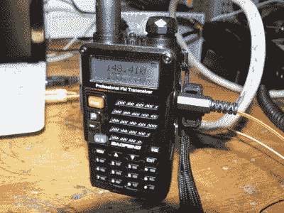

# 用 SDR 复活老式模拟手机

> 原文：<https://hackaday.com/2018/11/03/revive-that-old-analog-cell-phone-with-sdr/>

随着最新和最棒的 5G 蜂窝网络即将到来，很难相信就在不久前，手机还依赖于模拟网络。它们已经不再被使用了，但是你可能只需要去一次旧物交换会或者跳蚤市场就能得到一些这种老式的硬件。当然，这些过去时代的手机不仅仅是因为与现代设备相比它们的巨大尺寸而不实用，而是因为模拟蜂窝网络早已走上了软盘的道路。

 但是多亏了【Andreas Eversberg】的努力，那些古董手机可能会再次复活，即使只是在你当地黑客空间的半径范围内。他的软件允许用户[为欧洲和美国使用的几个复古电话网络](http://osmocom-analog.eversberg.eu/)创建一个功能正常的模拟基站，如 AMPS、TACS、NMT、无线电通信和 C450。您可以走老派路线，使用声卡和物理无线电，或者您可以完全拥抱 21 世纪，通过软件定义无线电(SDR)来实现这一切；在任一情况下，利用相对便宜的硬件，呼叫基站甚至多个移动设备之间的呼叫都是可能的。

[Andreas]为这个项目收集了非常好的文档，从如何用传统无线电设置自己的 DIY 蜂窝“塔”开始。他解释说，业余无线电对于大多数使用的频率来说都是一个可行的选择，并且他在改装二手出租车无线电方面取得了早期成功。他甚至提到受欢迎的宝丰手持无线电可以在紧急情况下使用，尽管由于无线电失真，并非所有的协议都有效。

如果你想走捷径，[Andreas]还解释了如何用一个 SDR 设备取代无线电。这极大地简化了安装，如果你愿意，可以把一整张放满收音机和电线的长凳变成你可以随身携带的东西。他的软件有使用 LimeSDR 和 LimeSDR-Mini 的特定选项，但您应该可以通过一点试验来使用其他设备。

我们之前已经回顾了 LimeSDR-Mini 硬件，以及 T2 在建立自己的 GSM 网络中的应用。