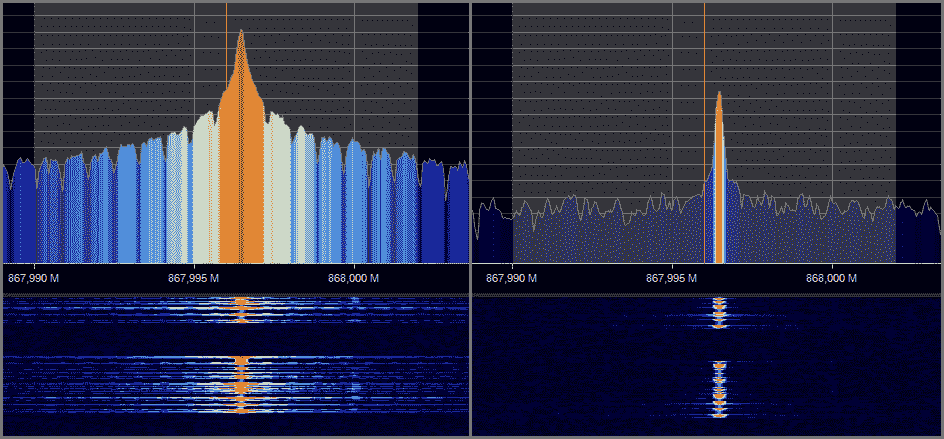
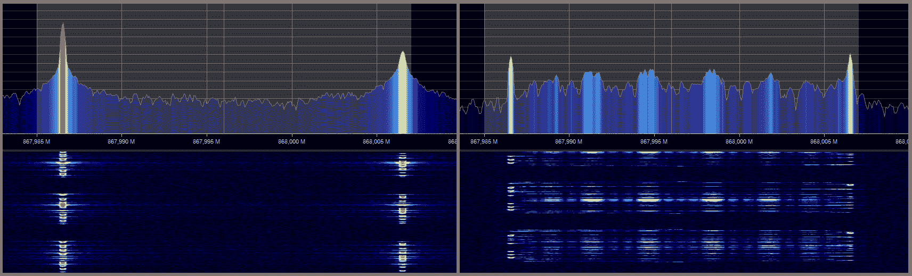
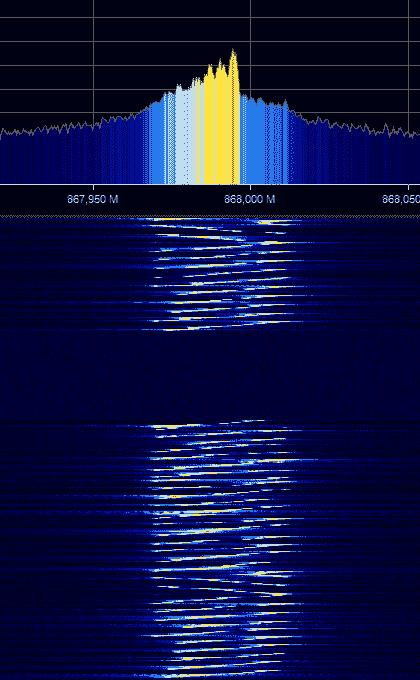

# 射频调制:黑客速成班

> 原文：<https://hackaday.com/2020/01/28/rf-modulation-crash-course-for-hackers/>

当您希望在项目中添加一些无线功能时，有很多选择。您真的不需要了解太多的技术细节就可以使用文档更加完善的模块，尤其是如果您只需要让一些东西快速工作的话。另一方面，也许你已经到了想知道这些东西实际上是如何工作的地步，或者也许你对全球速卖通上的廉价 RF 模块感到好奇。尤其是在 1 GHz 以下的频段，您可能会发现自己与一个电平非常低的模块接口，在那里您可能要调谐调制参数。以下概述应能让您充分了解 RF 调制的基础知识，从而为您的下一个项目选择合适的硬件。

规格中最常见的三种数字调制方案是频移键控(FSK)、幅移键控(ASK)和 LoRa(长距离)。为了让我倾向于机械的大脑理解一些概念，我发现用乐器产生的音高来思考射频调制更直观。

许多漂亮的图表也不会有什么坏处。来自两个不同 RF 开发板的信号被捕获，并使用 20 美元的 RTL-SDR 转换器转换成瀑布图和 FFT 图。虽然无线实验并不需要，但 RTL-SDR 是一个非常方便的调试工具，甚至可以检查模块是否正在传输。

## 幅移键控

顾名思义，使用幅移键控，振幅在两个级别之间移动，就像在钢琴上大声或轻声演奏单个音符(频率)一样，以表示二进制数据。ASK 调制的主要优势在于它的简单性，允许非常便宜的硬件。它的带宽效率也很高，因为它只在一个很窄的频带上输出。然而，ASK 调制受到干扰的严重影响，这限制了它的有效范围。ASK 调制的一种简化形式是开关键控(OOK ),其中发射机只需打开(1)和关闭(0)。这具有省电的优点，因为对于 0 符号不发射功率。ASK 常用于消费电子设备和自动车库门的廉价射频遥控器。支持更复杂调制方案的 RF 模块通常也可以进行 ASK 和 OOK 调制。

ASK (Left) and OOK (RIGHT), both transmitting at the same power level. Note how much less accumulative power is output by the OOK signal

## 频移键控

在频移键控中，传输信号在两个不同的频率之间转换，以表示二进制数据，就像钢琴上的两个不同音符一样。这在技术上是 2-FSK 调制。也可以使用四种不同的频率(4-FSK)来表示 01、11、10 和 00。FSK 使用更多的带宽，但比 ASK 更不容易受到干扰，允许更长的有效范围，可达数公里。在真实的硬件上，快速的频率变化会导致所需频率“过冲”，产生干扰。为了解决这一问题，FSK 的一种常见变体是高斯 FSK，其中频率之间的偏移被平滑，以帮助降低信号的有效带宽。蓝牙低能耗使用 GFSK 调制。

2-FSK (Left) and 2-GFSK (Right). On GFSK the intermediate frequencies are visible from the “smooth” shift.

## 劳拉

LoRa modulation, with the sweeping “chirps” clearly distinguishable

目前远程应用的宠儿是 LoRa，大多数黑客读者可能已经听过很多次了。LoRa 是“啁啾扩频”调制的一种形式。“啁啾”信号平滑地扫过特定的频率范围:通常为 125 kHz、250 kHz 或 500 kHz 宽。完成扫描所需的时间由“扩频因子”(SF)决定。SF 介于 7 和 12 之间，等于每个啁啾中编码的位数。较高的扩频因子会降低数据速率，增加功耗，但也使接收机更容易区分信号和背景噪声，并有助于更长距离的传输。通过偏移扫描的起始频率来编码数据。当扫描到达顶部频率的末端时，它“翻转”并从底部频率再次开始。

LoRa 调制允许良好的接收机灵敏度和抗干扰性，但它是以带宽效率为代价的。另一个缺点是硬件成本较高，部分原因是 LoRa 调制专利。所有 LoRa 射频芯片制造商必须向专利持有者 Semtech 支付许可费。

## 关闭变速器

使用 RF 时，最好了解当地关于允许频率和输出功率的规定。你不希望当局敲你的门，因为他们把邻居的钥匙都塞住了。如果你在 ISM 频段内，通常是 868/915 MHz 和 2.4GHz，不需要许可。然而，你总是可以获得你的业余无线电执照，并获得更多的频谱，以更高的功率输出，甚至实现洲际通信。

上述调制方案仅是现有的几种，每种都有优点和缺点。您可能会在零件库存中有几个选择，所以不要害怕在不同的用例中使用它们。而且一定要拔个 SDR 加密狗看看！