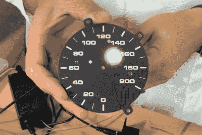

# RGB LED 戒指教旧破折号新花样

> 原文：<https://hackaday.com/2021/04/29/rgb-led-rings-teach-old-dash-new-tricks/>

这些年来，我们已经看到了几个所谓的“数字仪表板”升级，它们要么增加，要么用新的显示器完全取代车辆原有的仪表板指示器。无论是它的七段 led 还是由 Raspberry Pi 驱动的全功能图形界面，最终结果都是一样的:仪表盘看起来与汽车下线时大不相同。

但是[这个来自【Flyin ' Miata】](https://www.youtube.com/watch?v=mD_QolRatp4)的 LED 仪表盘项目采用了一种稍微不同的方法。相同直径的 RGB LEDs 环被放置在它们的无光泽黑色表面后面，而不是完全取代模拟仪表。当发光二极管关闭时，你永远不会注意到它们，但一旦它们开启，光就可以透过材料清晰可见。

LEDs can easily shine through the gauge face.

到目前为止，看起来大部分工作似乎已经投入到转速表中。运行在装备了阿达果羽毛 M4 的 CAN 上的固件可以做诸如基于当前发动机温度点亮动态红线之类的事情。它还会点亮 led，以便在模拟仪表移动时跟随它，这可能没有太多实际应用，但看起来肯定很酷。

在速度计方面，led 似乎主要用作警告指示器。如下面的视频所示，整个仪表可以亮起鲜红色，指示危急情况，如机油压力低。如果您愿意，系统还可以配置不同的颜色，以对应各种可能的故障情况。

[与我们看到的一些更激进的仪表盘更新](https://hackaday.com/2021/03/31/classic-triumph-gets-a-modern-digital-dash/)相比，这是一个有趣的妥协，有助于保留原始仪表的外观。当然，根据汽车的品牌和型号，[你也许可以偷偷放进一个小液晶显示屏](https://hackaday.com/2021/03/11/raspberry-pi-hitches-a-ride-in-a-1989-bmw-dashboard/)，而不会被任何人发现。

 [https://www.youtube.com/embed/mD_QolRatp4?version=3&rel=1&showsearch=0&showinfo=1&iv_load_policy=1&fs=1&hl=en-US&autohide=2&wmode=transparent](https://www.youtube.com/embed/mD_QolRatp4?version=3&rel=1&showsearch=0&showinfo=1&iv_load_policy=1&fs=1&hl=en-US&autohide=2&wmode=transparent)

【感谢 STR-Alorman 的提示。]