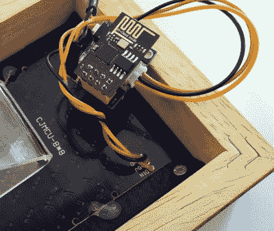

# RGB 字时钟不吝啬的特点

> 原文：<https://hackaday.com/2019/03/09/rgb-word-clock-doesnt-skimp-on-the-features/>

像大多数科技产品一样，单词钟似乎每年都在变得越来越好。随着黑客获得更好的微控制器和更强大的 LED 控制器，这些构建不仅看起来更加完善，而且获得了改进的特性和功能。对我们来说幸运的是，这些高级模块化组件的出现意味着它们也变得越来越容易制造。关于这些相似特征的一个例子，只需看看安德烈·埃尔戴的韦尔比斯就知道了。

 这款彩色字钟由 ESP8266、8×8 RGB LED 矩阵和 WS2812 RGB LED 控制器模块供电。[Andrei]使用了可以直接插入 LED 控制器的小型 ESP-01，只需要一个 3.3 VDC 的调节板就可以完成非常紧凑的电子封装。

为了防止 led 相互干扰，[Andrei]设计了一个 3D 打印网格，安装在矩阵板上。在那上面有一张纸，上面印着字母。他提到，通过简单地将同一张纸运行几次，他能够在喷墨打印机上打印出这种“模板”并获得良好的结果；每次通过时都会吸收更多的黑色墨水。从休息后视频中出现的犀利人物来看，这一招效果不错。

在组装好硬件后，[Andrei]将注意力转向了软件。我们真的认为这个项目在这里大放异彩，因为他的时钟不仅支持 NTP 通过互联网自动设置时间，还提供了一个完整的网络界面来控制各种功能，如 LED 颜色。您甚至可以直接从用户界面更改 NTP 服务器和网络配置，与将值硬编码到代码中相比，这是一种不错的方式。即使你不使用相同的硬件，如果你正在构建自己的单词时钟，开源控制软件绝对是你应该考虑的。

我们最近报道了另一个[易于构建的字钟，它使用了一个 LED 矩阵，而不是其他的全部](https://hackaday.com/2019/02/15/is-that-a-word-clock-in-your-pocket/)，但是它非常小。对于一张桌子来说，这样的尺寸更合理，但是[如果你想变得更大，你可能需要拿出激光切割机](https://hackaday.com/2018/12/26/word-clock-dont-need-no-stencil-font/)。

 [https://www.youtube.com/embed/VAJ8CCIhTg4?version=3&rel=1&showsearch=0&showinfo=1&iv_load_policy=1&fs=1&hl=en-US&autohide=2&wmode=transparent](https://www.youtube.com/embed/VAJ8CCIhTg4?version=3&rel=1&showsearch=0&showinfo=1&iv_load_policy=1&fs=1&hl=en-US&autohide=2&wmode=transparent)

