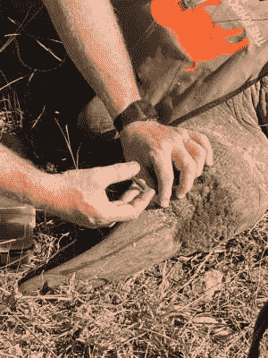

# 犀牛:通过使犀牛角具有放射性来解决偷猎问题

> 原文：<https://hackaday.com/2021/06/14/rhisotope-addressing-poaching-by-making-rhinoceros-horns-radioactive/>

毫无疑问，偷猎已经成为对现存的五种犀牛的生存威胁。即使是大多数犀牛生活的野生动物保护区也在努力保护世界上仅存的犀牛免遭肆意和残忍的偷猎。

偷猎者通常希望出售由纯角蛋白组成的角，角蛋白是构成我们指甲和头发的相同材料。在过去的几十年里，犀牛角的需求大幅增长，越南的黑市是最大的买家，主要用于发烧和其他药物，以及加工成雕刻饰品。这导致了犀牛数量的进一步减少。2017 年的统计数据显示，大约有 18000 只[白犀牛](https://ourworldindata.org/grapher/southern-white-rhinos)，剩下不到 5500 只[黑犀牛](https://ourworldindata.org/grapher/black-rhinos)。最近，随着最后一只已知雄性犀牛的死亡，非洲的北方白犀牛种群实际上已经灭绝。

显然，如果我们希望防止灭绝，我们需要处理偷猎。这里最新的建议是 Rhisotope 项目的一部分。这将使犀牛角具有放射性，但这样做将如何防止偷猎？让我们来看看。

## 防止偷猎

A rhino de-horning in progress. No horn means no poaching. (Credit: WildLifeAct.com)

偷猎行为被定义为“非法狩猎或捕捉野生动物”。在现代，这主要是指非法捕杀濒危物种。非洲农村地区大部分偷猎行为背后的驱动力是贫困。一公斤犀牛角在黑市上的价值约为 6 万美元，即使偷猎者只能从大约 3 公斤的犀牛角中获得其中的一小部分，尽管野生动物保护区的安全性越来越高，但这仍然是一个非常有利可图的风险。

这些高风险导致装备精良的偷猎者和安全部队之间的战争不断升级，悲剧性地导致双方死亡。被绳之以法的偷猎者面临最高 25 年的监禁。2013 年，一项通过在犀牛角上下毒来降低需求的尝试最终被取消了。到目前为止，在不伤害犀牛的情况下给犀牛去角是最有效的偷猎威慑手段。

然而，很明显，从每头犀牛身上取下犀牛角并不是一个理想的方法，因为它们确实用犀牛角来标记自己的领地和求偶。理想情况下，犀牛可以保留它们的角，同时也使它们不适合或不可能在黑市上被买家买到。这就是 Rhisotope 项目发挥作用的地方。这不仅会使牛角容易被全球机场和港口现有的辐射探测器追踪，而且不会影响动物本身。

## Rhisotope 项目

在约翰内斯堡威特沃特斯兰德大学(WITS)、俄罗斯核能公司 Rosatom、澳大利亚核科学与技术组织(ANSTO)和科罗拉多州立大学(CSU)以及国际科学家的合作下，Rhisotope 项目有许多目标:

1.  需求减少和号角贬值
2.  教育
3.  社区社会提升和投资
4.  犀牛研究

尽管犀牛比人类存在的时间长几百万年，但我们对这些地球巨型动物的最后残余仍然知之甚少。为了更好地保护这些动物，来自 WITS、CSU 和其他大学的科学家正在寻求了解更多关于犀牛生理学的知识。这也将有助于教育目标，该目标旨在使教师和其他人更容易纳入教育计划，教育年轻一代为什么我们需要保护犀牛免遭灭绝。

作为一个主要由贫困驱动的问题，解决贫困问题应该会大大降低当地居民的偷猎意愿。举例来说，如果一个当地农民协助偷猎一头犀牛，他们可能会得到 10，000 南非兰特，换算成美元大约是 726 美元。人们可能会认为，这并不多，但对于真正的穷人来说，这可能意味着缓慢挨饿和多年像国王一样生活的区别。

这就留下了众所周知的大象在房间里，第一点是关于角贬值。虽然当地偷猎者是问题的一部分，但有一个犯罪组织和黑市交易的国际网络，不仅涉及犀牛角和象牙，还涉及其他非法和高利润的商品。这个想法是让犀牛角对这些组织失去吸引力，从而减少需求。

这就是放射性同位素发挥作用的地方。

## 从罪犯到恐怖分子

Stable isotopes being injected into the horn of a rhino. (Credit: Rhisotope project)

正如在 [Rhisotope project 脸书页面](https://www.facebook.com/Rhisotope/)上详细描述的那样，向犀牛角注射放射性同位素(放射性同位素)的第一步已经开始，注射的是第一批稳定同位素。这样做的目的是观察这些材料在喇叭中的表现。

作为一个研究项目，它汇集了野生动物专家和放射性同位素专家的专业知识和技能，以回答几个基本问题:

*   犀牛角中的同位素有多稳定？
*   哪种放射性同位素可能最合适？
*   它是如何从屈指可数的犀牛扩大到数万头的？

这些辐射不足以对动物造成任何伤害。但是通过非法渠道走私犀牛角变得更加困难，因为泄露秘密的放射性特征很难隐藏。

据推测，将被挑选的放射性同位素将是伽马或贝塔辐射源，因为这些辐射源比阿尔法(大氦原子)辐射源更难阻挡。这种辐射会让喇叭和任何装它的集装箱点亮世界各地边境和港口使用的任何辐射探测器上的圣诞树。

从本质上讲，这将使走私这些放射性犀牛角与通过检查站走私浓缩铀或钚一样具有吸引力。自 2001 年美国遭受恐怖袭击以来，对放射性物质的检查变得更加严格，这在 2002 年国际刑警组织、欧洲刑警组织和国际原子能机构关于在边境检测放射性物质的 PDF 文件中有详细说明。

## 没有简单的解决方案

解决偷猎问题并不容易。虽然 Rhisotope 项目的多重目标应该给它一个很好的机会来解决手头的许多问题，但最终我们谈论的是解决贫困和国际犯罪组织。这两个问题都不是新问题，更不用说容易解决了。

也许在每个犀牛角上绑上相当于 GPS 追踪器的放射性同位素的想法会使走私犀牛角变得没有吸引力。但这是难以预测的事情。

对角的需求似乎在增加。当对话[询问越南人](https://theconversation.com/we-asked-people-in-vietnam-why-they-use-rhino-horn-heres-what-they-said-116307)关于购买和使用犀牛角制品的问题时，很明显，目前阻止人们购买这些产品的方法是无效的。总的来说，购买者并不关心犀牛的困境，他们也不相信食用犀牛角就像咬自己的指甲一样具有药用价值。对他们来说，这些产品的奢侈地位和普遍利益比这些事实更重要。

## 时间不多了

也许 Rhisotope 项目最悲惨的一面是，这可能是我们拯救这些动物免于灭绝的最后一次尝试。专家预测非洲犀牛数量将在十年内全面崩溃，这不是一个我们可以在几年后查看情况是否有所好转的问题。这意味着不仅要对付偷猎，还要找到人类和其他动物种群能够和平共处的方法。

犀牛发现自己的栖息地越来越少，受到偷猎者和战利品猎人的威胁。也许再过几年，我们就会发现自己不仅要告别最后一头犀牛，还要告别最后一头非洲象、最后一头 T2 长颈鹿和许多其他标志性动物。

对于今天的这一代人来说，这可能是一个必须思考的时刻，当被问及为什么我们让所有这些动物灭绝时，该如何告诉自己的孩子和孙子。我们可能还有几年，也许最多几十年，但是看着急剧下降的人口数量，毫无疑问，除非我们今天就采取行动，否则这些物种的灭绝是不可避免的。

作为 Rhisotope 项目的一部分，William Fowlds 博士安慰一头犀牛。鸣谢:Rhisotope 项目)