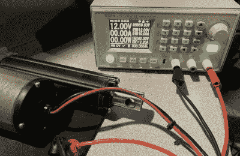
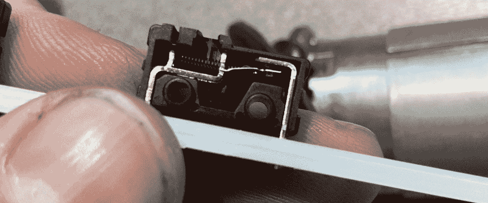

# 乘式割草机修理揭露微型罪犯

> 原文：<https://hackaday.com/2021/06/04/riding-mower-repair-uncovers-miniature-culprit/>

如果他们花了 4000 美元购买的割草机在拥有的第一年内出现重大故障，大多数人都会感到非常沮丧。但对于[xxbiohazrdx]来说，这是一个偷窥引擎盖下的借口，并找出是什么导致了这个最先进的景观齿轮。

应该说，至少从技术上来说，有问题的 Husqvarna TS 348XD 仍在工作。只是[xxbiohazrdx]注意到锁止差速器，这是在丘陵地形上保持牵引力的关键，当按下开关时，它似乎没有做任何事情。由于手动移动变速器上的接合杆会像预期的那样锁住差速器，所以问题很可能出在电子设备上。

Testing the dead actuator.

正如[xxbiohazrdx]所解释的，仪表板上的开关连接到一个线性致动器，该致动器移动变速器上的杆。用万用表测试线路和开关没问题，但是当执行器连接到工作台电源时，它不动了。更能说明问题的是，它没有消耗任何能量。绝对不是好兆头。安装一个新的致动器可以解决这个问题，但这是一个昂贵的部件，需要时间才能到达。

修复失灵的致动器看起来至少值得一试，所以[xxbiohazrdx]打开了它。PCB 看起来很好，没有明显的烤焦的元件。但是当一个用来限制致动器行程的内部微型开关被卡住时，一切都开始变得有意义了。当开关锁定在闭合位置时，致动器认为它已经完全伸出，不会移动。打开开关，将触点弯回到适当的位置后，一切都如预期的那样工作了。

A tiny piece of bent metal kept this $4,000 machine from operating correctly.

尽管这一步一步的修复过程很有趣，但最让我们震惊的是[xxbiohazrdx]决心修复而不是更换。在某些情况下，用一个新的零件替换掉一个损坏的零件会容易得多，但是相反，可疑的零件被仔细检查，并用手边的工具和材料哄着恢复了生命。

虽然有很多人不介意在等待替换零件到达时从草坪工作中休息几天，但不是每个人都负担得起这种奢侈。当你的生计依赖于你的设备时，快速维修是至关重要的，这就是为什么[制造商让农民修理拖拉机变得更加困难和昂贵](https://hackaday.com/2020/03/09/john-deere-and-nebraskas-right-to-repair-the-aftermath-of-a-failed-piece-of-legislation/)已经成为全球维修权利斗争中的一个[重大问题。](https://hackaday.com/2020/04/21/right-to-repair-tractor-manufacturers-might-have-met-their-match-in-australia/)