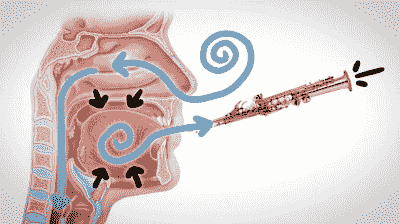

# 用 DIY 风笛迎接新年

> 原文：<https://hackaday.com/2021/12/23/ring-in-the-new-year-with-diy-bagpipes/>

还记得早期在疫情，人们外出时会穿上防护服，只穿上防护服，戴上橡胶手套去杂货店吗？只有我们吗？关键是，我们肯定不是唯一一个橡胶手套过剩的人，除了通常的用途——在家里做粗活，制作手形冰块，橡胶手套的用途少得可怜。

 好吧，这里有一个更有趣的东西:DIY 风笛。不管你对风笛发出的声音有什么感觉，风笛的工作方式都非常有趣。在插播的视频中，【查理·恩格尔曼】[向我们展示了它们是如何工作的](https://www.youtube.com/watch?v=y95I0rb1JoU)，并将它们比作萨克斯手肯尼·基的小爵士嘴。

你看，G 先生可以循环呼吸，这意味着他可以保持一个音符，只要他想。基本上，他能够在嘴里保持一定的空气储备来弹奏乐器，同时吸入新的空气。

如果我们把这个带回风笛，这个膀胱就类似于肯尼·基的嘴。它总是包含空气，所以它通过竖起的声音管道不断释放空气。在手套管的情况下，手套是膀胱，管是由吸管制成的。休息过后来看看吧——我们认为这种声音比真正的风笛更容易忍受。

[在](https://hackaday.com/2020/03/30/diy-bagpipes-made-from-common-household-items/)之前，我们见过用普通家居用品制作的风笛(如果你认为几个塑料录音机是普通家居用品的话)，在[我们也见过真正的风笛变成机电式](https://hackaday.com/2017/05/05/hackaday-prize-entry-electro-magnetic-enabled-bagpipes/)。

 [https://www.youtube.com/embed/y95I0rb1JoU?version=3&rel=1&showsearch=0&showinfo=1&iv_load_policy=1&fs=1&hl=en-US&autohide=2&wmode=transparent](https://www.youtube.com/embed/y95I0rb1JoU?version=3&rel=1&showsearch=0&showinfo=1&iv_load_policy=1&fs=1&hl=en-US&autohide=2&wmode=transparent)

谢谢你的提示，[基思]！