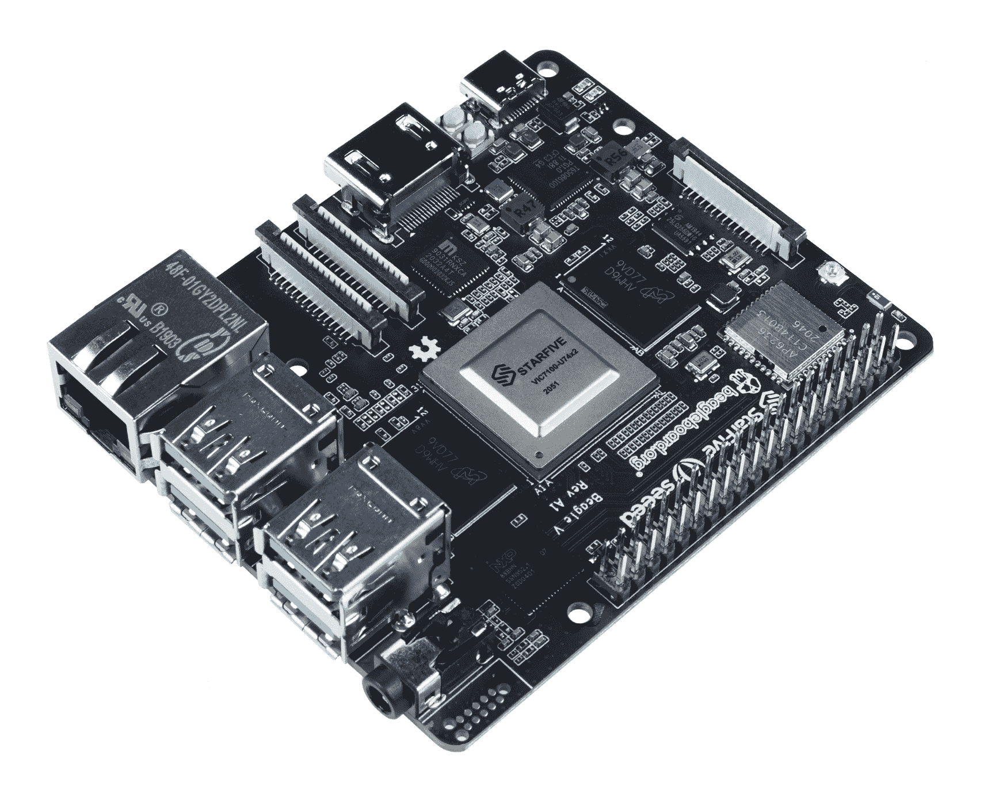

# RISC-V 随着即将到来的 Beagle V SBC 加入 BeagleBoard 生态系统

> 原文：<https://hackaday.com/2021/01/14/risc-v-comes-to-the-beagleboard-ecosystem-with-upcoming-beaglev-sbc/>

Beagle V 是一款基于 RISC-V 的单板计算机，由 BeagleBoard 和 Seeed Studios 合作开发，旨在成为“第一款运行 Linux 的经济型 RISC-V 计算机”。RISC-V 是每个人都感兴趣的开源处理器架构，因为它绕过了英特尔或 AMD 等制造商的专有硅，允许公司推出自己的硅处理器，而无需支付核心许可费。

BeagleBoard 长期以来一直是单板计算机领域的主要玩家之一，迄今为止由 Raspberry Pi 主导。该主板比该公司以前的产品略大，具有一个 StarFive 双核 64 位 RISC-V 处理器，运行速度为 1.0 GHz。[GitHub repo 上的规格表](https://github.com/beagleboard/beaglev/blob/main/BeagleV_Info.pdf)显示了 4 GB 和 8 GB RAM 选项，内置 WiFi 和蓝牙，支持解码的硬件视频，两个摄像头连接器，一个用于外部显示器的 DSI 连接器，以及一个全尺寸 HDMI 端口。千兆以太网、四个 USB-3 端口、一个音频插孔和作为电源的 USB-C 封装在主板的边缘。GPIO 路由至 2×20 引脚接头。

Seeed Studio [将 8 GB RAM 版本的主板成本定为 149 美元](https://www.seeedstudio.com/BeagleV-p-4828.html)，尽管目前在这个早期阶段，你必须申请并被选中才能购买主板。尚不清楚首次运行后价格是否会保持不变；产品页面指出优惠券代码是必要的，并且[Seeed 工作室的文章](https://www.seeedstudio.com/blog/2021/01/13/meet-beaglev-the-first-affordable-risc-v-single-board-computer-designed-to-run-linux/)指出这是一个介绍性的价格。然而，同一篇文章还列出了 119 美元的 4 GB 内存版本。BeagleBoard 页面显示了 2021 年 4 月“社区试运行”的时间表。

看到 RISC-V 继续取得进展令人兴奋。这是一个基于核心的强大主板，如果成功，它将有助于进一步证明开源处理核心在日益主流的产品中的可行性。