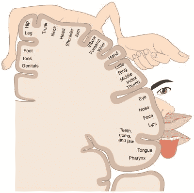

# 工会机器人的崛起

> 原文：<https://hackaday.com/2018/12/20/rise-of-the-unionized-robots/>

机器人第一次加入了工会。这不应该太令人惊讶，因为欧盟的一项决议已经建议为机器人创造一种法律地位，以承担责任，而且机器人已经成为一个国家的公民。自然，这样做要么是为了在现实到来之前激发讨论，要么是作为宣传噱头。

在机器人获得与人类相似的法律地位之前，现实是什么样的？为此，我们可以看看小说。

钢铁侠电影中的虚构主角托尼·斯塔克有一个名为 Dum-E 的机器人，它比工业机器人手臂大不了多少。然而，斯塔克使用自然语言与它互动，当斯塔克在使用灭火器不必要的喷洒斯塔克后责骂它时，它显然有感情，这从它的姿势和悲伤的声音中可以看出。在一部电影中，Dum-E 一边发出同情的声音，一边救了 Stark 的命。当 Stark 让 Dum-E 为一些无法解释的越轨行为戴上帽子时，Dum-E 似乎通过向 Stark 开枪来报复。因此，虽然 Dum-E 是一个能够对自然语言做出反应的机器人助手，我们相信 Hackaday 读者会喜欢在我们的研讨会上拥有它，但它也有情感，并根据自己的意志采取行动。

这里有一个练习，试图找到一个工具和一个机器人之间的界限。

## 将工具带入生活

理想情况下，机器人会提供一些我们还没有的东西，例如，精确度或超人的力量。当你想一想，我们已经有了这些工具。我们给一台数控机床一个 DXF 文件，设置好它，当我们在它旁边做其他事情时，它就开始工作，也许是焊接电路。但是如果我们不给它精确的步骤，数控机床什么也做不了。

更接近的是像 Festo 机器人一样的机械臂助手，它可以在你做其他事情或者你们一起做一些事情的时候做一些事情。但是，这些机器人手臂的动作要么是编程的，要么是通过你移动它来学习的，因为它记录了运动。同样，工厂里的机器人都严格遵循预先编程的步骤。

但是如果机器人像拟人化的机器人一样引起了人们的同情呢？加入工会的机器人就是这样做的。这是一个名为“胡椒 T2”的大致人形机器人，由软银机器人公司大规模生产，用于零售和金融场所。它有一张带眼睛的脸和嘴巴的样子。它还会说话，并对自然语言做出反应。所有这些导致许多顾客将其拟人化，像对待人类一样对待它。

然而，作为程序员和硬件开发人员，我们知道将机器拟人化或像对待宠物一样对待它是没有根据的反应。这发生在 Pepper 身上，但我们之前也讨论过[如何发生在 Boston Dynamics 的四足动物和星球大战](https://hackaday.com/2017/10/09/our-reactions-to-the-treatment-of-robots/)中的 BB-8 身上。即使机器人使用最新的深度神经网络，学习以一种我们无法完全解释的方式做事情，就像我们可以解释一个`for`循环如何运行一样，它仍然只是一台机器。关闭机器人甚至拆卸它都不会引起伦理上的困境。

但是，如果机器人从工作中获得收入，并且这种收入是它支付电池充电费用的唯一方式，那会怎么样呢？当然，我们一直在给电钻电池充电，如果电钻无法完成工作，不再充电也不存在道德上的两难问题。

Homunculus: sensory mapping on our brain, by OpenStax College CC BY 3.0

如果机器人有自我意识，有内心独白会怎样？这种同情会开始被证明是正当的吗？编码器和拉伸传感器会告诉它四肢的位置。触摸和热传感器将被映射到自身的内部表示上，就像我们大脑皮层中的侏儒一样。触摸一个表面会改变它内心的独白，把它的注意力吸引到新的感觉上。太热会打断独白，作为疼痛的信号。电池电量低会给人一种饥饿和恐慌的感觉。这种自我意识和持续不断的内心独白是否让它与一个人类几乎没有区别？套用笛卡尔的话，它思故我在。

对于许多业余读者来说，上述描述听起来一点也不新奇。许多机器都有传感器、反馈回路、报警状态和内部状态机。他们从创造者那里得到的唯一同情是创造的骄傲。

当然，机器人仍然会遗漏难以捉摸的意识概念。有些人会争辩说，一旦你有了内心独白，那么意识就变成了我们告诉自己存在的东西。但这一争论远未解决。如果你信教，那么你可以说机器人没有灵魂，从定义上来说，它永远都没有灵魂。取决于你的思想流派，一个机器人可能永远不会保证同情或工会卡。

但是，尽管机器人目前没有生命或不死，但这并没有阻止一个国家授予一个公民身份。

## 沙特阿拉伯授予索菲亚公民身份

你可能见过汉森机器人公司制造的[索菲亚](https://www.hansonrobotics.com/sophia/)。它最著名的一次亮相是在《今夜秀》节目中，它与主持人吉米·法伦进行了一次对话，并在一场石头剪刀布的游戏中打败了他。

索菲亚是一个社交机器人，旨在使用自然语言处理与人互动，阅读情感([我们在](https://hackaday.com/2016/11/17/raspberry-pi-robot-that-reads-your-emotions/)之前已经在黑客中看到过)，并阅读手势。回复由他们的文字团队提供，并通过对话系统即时提供。它也有一张表情丰富的脸，并用手做手势。

 [https://www.youtube.com/embed/EETf0LLNk0I?version=3&rel=1&showsearch=0&showinfo=1&iv_load_policy=1&fs=1&hl=en-US&autohide=2&start=4817&wmode=transparent](https://www.youtube.com/embed/EETf0LLNk0I?version=3&rel=1&showsearch=0&showinfo=1&iv_load_policy=1&fs=1&hl=en-US&autohide=2&start=4817&wmode=transparent)

作为众多公开露面之一，索菲亚在沙特阿拉伯首都利雅得举行的 2017 年未来投资倡议峰会上接受了采访。随后，采访者宣布索菲亚刚刚被授予第一个机器人的沙特公民身份。显然，这是一个宣传噱头，但不太可能有人会想到将它授予波士顿动力公司的 SpotMini，这是一个遥控但半自动的四足机器人，也出席了峰会。这意味着机器人至少给人留下了一种印象，即它们正在接近更像人类的东西，无论是外观还是行为。

## 欧洲机器人民法规则

每个人都听说过人工智能及其物理表现形式机器人将如何取代我们的工作。不管这是否会发生，1917 年~~2017 年~~欧洲议会通过了一项名为[机器人民法规则](https://www.mccarthy.ca/en/insights/blogs/cyberlex/europeans-express-positive-views-ai-and-robotics-report-preliminary-results-public-consultations)的决议，提出了管理人工智能和机器人的规则。该决议的大部分内容都非常具有前瞻性和相关性，涵盖了数据安全性、安全性和责任等问题。然而，其中一段写道:

> f)为机器人创造一种特定的法律地位，以便至少最先进的自主机器人可以被确立为具有电子人的地位，具有特定的权利和义务，包括赔偿它们可能造成的任何损害，并在机器人做出明智的自主决定或以其他方式独立与第三方互动的情况下适用电子人格；

然而，从长远来看，这种法律地位是为了未来的期望，如果机器人有一天需要它的话。这种地位将使人们更容易确定在财产损失或人身伤害的情况下谁应承担责任。

## 从长远来看，这有关系吗？

很难说机器人是否值得加入工会或被赋予人格。如果我们再次从小说中汲取灵感，电视剧《终结者:莎拉·寇娜编年史》的一个主题是，当机器人变得和我们一样时，这个问题可能会简单地消失。另一方面，埃隆·马斯克的解决方案是逐渐让我们变得更像他们。与此同时，我们将满足于一个半智能车间机器人能够精确和超人的力量。