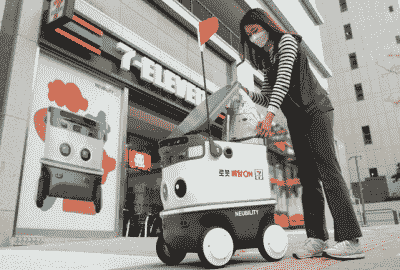

# 机器人送货上门

> 原文：<https://hackaday.com/2021/12/29/robot-delivery-to-your-door/>

虽然网上购物在南韩已经很流行了，但是随着疫情期间人们更多的呆在家里，网上购物变得更加流行了。一些机器人送货服务已经在城市周围推出，例如使用 neubibility 的 Neubie 机器人的 [7-Eleven，使用 LG 的 CLOi ServeBot](https://koreajoongangdaily.joins.com/2021/11/22/business/industry/7eleven-automatic-driving-robot-delivery-robot/20211122181507714.html) 的 [GS25 便利店，以及使用 Delidrive 机器人的](http://www.koreaherald.com/view.php?ud=20210613000176) [Baemin 食品配送服务](http://m.koreaherald.com/view.php?ud=20211215000742)。

不管你喜不喜欢，在首尔这样人口密集的大城市，绝大多数人都住在公寓里。这非常适合这些机器人送货项目。事实上，这些试点项目中的许多只在一个公寓楼中可用，该公寓楼可以由十至二十栋 15 层以上的建筑组成。当只处理一个校园时，训练你的机器人在人行道上导航、操作门、呼叫电梯和按响客户的家庭对讲机是一项更容易的任务。

一些项目更加雄心勃勃，比如在延世大学松岛市校区运行的另一个神经系统。你可以点炸鸡，然后让一个机器人送货上门，它会沿着人行道以每小时 5 到 6 公里的速度送到你的住处。首先，政府法规没有完全跟上技术的发展。这些服务基本上是按个案操作，暂时豁免的基础上。他们不允许在街道上行驶，在人行道上行驶时，他们必须避免撞到人。

我们去年写了一个原型 [RC 卡车运送系统](https://hackaday.com/2020/09/04/autonomous-off-road-food-delivery-with-pixhawk/)，也涵盖了[亚马逊无人机](https://hackaday.com/2021/07/15/amazon-drones-dont-go-far/)和[自动化货物运送](https://hackaday.com/2019/06/17/automate-the-freight-autonomous-delivery-hits-the-mainstream/)。这些都显示出前景，但还不是主流。你的绝大部分订单还是一个人送的。这些自动化送货服务最终会取代人类吗？请在下面的评论中告诉我们你的想法。