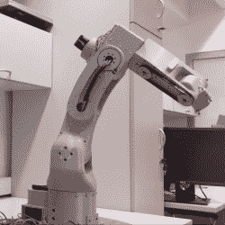

# 机械臂运动工业设计，3D 打印摆线齿轮

> 原文：<https://hackaday.com/2020/08/14/robotic-arm-sports-industrial-design-3d-printed-cycloidal-gears/>

【Petar CrN JAK】的 [Faze4 是一款开源机械臂](https://hackaday.io/project/167247-faze4-robotic-arm)，拥有 3D 可打印部件，部分灵感来自工业机械臂的设计。特别是，[Petar]旨在尽可能隐藏手臂内部的布线和电缆，结果看起来很棒！只需在下面的视频中观看它的移动。

摆线齿轮箱已经越来越多地出现在机械臂项目中，Faze4 很好地利用了它。为什么是摆线齿轮？它们很容易进行 3D 打印，并且具有较低的反冲，这使得它们对机器人应用很有吸引力。也没有必要从头开始设计摆线齿轮。【Petar】发现[on shape](https://forum.onshape.com/discussion/7567/cycloidal-gear-generator)中的这个摆线齿轮发电机在设计 Faze4 时极其有用。

该项目的 GitHub 库有所有的设计文件，以及一些视频演示和一个链接，可以链接到任何想自己制作的人的组装文档。观看 Faze4 在下面嵌入的视频中进行一些测试动作。

 [https://www.youtube.com/embed/-qTVx23o6C0?version=3&rel=1&showsearch=0&showinfo=1&iv_load_policy=1&fs=1&hl=en-US&autohide=2&wmode=transparent](https://www.youtube.com/embed/-qTVx23o6C0?version=3&rel=1&showsearch=0&showinfo=1&iv_load_policy=1&fs=1&hl=en-US&autohide=2&wmode=transparent)

摆线齿轮箱与行星齿轮和应变波齿轮有相似之处，看起来很迷人。查看我们之前的报道，了解更多关于它们是什么以及如何工作的信息。