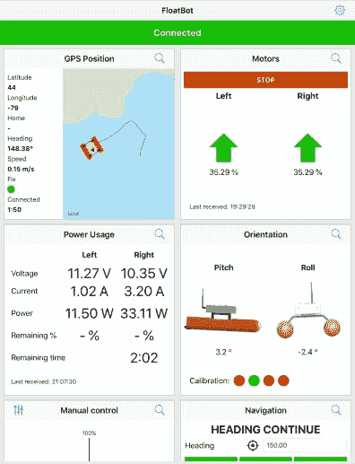

# 机器人船高高地骑在 PVC 管浮桥上

> 原文：<https://hackaday.com/2022/04/10/robotic-boat-rides-high-on-pvc-pipe-pontoons/>

如果你想建造自己的漫游者，有很多便宜的遥控卡车可以提供可使用的底盘。想用定制的无人机在空中飞行吗？由于第一人称视角(FPV)飞行的巨大普及，你会发现几乎无限多种负担得起的固定翼和四轴飞行器平台可供选择。但是当谈到机器人船只时，交钥匙选项就不那么多了；这些玩具都太小了，而且商业选项的价格是为那些有 R&D 预算的实体制定的。对于业余水上探险家来说，创造力是游戏的名字。

就拿[这艘由【韦斯古德】](https://imgur.com/gallery/1ftuOgl)建造的令人印象深刻的船来说吧。通过安装在一对浮桥上的 3D 打印电子外壳，该浮桥由五金店提供的廉价 4 英寸 PVC 管制成，它提供了一个稳定的平台，而不会破产。内置在管道印刷尾盖中的商用喷气式驱动装置提供推进力，并允许飞行器通过不同的推力进行操纵。没有舵或暴露的螺旋桨，这种设计特别适合在浅水中操作。

A removable electronics tray allows for easy access.

电子箱位于水面上方，包含一个 Raspberry Pi 2、BU353 USB GPS 接收器和一个 Arduino Mega 2560，搭配一个定制 PCB，提供方便的端口来连接双通道 Cytron 3 amp 电机驱动器和 Adafruit BNO055 9-DOF IMU。电力由安装在浮桥底部的两个 6，000 mAh LiPo 电池提供，一对匹配的 Adafruit 电流/电压传感器用于跟踪能量预算。一个带有外部天线的小型 USB WiFi 加密狗插入到 Pi 中，提供了一个 WiFi 网络，[wesgood]可以通过 iPad 连接到该网络进行控制。

如果飞行器的控制软件看起来特别完美，那可能是因为[韦斯古德]恰好是一名专注于移动应用的专业开发人员。虽然我们对使用 WiFi 进行重要的长途连接有点怀疑，但我们不能否认 iPad 允许非常光滑的界面。除了显示飞行器各种系统的状态，它还允许用户手动控制或为自主导航设置航路点——尽管听起来最后一个功能现在只是部分实现了。

    

我们喜欢这个设计，并渴望看到更多的项目发展。最近[wesgood]试验了可以悬挂在电子箱底部的[有效载荷，特别是用于执行水深观测的声纳模块。人们对内陆水道的众包深度图相当感兴趣，能够可靠地自主绘制这些区域的机器人船](https://imgur.com/gallery/MmZrHlf)[肯定比必须手动收集数据](https://hackaday.com/2021/09/06/homebrew-sounder-maps-the-depths-in-depth/)更进了一步。