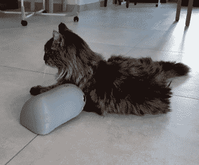

# 为猫制造的机器老鼠玩具

> 原文：<https://hackaday.com/2020/08/28/robotic-mouse-toy-built-for-cats/>

猫是大自然天生的猎手。无论是啮齿动物、昆虫还是激光，它们都会毫不留情地突袭和攻击。Sourino 是为了挑战一只猫而制造的，或者仅仅是为了逗逗它，它是一只用普通现成零件制造的机器人老鼠。

A test subject appears unamused.

该项目由索里斯(法语中“鼠标”的意思)和 Arduino 组合而成，由 Arduino Nano 驱动。连接了三组超声波传感器，与仅使用单个传感器相比，这种机器人鼠标的避障能力大大提高。这个机器人可以轻松地通过基本的迷宫或家庭地板。一对齿轮马达用于驱动，使用简单的滑动转向来转弯。这一切都封装在一个 3D 打印的外壳中，其中安装了各种组件，并暴露了超声波传感器。甚至有一个红外遥控启用模式选择或完全手动控制。

虽然“机器人”缺乏普通家鼠的速度和灵活性，但它仍然是一个教授大量宝贵经验的项目。我们确信[Electrocat01]在机器人导航、机械设计和 3D 打印方面学到了很多技能。正如我们之前看到的，创造机器老鼠实际上是一个竞争激烈的领域。休息后的视频。

 [https://www.youtube.com/embed/rkD5clHDkn4?version=3&rel=1&showsearch=0&showinfo=1&iv_load_policy=1&fs=1&hl=en-US&autohide=2&wmode=transparent](https://www.youtube.com/embed/rkD5clHDkn4?version=3&rel=1&showsearch=0&showinfo=1&iv_load_policy=1&fs=1&hl=en-US&autohide=2&wmode=transparent)

