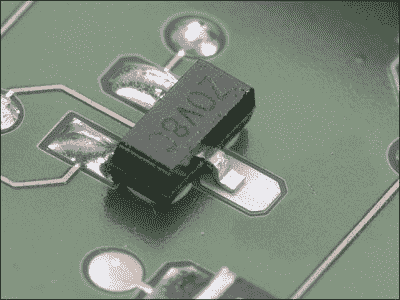

# 罗德与施瓦茨 FSIQ 信号分析仪中频滤波器模块维修

> 原文：<https://hackaday.com/2022/01/12/rohde-schwarz-fsiq-signal-analyzer-if-filter-module-repair/>

当浏览易贝或类似网站时，谁会忍不住抢购一件非常昂贵的实验室测试设备呢？也许当你浏览旧货市场时，它会给你悲伤的眼神。通常，这种设备因为有缺陷而廉价出售，但是只要稍加注意，就可以起死回生。这就是为什么罗伯托·巴里奥斯(Roberto Barrios)最终拥有一台罗德与施瓦茨 FSIQ 7 信号分析仪[在他的住处闲荡了几个月，直到他把它修好](https://rbarrios.com/projects/fsiq/)。

See anything wrong with this picture?

修复的一部分是用一个用过但工作正常的替换物替换一个损坏的 RF 转换器模块(A160 IF-Filter ),但这使设备出现了奇怪的校准故障。在追查原因的过程中，[Roberto]拍摄了许多 PCB 两面的高分辨率图像，以便对电路进行逆向工程。更复杂的是，校准结果表明该装置的过滤器在启动时是正常的，但几分钟后就会出现偏差。

在将过滤器模块扩展到外壳外工作并试验性地使用热风枪后，最终发现原因是一个未焊接的衬垫。考虑到故障的原因非常简单，在生产替换模块时，R&S QA 似乎有一天不在状态。如果说这里有什么教训的话，那就是简单的目视检查有时是解决硬件问题所需要的。

你有哪些[昂贵的齿轮维修故事](https://hackaday.com/2021/06/04/riding-mower-repair-uncovers-miniature-culprit/)？你学到了哪些可以节省他人时间的东西？