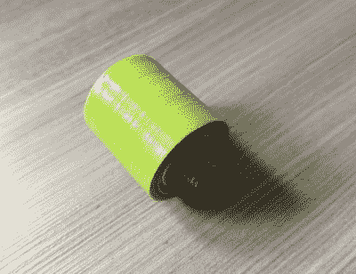

# 滚动你自己的暴走鞋

> 原文：<https://hackaday.com/2020/09/17/roll-your-own-heelys/>

还记得暴走鞋的高跟鞋吗？抬起你的脚趾，就可以走了。我们至少比目标人群大 10 或 15 岁，但还是买了一双，只是为了取悦我们内心的孩子，找点乐子。小孩子们会穿着它们到处跑，在商店里跑来跑去，让除了其他小孩子之外的所有人都感到烦恼。我们可以想象一些店主在进门时就能发现这些东西，从而将滑冰派对扼杀在萌芽状态。

【DevNerd】已经构思出终极计划:[如果你自己做暴走鞋，没人一定要知道，除非你开始在](https://www.instructables.com/id/DIY-3D-Printed-Heelys/)身边打滚。[DevNerd]首先在一双 Air Jordans 的底部切割一些 20 毫米深的大洞，并打印出一个坚固的轮子和一个支撑框架。

每个轮子的两端都有一个在螺杆上旋转的轴承。我们不确定为什么[DevNerd]使用螺纹杆，因为这似乎会过早地磨损框架盒。

不想割破你的鞋子，但想要一些甜蜜的轮滑鞋在每天的通勤中穿过大厅？你可以用托盘木制作它们。