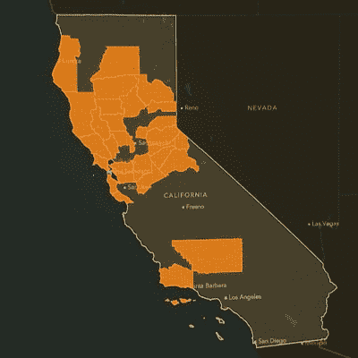

# 加州电网轮流停电是怎么回事？

> 原文：<https://hackaday.com/2020/08/31/rolling-blackouts-in-california-again/>

在一年中的这个时候，热浪席卷美国西海岸的大部分地区并不奇怪，但随着气候变化的副作用变得更加明显，近年来这些热浪的频率和严重性越来越严重。为了应对这种情况，随着电力需求的增加，加州的电网运营商已经制定了有限的轮流停电措施。

这也不是加州第一次遭遇选择性停电。加州的电网特别容易出现这样的问题，既有工程问题，也有其他不太明显的问题。

## 基础设施:一个老问题

电网的物理问题很简单，通常被作为几乎被遗忘的老化基础设施系统整体问题的背景噪音的一部分。在北美的大部分地区，电网以及道路、桥梁、供水和污水处理系统、机场和几乎任何其他基础设施都主要是在二战后的战后繁荣时期建造的，然后在接下来的几十年里基本上都烂掉了。保持所有基础设施的运行需要大量的维护，但也需要政治资本和意愿来确保容易遗忘的事情不会被遗忘。因此，几乎所有基础设施的维护预算都被大幅削减，导致近年来发生了几起重大灾难，以及无数的小麻烦，这些都只是预示着即将到来的缓慢崩溃。

美国西海岸的电网也不例外。第二次世界大战后，加利福尼亚经历了人口激增，这种情况一直持续到今天。大多数基础设施问题，就像这个国家的其他地方一样，只是在整个系统勉强升级以满足需求时才得到修补。任何曾经在拥挤的交通中在加州主要城市的道路上开车的人都会证实这种现状。当基础设施已经不堪重负时，再有一根稻草就能压垮骆驼。这根稻草是 2018 年的[营地火灾，虽然不是第一次也不是最后一次由电线问题引起的野火，但却是最具破坏性的一次。除了造成至少 85 人死亡和烧毁 153，336 英亩土地之外，这场火灾还导致加州(和美国)最大的能源公司 PG & E 破产，该公司仍在努力恢复。](https://en.wikipedia.org/wiki/Camp_Fire_(2018))

Map of 2019 California rolling blackouts [as reported by Bloomberg](https://www.bloomberg.com/news/videos/2019-10-09/pg-e-blackouts-spread-across-northern-california-video)

事实上，这些停电并不是自从营火以来加州第一次(也可能是最后一次)停电。去年，由于火灾风险增加，北加州在大约一个月的时间里实施了一波轮流停电。这些最近的停电并不新鲜，除非对电网进行重大检修，否则它们很可能会持续下去。

下垂的电线可能是你以前没有考虑过的火灾风险，但它是电网运营商目前面临的威胁之一。今年，随着人们越来越多地使用空调，加州更加炎热干燥的夏季给电网带来了额外的压力。然而，压力电网上的更多电力意味着电线中的更多电流，这意味着更多的电阻损耗，这意味着电线因热量而膨胀更多(更不用说热浪本身增加的环境热量)，它们可能会凹陷到树木和其他障碍物中，特别是如果通行权没有得到认真维护的话。这是一个恶性反馈循环，将紧张的电网置于容易引发火灾的境地，但也是像 2003 年东北大停电这样的大规模级联故障的处方。尽管如此，升级电力基础设施的努力进展缓慢或者根本不存在。这就是我们可以开始看到其他非工程问题出现的地方，这些问题可能会更糟。

## 电网运营商了解历史

大多数[关于最近轮流停电](https://www.nytimes.com./2020/08/16/business/california-blackouts.html)(付费墙警告)的报告表明，电网并没有以必要的容量运行，然而，也许是出于对热浪和加州电力线引发火灾的历史的充分谨慎，系统运营商决定暂时减少电力。在加州推动将更多的能源组合转移到可再生能源的同时，还有其他关于因风力不足而突然失去发电能力的[报告，然而系统运营商通常会随时准备好备用发电，如燃气轮机、水电站或其他发电厂，而不是诉诸滚动停电。虽然突然失去风力可能是造成问题的原因，但这不应该需要停电来解决，而且加州依赖的风力也不应该是他们第一次看到这样的问题。](https://www.msn.com/en-us/news/us/who-turned-off-the-lights/ar-BB188jnP)

这里需要注意的是，加州电网的运营商是加州独立系统运营商(CAISO ),这是一家控制大规模电力传输系统的非营利机构，实际上并不是一家电力公司，也不负责任何能源生产。加州有这样一个系统的原因很复杂，但可以追溯到 90 年代各种立法的通过，联邦能源监管委员会(FERC)的成立，以及大约 15 年来的其他几次政治行动。并非每个州或地区都有像加州那样的独立运营商，但由于 FERC 的这些要求，加上安然丑闻，大多数运营自己的大容量输电系统的公用事业公司至少必须独立运作。虽然没有直接卷入安然公司所知的更大的会计丑闻，但他们在 21 世纪初导致加州又一轮轮流停电中扮演了重要角色。

很容易从两个角度看待最近的停电事件，一个是需要解决的简单工程问题，另一个是更广泛的历史和法律问题的一部分，这个问题在加州已经存在了几十年，并将无限期地继续下去，特别是在气候变化的影响越来越明显的情况下。事实上，加州已经开始了今年的野火季，这仅仅是个开始，无论是火灾还是该州电力公司的问题。