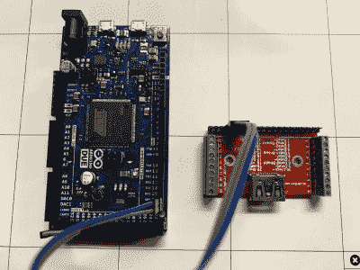

# 用 Arduino 在亚马逊 Fire TV Cube 上扎根

> 原文：<https://hackaday.com/2018/11/07/rooting-the-amazon-fire-tv-cube-with-an-arduino/>

亚马逊可能不会对此感到高兴，但他们的 Fire TV Stick 的成功至少有一部分是由于围绕 Android 驱动的设备出现的大规模黑客攻击和修改场景。在 YouTube 上快速搜索“Fire Stick Hack”将会出现一系列看似无穷无尽的视频，有些视频的浏览量高达数百万，这些视频将向观众展示如何在这个小媒体加密狗上安装非官方软件。现在看来，他们最新的媒体设备 Fire TV Cube 开始吸引同样的关注。

【exploitee . RS】的团队最近公布了他们的研究，该研究表明新的 Fire TV Cube 只需一个 [Arduino 和一根你愿意拆开的 HDMI 电缆](https://blog.exploitee.rs/2018/rooting-the-firetv-cube-and-pendant-with-firefu/)就可以扎根。当然，这比那要复杂得多，但是在他们提供的视频和他们的 WiKi 之间，看起来所有的信息对任何想打开自己的魔方的人来说都是存在的。如果这让你上了亚马逊淘气鬼名单，不要惊讶。

该过程首先将器件的 Amlogic S905Z 置于器件固件升级(DFU)模式，通过 HDMI 端口的 I2C 接口向电路板发送字符串“boot@USB”即可。这就是 HDMI 电缆的用武之地:你可以切开一根，直接连到你的 Arduino 上，运行[Exploitee.rs]提供的草图来发送适当的命令。当然，如果你想变得有趣，你可以使用 HDMI 分线板来代替。

当主板处于 DFU 模式时，您可以读写设备的 eMMC 闪存，但这并不能完全让您进入，因为仍然有安全引导需要应对。但随着这些事情的发展，该团队能够识别第二个漏洞，该漏洞可以与 DFU 模式结合使用，以欺骗设备禁用签名验证。现在有了在 Fire TV Cube 上运行未签名代码的能力，[Exploitee.rs]实现了 fastboot，使其更容易将定制的根固件映像刷新到硬件。

就像之前的 Fire TV Stick 一样，[当你关闭一个设备的安全功能时，确保你了解其中的风险](https://hackaday.com/2018/04/18/fix-your-insecure-amazon-fire-tv-stick/)。他们通常是为了保护最终用户和制造商。

 [https://www.youtube.com/embed/jUe1_NKH40o?version=3&rel=1&showsearch=0&showinfo=1&iv_load_policy=1&fs=1&hl=en-US&autohide=2&wmode=transparent](https://www.youtube.com/embed/jUe1_NKH40o?version=3&rel=1&showsearch=0&showinfo=1&iv_load_policy=1&fs=1&hl=en-US&autohide=2&wmode=transparent)

