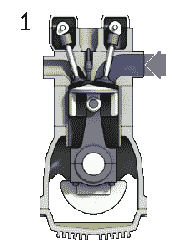

# 转阀发动机获得第二次机会，冒烟的竞争

> 原文：<https://hackaday.com/2022/02/21/rotary-valve-engine-gets-a-second-chance-smokes-the-competition/>

这是一个专注的黑客，他有耐心从零开始构建一个引擎。而且是一个边缘痴迷黑客做了两次。[与此同时在车库里]是第二个类似的人，在休息时间下面的视频中[，他拿着一个失败的引擎设计，鼓起勇气让它运行起来。](https://www.youtube.com/watch?v=1EP49XuejVM)

整个建造始于一种不同类型的进气阀和排气阀的想法。[与此同时，在车库里]构思了一个设计，取消了传统的提升阀。这种设计不是通过凸轮轴将气门推离其气门座来打开气门，而是使用一个铲状气缸，这样当它旋转时，其端口暴露于进气或排气。

Four Stroke Cycle with Poppet valves. Courtesy [Wikipedia](https://en.wikipedia.org/wiki/Four-stroke_engine), [CC BY-SA 3.0](https://creativecommons.org/licenses/by-sa/3.0)

在压缩冲程中，气门气缸成为燃烧室的一部分，两个气门都背向活塞。如果你读了评论，你会发现这些年来已经有很多人提出了这个想法。用他的磨、车床和技术，(同时在车库里)让它发生了。但并非没有一些麻烦。

第一次迭代抵制了所有启动它的大胆尝试。在这之前长达一小时的视频最终没有开始。尽管他有漂亮的机器工作和深思熟虑的设计，但事实并非如此。火来自发动机，要么通过排气管，要么通过化油器，但它从来没有运行。在这个版本中，几个部分进行了重新处理，效果立竿见影！发动机点火很好，甚至转速似乎也很快。作为第一代原型车，它缺少密封件和其他花哨的部件来防止油进入燃烧室。作为预防措施，普通的发动机机油也被添加到燃油中。它冒烟的事实并不令人惊讶，只是证明了该设计将受益于另一次迭代。然而，大多数原型不都是这样吗？

国产发动机在 Hackaday 并不是什么新鲜事物，这位作者最喜欢的喷气涡轮机之一就使用了卫生纸架。是的，真的。感谢【基思】给的[提示](https://hackaday.com/submit-a-tip/)！

 [https://www.youtube.com/embed/1EP49XuejVM?version=3&rel=1&showsearch=0&showinfo=1&iv_load_policy=1&fs=1&hl=en-US&autohide=2&wmode=transparent](https://www.youtube.com/embed/1EP49XuejVM?version=3&rel=1&showsearch=0&showinfo=1&iv_load_policy=1&fs=1&hl=en-US&autohide=2&wmode=transparent)

