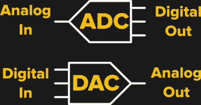
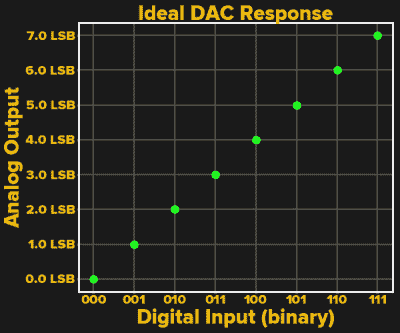
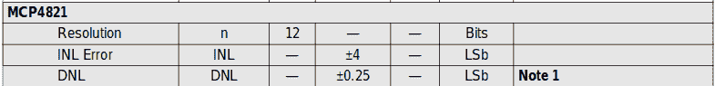
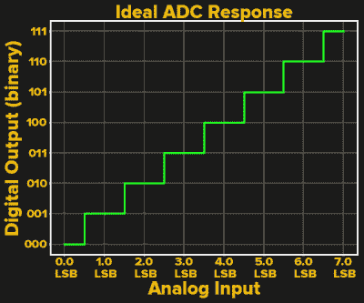

# RTFM:ADC 和 DAC

> 原文：<https://hackaday.com/2019/10/16/rtfm-adcs-and-dacs/>

如今，很难找到一个项目不使用模数转换器(ADC)或数模转换器(DAC)来完成*某些事情*。无论这些转换器是微控制器上的内置外设，还是通过 SPI、I2C 或并行总线连接的独立器件，所有这些转换器都有一些共同的属性，知道如何阅读它们的规格可以让你省去很多麻烦。

关于这些器件，有一些重要的事情需要了解，当你第一次尝试在这些器件上浏览数据手册时，你可能会感到有些困惑。让我们深入了解这些转换器的静态(DC)特性——交流性能非常复杂，需要后续文章来讨论。

## 这两个领域

想象一下微控制器上的数字引脚。引脚的值可以是 1 或 0，很容易理解这些值的电压将是 0 伏或 5 伏(假设我们的微控制器由 5 伏电源供电)。介于两者之间的电压呢？如果我们需要测量或产生 0 至 5 伏之间的信号，就需要 ADC 或 DAC。但是这两者有无数不同的用途。

 这些转换器的明显目的是在模拟域和数字域之间转换一个量。图中所示为两个假设的 3 位转换器，每种类型一个。为简单起见，我们假设数字端采用直接二进制编码，000 对应最小输出，111 对应最大输出。其他转换器可能使用带符号或偏移二进制表示、[或其他更复杂的代码](http://www.ti.com/lit/an/sbaa042a/sbaa042a.pdf) (PDF)。无论哪种方式，数字方面，无论是输入还是输出，都非常简单。对于 N 位直接二进制转换器，数字端由 2 个 ^N 值组成，从 0 到 2 ^( N ) -1。注意 2 ^N 本身不在集合中；我们的 3 位转换器停止在 7。

另一方面，模拟端可能更复杂。首先，模拟量可以是电压、电流，对于数字电位计，可以是电阻。对于电压或电流转换器，输出可以是单端的，即在一根导线上传输，也可以是差分的，模拟量是两个输入或输出之间的差值。但是，在这种多样性背后是一组共同的属性和规格，这对理解和应用这些转换器非常重要。

## 同功指

 对于上述简单的 3 位 DAC，我们可以创建一个理想化的传递函数图，这只是输入(数字值)与输出(模拟值)的关系。x 轴上的数字值显然只呈现某些值，在图上用二进制表示。y 轴稍微有点混乱。规格中通常以 LSB 为单位描述模拟端，对应于转换器的最小步长，即最低有效位的*模拟值的单位。乍一看，这似乎是一种描述模拟量的奇怪方式，但这是有充分理由的。*

几乎所有转换器都允许设计人员指定满量程输出的参考值。例如，在一个电路中，我们可以选择 DAC 的满量程输出为 7 V。在这种情况下，LSB 将为 1 V，另请注意，要获得 7 V 满量程输出，我们必须为 DAC 使用 8 V 基准电压:最大输出为`Vref * x / 2^N`，其中 x 为二进制输入码。注意，您的转换器可能有所不同:*务必阅读数据手册。*

在使用此示例 DAC 的另一个电路中，我们可能选择 3.5 V 的满量程值，因此 LSB 为 0.5 V，因此，转换器的实际分辨率取决于基准电压。事实证明，许多其他重要参数——尤其是误差——也取决于基准电压源，因此在数据手册中以 LSB 为单位列出这些参数，可以方便地进行比较并转换为实际单位:只需简单的乘法运算即可。

## 错误

LSB 单位出现的地方之一是非线性误差规格。下面显示的是摘自我的 go-to DAC 低频使用的数据手册，Microchip 的 12 位电压输出 [MCP4821](http://ww1.microchip.com/downloads/en/DeviceDoc/22244B.pdf) (PDF)(他们使用带小写“b”的 LSb，但我不会反对他们)。这里还出现了另外两个新术语——INL 或积分非线性和 DNL 或微分非线性。尽管它们听起来像是你必须重新学习旧的微积分课本，但是不要担心，它们都是简单的概念。

DNL 就是理想 LSB 值步长与器件实际值之差。对于 MCP4821，0.25 LSB 规格表示实际步长将在 0.75 LSB 和 1.25 LSB 之间。在我们的 3 位/7 V 转换器示例中，我们可以预计每一步都在 0.75 V 至 1.25 V 之间(对学究的脚注:DNL 规格在数据手册的“典型值”一栏中，因此您实际上可能会看到更好或更差的值)。对于超过 1 LSB 的大 DNL 值，DAC 可能变得非单调，这意味着在某个时间间隔内，随着输入增加，输出可能会减少；这绝对是你需要注意的。

另一方面，INL 测量理想直线传递函数和实际传递函数之间的最大差异。例如，如果实际点位于一条弯曲或不规则的路径上，INL 会告诉您在任一点上离理想值有多远。例如，上述 4 LSB INL 规格对于我们的玩具 3 位/ 7V 转换器来说非常糟糕，意味着输出可能会偏离高达 4 V，然而，对于 12 位 DAC 来说，这是一个更好的规格，意味着误差小于 0.1%(4/4095)。不要犯取 4 LSB 并把这个解释为*四位*，或者 2 ⁴ = 16 步的错误。

## 模拟到数字

 就 ADC 而言，输入和输出的角色颠倒，如我们的玩具 3 位 ADC 的传递函数图所示。现在，输入以 LSB 为单位描述，可以是电压或电流，输出是数字值，本例中是直接的二进制表示。正如所料，当输入值跨越连续阈值时，输出代码会发生跳跃性变化。起初可能不太明显的是，理想阈值位于半步处，最小和最大数字输出对应的输入范围是其它值的一半。例如，“000”和“001”之间的阈值设置为 1/2 LSB。这使得转换中的误差最小化；您可以将此视为“舍入”到最接近的输出值。

注意，如果我们希望本例 ADC 的 LSB 值为 1 V，我们使用 8 V 基准电压。这将最低阈值设置为 0.5 V，最大阈值设置为 6.5 V，这是 ADC 的典型配置，但情况并非总是如此；一些转换器的阈值为 LSB 的整数倍。务必阅读器件的数据手册，了解其具体工作原理。

ADC 还规定了 DNL 和 INL 误差。在这种情况下，DNL 误差值指定了连续输出值的阈值之间的最大距离，换句话说，就是图表中步长的宽度。同样，大于 1 LSB 的 DNL 值可能会给 ADC 带来问题，导致失码现象:输出可能会完全跳过某些数字值。与 DAC 一样，在 ADC 中，INL 误差告诉你任何阈值与理想直线转换的最大距离，换句话说，就是与期望值的差距。

ADC 还有另一个“误差”:量化误差。我在这里用引号将这个词括起来，因为量化误差不会偏离理想 ADC 模型。相反，它只是输出的离散数字阶跃的结果。由于输入可以是任何模拟值，当以离散步长转换为数字值时，误差最高可达 1/2 LSB。例如，1/2 LSB 的模拟输入值加上一个任意小的量将被转换为数字“001”，而 1/2 LSB 的输入减去一个任意小的量将被转换为“000”。两者之一与原始输入值相差约 1/2 LSB。

## 增益和失调误差

最后提到的两个误差是增益和失调。失调误差很容易想象:任一传递函数上的零点可能与模拟世界中的零不对应；数字输入为零的电压 DAC 可以输出非零电压。另一方面，增益误差表示与理想传递斜率 1 的差异。例如，如果电压输出 DAC 集成了缓冲放大器，该放大器的增益可能不会正好为 1；这种情况下，缓冲器会导致输出变高或变低，具体取决于实际的放大器增益。这也是基准电压误差出现的地方。

增益和失调误差的好处在于，它们可以很容易地被“校准掉”。通过对系统的两次测量，您可以确定实际的增益和失调值，并使用这些值来校正软件中的误差。事实上，这通常是您通常会看到被纠正的仅有的两个错误；对于其他转换器，如果需要，通常会选择更好的转换器。 [TI 有一个很好的视频](https://training.ti.com/lessons-precision-dacs-calibration)解释如何进行这种校准。

## 底线

以上是 ADC 和 DAC 规格中 DC(直流)部分的快速浏览:通过检查增益、失调和 INL 规格，您可以了解 ADC 或 DAC 中的误差。希望这能给你足够的时间来开始挖掘。如果你想深入研究细节，有一些半导体制造商发表的很好的参考资料。 [TI 的了解数据转换器](http://www.ti.com/lit/an/slaa013/slaa013.pdf) (PDF)是一个很好的开始；[微芯片在他们的网站上也有很好的解释](https://microchipdeveloper.com/adc:understanding-adc-specifications)。