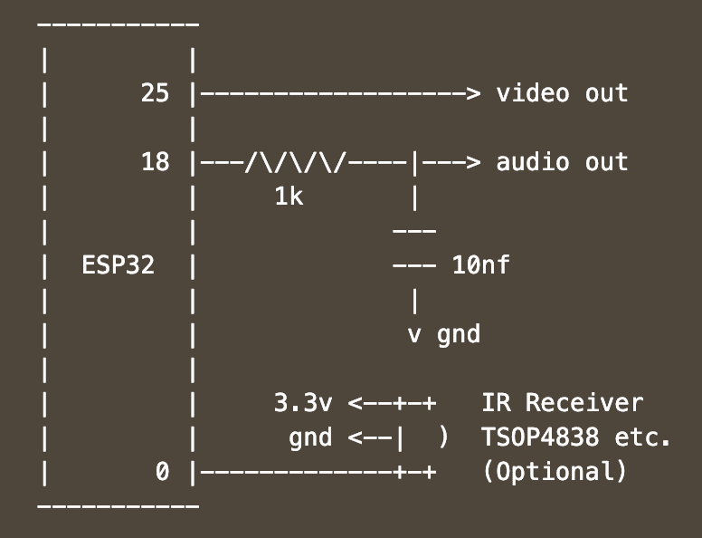

# 在 ESP32 上运行您最喜爱的 8 位游戏

> 原文：<https://hackaday.com/2020/06/09/run-your-favorite-8-bit-games-on-an-esp32/>

在 Hackaday 总部，我们对老式游戏模拟并不陌生。旧游戏机和街机柜的新版本经常成为聪明黑客将尽可能多的功能塞进微型现代微控制器的绝佳素材。我们之前已经讨论过[rossumur]的黑客攻击，但是[ESP _ 8 位](https://github.com/rossumur/esp_8_bit)是综合能力的一个里程碑。这一次，他超越了自己。

ESP 8 位没有什么做不到的。它可以模拟三个流行的控制台，带有 ROM 选择菜单(带有菜单框)。不要担心建立一个控制器，只需连接任何旧的(HID 兼容)蓝牙经典键盘或你手边的 WiiMote。如果这样做还不行，从 Atari Flashback 4 的操纵杆到 Apple TV 遥控器等一系列红外设备都可以兼容。连接模拟音频和复合视频，设备就可以使用了。

该系统以绝对最少的组件提供了这种令人印象深刻的能力。通常情况下，原理图过于复杂，不适合写在一篇短文中，但我们将在这里复制这个原理图，让您对我们正在讨论的内容有所了解。当你刷新了你的[电子艺术](https://en.wikipedia.org/wiki/The_Art_of_Electronics)并对工作中的硬件有了一个完整的理解后再回来。我们从未停止对现代“业余爱好者”组件的可用能力的惊讶。有了这么短的炸弹，这个东西可以由任何人用 ESP-32- *任何东西组装起来。*

还有一个黑客值得注意；聪明的办法是[rossumur]从一个非常繁忙的微控制器获得全彩色 NTSC 复合视频。他们指出，NTSC 可能很挑剔，需要一个极其稳定的高速参考时钟作为基础。[rossumur]发现 ESP-32 包括一个专为音频工作设计的 PLL(“APLL”)，它方便地支持小数部分，允许将其调整到所需频率的一英寸以内。该项目的 GitHub 页面中包含了[的完整描述，包括了获取彩色 NTSC 视频的各种努力的详细背景(包括您可能从这些页面中认出的几个黑客的名字)。](https://github.com/rossumur/esp_8_bit#composite-video)

 [https://www.youtube.com/embed/qFRkfeuTUrU?version=3&rel=1&showsearch=0&showinfo=1&iv_load_policy=1&fs=1&hl=en-US&autohide=2&wmode=transparent](https://www.youtube.com/embed/qFRkfeuTUrU?version=3&rel=1&showsearch=0&showinfo=1&iv_load_policy=1&fs=1&hl=en-US&autohide=2&wmode=transparent)

