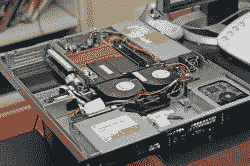
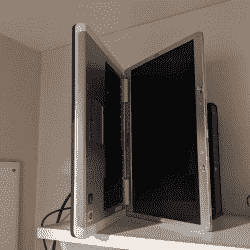

# 运行您自己的服务器以获得乐趣(零利润)

> 原文：<https://hackaday.com/2022/03/15/run-your-own-server-for-fun-and-zero-profit/>

似乎什么都有服务，但有时你只是通过自己做来学习更多。如果你还没有享受过运行自己的服务器和托管自己的网站这种有点不合时宜的快乐，那么，今天你很幸运！

是的，我们将把一台旧电脑改造成一台网络服务器，用来在家里托管你所有的项目。你可以很容易地使用 Raspberry Pi——甚至零 W 也可以——或者任何可以运行 Linux 的东西，但是要知道，并不是所有的计算平台都是一样的，我们很快就会讨论这一点。

是的，我们将在这个系列文章中推出我们自己的产品。有许多活动部件，所以我们将不得不涉及许多材料。别担心，这并不复杂。你不需要按照我们说的方式去做事情。每一个转折点都有灵活性，我们鼓励你打造自己的道路。这就是乐趣的一部分！

注意:为了节省空间，我们将跳过一些最基本的细节，比如安装 Linux，而把重点放在那些对项目影响最大的细节上。这篇文章给出了在家托管项目网站的高层次概述。它有意掩盖更深层次的细节，并做出一些必要的假设。

# 自托管 101

我们都知道什么是网站。你正看着一个。你如何建立一个网站？你可能有一个想法。有些 HTML 是通过某种 web 服务器软件呈现给世界的。但是 web 服务器如何知道显示哪些 HTML 文件呢？人们如何从他们可以在浏览器中输入的名字获取到你的网络服务器？知识产权是如何涉及的，这是不是可以通过你的家庭互联网连接来实现？

首先来说一个 web 服务器。它只是一台有服务网站的软件的电脑。最常见的服务器软件叫做 Apache，它可以兼容你想运行的任何类型的网站。它处理将网站请求与组成网站的文件集合相关联的任务。

A typical rack mount web server courtesy [Wikipedia](https://en.wikipedia.org/wiki/Web_server) [CC BY 2.5](https://creativecommons.org/licenses/by/2.5)

要运行 Apache，我们需要一台计算机和一个操作系统。我们将找到一台旧笔记本电脑，并在上面安装 Linux Mint。Linux Mint 是 Ubuntu 的后代，所以大多数 Ubuntu 教程都可以很好地使用它。

对于硬件，我们使用的是 Vista 时代的笔记本电脑，配有 64 位双核 AMD Turion 处理器、2GB 内存和一个旧的 120GB 硬盘。是的，我们真的应该花几个钱，换成 SSD。但这只是一个为了好玩而拼凑的项目，没有必要花钱做一个简单的实验。当然你不一定要用旧笔记本电脑。一台台式电脑就可以了，或者一台小型的——任何东西都可以。

如果你像我一样，想把服务器藏在架子上，请记住，当出现问题时，你需要一个显示器和键盘来诊断它。笔记本电脑有内置显示器和键盘的好处！当它离线而你不知道为什么的时候，这就非常方便了。

关于你选择的计算机的一个重要注意事项:它需要有一个支持的操作系统。在 x86 世界中，这意味着 64 位处理器。大多数现代 Linux 发行版都不太支持 32 位处理器，甚至根本不支持。如果没有支持的操作系统，您的项目将缺少最新的软件。这不仅会限制功能，还会限制安全性。你不会在互联网上运行 Windows XP，所以不要选择 Linux 的旧版本。

## 第一步:连接互联网

如果可能的话，服务器需要有线连接，但是只要可靠，无线连接也很好。我们的旧笔记本电脑没有 Wi-Fi 适配器，所以它是硬连线到我们的 ISP 提供的调制解调器/路由器/电话之类的东西。我们还建议您为笔记本电脑配置一个静态 IP 地址，这样它在您网络上的 IP 地址就不会改变。您可以在路由器中这样做，也可以在 Linux 的以太网配置中这样做。

## 配置服务器

Vents are on the left, and so it sits open on the right side next to the ISP supplied router

我们清单上的下一步是安装一些 Linux 的基本工具，比如命令行的 nano 文本编辑器和 [SSH(安全外壳)服务器软件](https://www.cyberciti.biz/faq/ubuntu-linux-install-openssh-server/)。SSH 将允许您从另一台计算机连接到服务器，一旦安装了 SSH，您就可以将笔记本电脑放在路由器旁边的架子上，然后忘掉它。但是不要让笔记本电脑关着——它需要通风，所以至少让屏幕半开。为了节省空间，请将笔记本电脑侧放，让通风口朝上。

要登录服务器，你需要一个终端程序。大多数操作系统都带有 SSH 终端程序，如 Windows 终端或 Mac OS 中的终端。我在 Windows 上使用 MobaXterm 已经很多年了，我发现它更加方便。有些人更喜欢像 [PuTTY](https://www.putty.org/) 这样的基本 SSH 终端程序。使用适合您的方式，并通过 SSH 连接到您的服务器的 IP 地址。

接下来，你需要安装 [Apache web 服务器软件](https://httpd.apache.org/)。网上有很多这样做的教程，但是要小心:很多教程会让你做 Apache、MariaDB 和 PHP 的基本安装，然后让你以 root 用户的身份在`/var/www/html`中托管你的文件。*不要这样做！*你需要创建一个所谓的 Apache 虚拟主机和一个新的系统用户来关联它。

## 你领域的主人

最后，您需要一个域名以及将它与您的 Linux 服务器关联起来的方法。有大量的域名注册商可供选择，你可以以低于 10 美元/年的价格获得一个. com 域名。常见的极客认可的注册商有 [Cloudflare](https://www.cloudflare.com/learning/dns/glossary/what-is-a-domain-name-registrar/) 或 [Namecheap](https://www.namecheap.com/) 。 ***这些不是代言*** ，如果你以前从未做过，只是朝正确的方向推了一把。(欢迎在评论中留下你的评论。)

要将该域与您的服务器相关联，您需要域名系统(DNS)提供商的服务。DNS 是通过所谓的地址(A)记录将你的域名映射到 IP 地址。

## 先生，你的 IP 很有活力

许多域名注册商提供免费的 DNS 服务，但他们并没有为在家托管进行优化。为什么不呢？如果你的服务器位于某个数据中心，它会被分配一个永久的 IP 地址。但是因为你是在家里托管，你的网络连接的公共 IP 会不时改变，你的网站会离线，直到全球的 IP 更新。你需要一个 DNS 提供商来检测这种变化，然后相应地更新你的域的 A 记录。

有许多这样的服务提供者，你甚至可以自己做。但是为了简单起见，我们将推荐在 Cloudflare 上运行 DNS。Cloudflare 免费提供内容交付网络(CDN ),在世界和您的服务器之间增加了一层。这很方便，因为 Cloudflare 的 IP 永远不会改变。当您的服务器获得一个新的 IP 地址时，它可以将此信息传达给 Cloudflare，而 cloud flare 会相应地路由所有流量，而无需在全球范围内更新 DNS。这是一个巨大的优势。他们还将你的网站缓存在他们的 CDN 中，这样当你的网站点击 Hackaday 的首页时，它可以在流量的冲击下存活下来！

向外界隐藏您的公共 IP 是使用 Cloudflare 的另一个原因。唯一公开的 IP 将归 Cloudflare 所有，它们会将 web 请求转发到您的服务器，同时将坏人拒之门外。这为您的家庭服务器和家庭网络提供了另一层保护。最棒的是它是完全免费的。

他们出色的文档描述了[如何通过他们的服务](https://support.cloudflare.com/hc/en-us/articles/360020524512-Manage-dynamic-IPs-in-Cloudflare-DNS-programmatically)建立动态 DNS。

## 从网络浏览器到网络服务器，然后返回

一旦配置了 DNS 和 web 服务器，您需要告诉家里的路由器接受端口 80 和 443(http 和 https 通信端口)上的通信，并将它们路由到您的 Linux 笔记本电脑。有些路由器会让您设置一个 DMZ，直接将整个服务器暴露在互联网上，但不建议也不要求这样做。您还需要在服务器上配置防火墙，以接受端口 80 和 443 上的流量。既然我们有 443 开放，让我们加密我们的 HTTP 流量，好吗？

是否有技术优势是有争议的，但是你的网站需要 SSL 证书。如果没有别的，这将使你的网站更符合现代浏览器的口味，如果没有 SSL 证书，浏览器会显示警告。在过去，你需要一个静态的 IP 地址，并在 SSL 证书上花一大笔钱。现在这两种情况都没有。SSL 证书可以由 [Let's Encrypt](https://letsencrypt.org/) 提供，这是一个免费的 SSL/TLS 证书提供商，它使用名为 [Certbot](https://certbot.eff.org/) 的软件来获取证书，甚至为您配置 Apache。滑头！

# 你还能做什么？

你的新家庭服务器还能做什么？可能性几乎是无穷无尽的！即使你的网络速度很快，你也可以让你的新服务器更快地工作。在本地运行您自己的解析 DNS 服务器意味着您可以在自己的网络上缓存 DNS 查找，从而加快 DNS 解析。这可以给你的网络浏览体验带来更快的速度。您还可以使用 Pi-Hole 软件来阻止所有广告客户，这样您的设备就不需要单独的广告拦截器。

家庭服务器也为你的 IOT 项目提供了一个很好的数据收集点，并为你提供了一个实验的平台。有许多黑客在运行自制的服务器，他们中的一些人甚至走得更远，让他们的服务器完全依靠太阳能运行，比如 https://solar.lowtechmagazine.com/

# 可供选择的事物

我们已经列出了你需要的所有移动部件。你应该知道，就像有无数种方法可以构建任何其他项目一样，你也有大量的备选方案。

除了 Apache web 服务器，您还可以使用 NGINX(发音为“engine ex”)。除了动态域名系统，你还可以订购带有静态 IP 的商务级互联网连接。除了 Linux，您可以使用 BSD、Windows、MacOS 或任何其他数量的操作系统。除了笔记本电脑之外，您还可以使用旧的台式机、任何口味的覆盆子 Pi、当地互联网车库出售的剩余机架安装服务器，甚至是上面有简单 web 服务器脚本的 ESP8266。

# 就这样吗？

无论你做什么，一定要享受这个项目，如果你从来没有做过这样的事情，我们建议你从最简单的方法开始，然后逐步达到更深奥的方法。

还有很多很多问题需要回答:我应该用什么软件来创建我的项目网站？当谈到记录项目时，我应该深入兔子洞多深？我想在我的边吃边砍披萨上放什么配料？敬请关注下一期，即将在你附近的 Hackaday 推出！