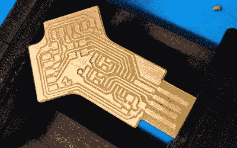

# SAMD11 以一个端口的价格提供两个串行端口

> 原文：<https://hackaday.com/2022/04/04/samd11-provides-two-serial-ports-for-price-of-one/>

虽然普通计算机用户可能几十年来都没怎么考虑过低级的串行端口，但对于硬件黑客来说却不是这样。廉价的串行到 USB 适配器对于窥探调试端口或编程芯片来说是无价的，如果你问我们，你永远不会有太多的放在长凳上。[Quentin Bolsée]非常喜欢它们，他甚至想出了如何用 SAMD11C14 微控制器构建一个双端口适配器。

 正如【昆汀】在文章中解释的，这不仅仅是某种 Y 型电缆。当连接到主机时，适配器显示为两个不同的串行端口，每个端口都有独立的设置，如波特率和奇偶校验。如果你想做一些好莱坞式的黑客行为，这个方便的小工具可以让你同时接入两个设备的串行端口，但更实际的是，它允许你只使用一个 USB 连接建立同一块电路板的调试和编程接口。

[Quentin]为他的适配器加工了一个定制的 PCB，我们不得不说这看起来很惊人，但是那些家里设备有限的人应该能够将 MIT 许可的电路板文件发送出去进行生产。他还提供了 SAMD11C14 固件的源代码，因此您已经拥有了构建自己版本的这个简洁工具所需的一切。

两个端口不足以满足您的并行黑客需求？信不信由你，[我们还看到了一个四路 USB 转串行适配器](https://hackaday.com/2016/07/22/quad-serial-adapter/)，你可以把它放在一起，尽管它是一个相当复杂的电路。