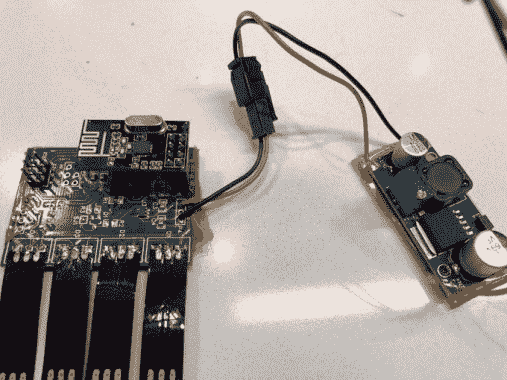
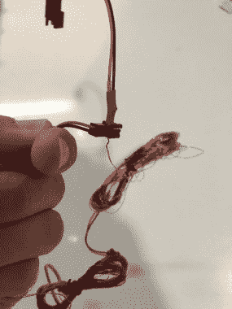
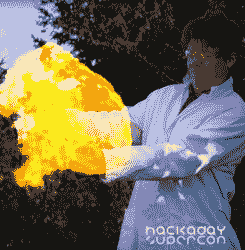

# 萨米·卡姆卡尔的 LED 气球网络

> 原文：<https://hackaday.com/2019/01/24/samy-kamkars-led-balloon-network/>

在北半球一月夜晚的寒冷黑暗中写下这篇文章，我不得不承认对 Samy Kamkar 和他的朋友们有点嫉妒。他们的夏季活动之一是在某个看起来相当温暖的隐蔽营地举办私人派对，从这里看起来非常有吸引力。

萨米想为他的朋友们提供一个奇观。他想出的是发光的球体。LED 气球会漂浮在营地上方，用它们漂亮的同步照明让他的朋友们惊叹不已。因此，无线通信、轻于空气的可燃气体与电子重量计算以及代码优化的冒险开始了，其细节在下面嵌入的 [Samy Kamkar 的 2018 年 Hackaday 超级大会演讲](https://www.youtube.com/watch?v=1NBNrgTEwq0)中分享。

## 浮动项目日益膨胀的复杂性

最初的想法是在一个便宜的气球里放一两个 LED 灯，这被证明是不切实际的，因为事实证明，如果没有大量的光，气球就不能很好地发光。萨米考虑了几种选择，最终选定了著名的“neo pixel”ws 2832 或“dot star”APA 102。在这一点上，该项目跨越了门槛，从一个派对的快速乐趣变成了一个重大的工程挑战:只有几克的氦气来提供升力，led，控制器和电池将不得不满足几乎不可能的重量标准。

他的演讲对各种通信选项进行了引人入胜的审视，例如，我们发现 WiFi 协议最初提供了红外物理传输层，如果 LED 命令以串行流的形式直接通过无线电链路发送，则气球内的微控制器可能是不必要的。尽管最终他选择了他能找到的最便宜的微控制器，ATtiny24 和 Nordic NRF24L01 无线模块。从他对 NRF24L01+网络的解释中可以收集到一些有趣的观点，即每个气球如何被赋予自己的地址，以及整个星座如何拥有广播地址。

  Driver board and LED strips taped to the outside of each balloon  30 awg wire an fishing line tethered each balloon

为一串耗电的发光二极管选择电池成了一个问题，受到氦气球所能举起的物体的限制。例如，不起眼的 AA 电池在功率方面可能具有惊人的性价比，但却是一个令人惊讶的重要前景。一个出乎意料的简单解决方案是用一根电线将气球拴起来，为一个小型降压转换器板提供 48V 电源。

## 如果世界大事不能给你提供帮助，那就自己做吧

Making your own hydrogen certainly leads to interesting experiences!

令人惊讶的是，他甚至进一步研究了升力气体，认为氦气可能有点贵，因为海湾邻国之间的争端威胁到了世界供应。我们并不是每天都写有人自己制造氢气作为升力气体，但他在决定火灾前景和不必要的氯作为副作用不值得之前尝试了一下。

最后，我们经历了编写代码以适应 ATtiny24 微薄内存的所有痛苦，并提供了一些优化 ATtiny 汇编程序的优秀技巧。在试验中发生灾难性的混乱后，系绳线在现场组装，软件通过 TouchDesigner 由 Thalmic Myo 手势传感器控制。在去露营地真正尝试之前，进行了早期测试。讲座的高潮是一个展示气球活动的视频，让我们更加向往夏天。

> 为这个周末在[@ Hackday](https://twitter.com/hackday?ref_src=twsrc%5Etfw)super co 的这么多演讲激动不已，包括[@ BenKrasnow](https://twitter.com/BenKrasnow?ref_src=twsrc%5Etfw)[@ kenshirriff](https://twitter.com/kenshirriff?ref_src=twsrc%5Etfw)[@ szeloof](https://twitter.com/szeloof?ref_src=twsrc%5Etfw)[@ dominicgs](https://twitter.com/dominicgs?ref_src=twsrc%5Etfw)[@ kb 1 lqc](https://twitter.com/KB1LQC?ref_src=twsrc%5Etfw)[@ Chris _ Gammell](https://twitter.com/Chris_Gammell?ref_src=twsrc%5Etfw)[@ glowascii](https://twitter.com/glowascii?ref_src=twsrc%5Etfw)[@ nanographs](https://twitter.com/nanographs?ref_src=twsrc%5Etfw)[@ bugejakarl](https://twitter.com/BugejaCarl?ref_src=twsrc%5Etfw)&其他！也将分享一个最近的有趣项目。[pic.twitter.com/lr3PRenzng](https://t.co/lr3PRenzng)
> 
> —Samy Kamkar(@ samykamkar)[2018 年 11 月 2 日](https://twitter.com/samykamkar/status/1058397124918882304?ref_src=twsrc%5Etfw)