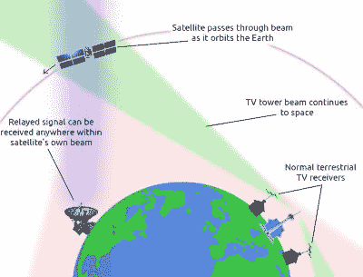

# 卫星探听器接收到令人惊讶的电视广播

> 原文：<https://hackaday.com/2022/03/22/satellite-snoopers-pick-up-surprising-tv-broadcast/>

虽然基于互联网的流媒体服务似乎是电视的未来，但仍有很多地方通过电缆、卫星或天线连接进入家庭。对于大多数卫星传输来说，这意味着数字多路传输承载着来自地球静止卫星的大量频道，为此需要机顶盒或其他解码器。想象一下，当人们看到俄罗斯极地通信卫星*子午线 9* 具有高度椭圆形轨道[传输老式地面模拟电视](https://twitter.com/dereksgc/status/1505633665597988867) ( [ThreadReader Link](https://threadreaderapp.com/thread/1505633665597988867.html) )时，卫星观察者会有多惊讶。究竟发生了什么事？

How a Russian polar comms satellite picked up a TV station.

问题中的电视信号来自土库曼斯坦，那么在南极基地的一些想家的土库曼斯坦人被款待品尝他们的国家吗？事实远比这有趣，因为这个信号来自一个服务于土库曼斯坦国内电视观众的地面发射机。

我们都听说过这样的想法，不知何故，每部电视节目都在某个地方以无线电波的形式穿越空间，虽然我们可能飞不到足够远的地方去检查 20 世纪 60 年代的《谁是医生》剧集，但事实是，当地球弯曲远离它们时，来自电视塔的水平传输会传递到太空中。

因此，子午线 9 号穿过了土库曼斯坦发射机发出的光束，该发射机恰好处于与其一个转发器相匹配的超高频频率上，结果是一个意想不到的卫星电视节目。我们感谢[ [@dereksgc](https://twitter.com/dereksgc) ]和[[斯科特·蒂利](https://twitter.com/coastal8049) ]的工作，为我们带来了这一迷人的观察。我们以前报道过[斯科特]的工作，最著名的是[重新定位了一艘丢失的 NASA 飞船](https://hackaday.com/2018/01/25/search-for-military-satellite-finds-one-nasa-lost-instead/)。