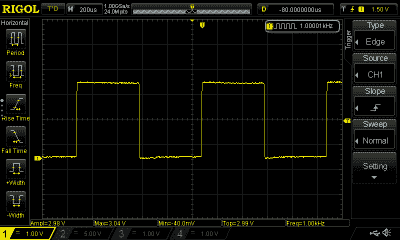
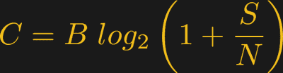

# 跟我说:带宽

> 原文：<https://hackaday.com/2019/07/16/say-it-with-me-bandwidth/>

带宽是在流行语言中被过度使用的技术术语之一:例如，一个编辑可能会问你是否有带宽来写一篇关于带宽的黑客文章。除了这种口语用法，在工程环境中还有几个非常具体的含义。我们可能会谈论像人声这样的信号的带宽，或者像滤波器或示波器这样的系统的带宽，或者，我们可能会考虑我们的互联网连接的带宽。但是，虽然后一个例子可能看起来与其他例子根本不同，但实际上有一个非常深刻而有趣的联系，我们将在结束之前发现它。

让我们看一下在不同的上下文中，我们所说的带宽是什么意思。

## 数字带宽

 带宽这个术语最常见的用法可能是指数字通道的数据带宽，换句话说，就是信息传输的速率。在这种情况下，它是以每秒位数来衡量的。例如，您的 ISP 可能会为您提供 50/10 Mbps 的互联网服务，这意味着您拥有每秒 5000 万比特的下载能力和每秒 1000 万比特的上传能力。在这种情况下，你会说下载带宽是 50 Mbps。测量网络信道的数字带宽就像发送固定数量的比特并计时需要多长时间一样简单；这就是那些宽带网速测试站点做的事情。

我们稍后将回到数字带宽，看看它与下一个概念，即信号带宽的关系。

## 信号带宽

 带宽这个术语也用来描述信号所占据的频率范围。在这种情况下，信号的带宽定义为信号中包含的最大频率减去最小频率。如果一个信号的频率成分在 100 Hz 到 300 Hz 之间，我们可以说这个信号的带宽为 200 Hz。作为一个具体的例子，考虑美国的中波(即 AM)广播波段:每个信号占用 20.4 kHz 的带宽。因此，在 1000 kHz 信道上工作的发射机应该只输出 989.8 kHz 和 1010.2 kHz 之间的频率。有趣的是，调幅 RF 信号占用传输音频带宽的两倍，因为两个频率边带都存在；20.4 kHz RF 带宽用于发送最大带宽为 10.2 kHz 的音频。

虽然带宽的定义看起来非常简单，但应用于普通信号有时会令人困惑。考虑一个 1 kHz 的理想方波。该信号以 1 kHz 的频率重复，因此我们可以假设其带宽为 1 kHz。事实上，理想方波包含基频所有奇数倍的分量，在本例中为 3 kHz、5 kHz、7 kHz 等。决定信号带宽的实际上限取决于方波的“理想”程度，也就是边沿的清晰度。虽然这些分量的幅度随着阶数的增加而下降，但它们对于正确构建原始波形非常重要。事实上，产生正弦波的一种常见方法是滤除方波信号的高阶成分。

给定一个信号，我们如何确定它的带宽？例如，我年轻时的普通老式电话服务(POTS)通过 300 Hz 到 3000 Hz 之间的频率，这对于语音通信来说已经足够了；我们可以说，通过这个系统的信号被限制在 2700 赫兹的带宽。虽然如果 POTS 系统具有尖锐的频率边缘，这是正确的，但实际上，通过的信号会有一些低于 300 Hz 和高于 3000 Hz 的小成分。因此，为波段边缘定义非零阈值更为常见。例如，在测量信号的最高和最低频率时，我们可能会使用信号功率为其峰值一半的频率，即–3 dB，相当于幅度的 70.71%。虽然 3 dB 是目前最常见的值，但您会发现其他值也有使用。

## 系统带宽

 带宽这一术语的第三个用途是描述系统通过的频率范围，如上述的滤波器、放大器或电话系统。虽然通过系统的特定信号可能具有非常窄的带宽，例如，大约 2600 Hz 的近乎纯正弦波，带宽仅为几 Hz，但系统本身仍然具有 2700 Hz 的带宽。与信号带宽一样，系统带宽可以在 3 dB 点(此时系统传递的信号功率降至一半)测量，也可以使用其他阈值，某些滤波器可能使用 6 dB 和 20 dB。

例如，我测量了接收 ADS-B 传输的 1090 MHz 滤波器的响应。该滤波器的 3 dB 响应范围为 927.3 MHz 至 1，181.8 MHz，3 dB 带宽为 254.5 MHz。另一方面，如果在-20 dB 点测量，滤波器的带宽为 312 MHz。

另一个实际例子是示波器——示波器规格中的“X MHz”指带宽，几乎总是在-3 dB 点测量。100 MHz 示波器的前端放大器将通过 0 Hz (DC)和 100 MHz 之间的频率，损耗为 3 dB 或更少。这意味着一个 100 MHz 的正弦波可能只显示其实际幅度的 71%,但也可以看到略高于 100 MHz 的频率，它们的幅度只会降低更多。另一个后果是，100 兆赫的方波在 100 兆赫的示波器上看起来像正弦波；为了获得方波的精确图像，示波器的带宽必须大于方波基频的五倍。100 MHz 示波器最适合用于观察 20 MHz 或更小的方波。

示波器带宽通常通过测量非常快的边沿的上升时间来评估。假设信号边沿远快于示波器的上升时间，示波器的带宽为 BW = 0.35/t_rise，带宽单位为 Hz，上升时间单位为秒。例如，上升时间为 1 ns 的示波器带宽为 350 MHz。系数 0.35 假设示波器前端的频率限制元件产生高斯滤波器形状，尽管结果对于一阶 RC 滤波器几乎相同；具有更尖锐的“砖墙”响应的示波器可以具有 0.45 或更大的因子。关于示波器带宽的更多信息，请查阅 Jenny List 的这篇文章。

## 信息容量

在本文的开头，我提到了数字带宽和信号带宽之间的一个联系:事实证明，它们之间的关系是信息论的一个基石。考虑这样一个问题:对于 1 Hz 带宽的信道，你能做什么？如何限制通过此链路发送的信息量？Claude Shannon 是第一个为抽象通信系统解决这个问题的人，在抽象通信系统中，符号通过信道发送。他提出了噪声信道编码定理，该定理表明最大可能的信息速率取决于符号在传输中被破坏的概率。在传输过程中产生更多错误的信道限制了数据的传输速率，不管我们在纠错码方面有多聪明。

后来，Shannon-Hartley 定理将这一结果扩展到抽象程度较低的信号信道，其中误差是由加性高斯白噪声(AWGN)引起的。最终结果是一样的:最终限制信息传输速率的是信道中的噪声。在信道被 AWGN 破坏的情况下，我们有以下结果。

信道容量 C(单位:比特/秒)取决于带宽 B(单位:Hz)以及信道中信号功率 S 与噪声功率 N 之比。这是信道的理论极限，我们可能必须非常努力地想出聪明的纠错码来接近实际中的这个极限，但是我们永远不能超过它。

有了这个等式，我们就可以回到最初的问题:通过 1 赫兹的信道，我们每秒可以发送多少信息？如果信道是无噪声的，信噪比(SNR)是无限大的，我们可以以无限的速率发送数据——当然，这种情况永远不会发生。然而，在相等的信号和 AWGN 噪声功率或 0 dB SNR 的情况下，结果表明我们每秒最多只能发送 1 比特。那是从无穷大的一个大落差！另一方面，如果信道的信噪比为 60 dB，理论上，我们可以在 1 Hz 带宽内发送最大 19.9 bps 的信号。当然，如果噪声水平保持不变，我们需要将信号功率提高 60 dB——100 万倍——才能实现这一目标。事实是，我们只能接近这些速率极限，而这样做的代码包含了大量的研究。

## 带宽=带宽=带宽

尽管该术语在不同的上下文中有不同的用法，但带宽的概念非常简单。简而言之，信号带宽是信号占用的频率量，系统带宽是系统通过的频率范围，数字带宽是信息在通道中流动的速率。但是，连接这些简单概念的是信息论的一些非常有趣的基本原理。在本文中，我们只能触及这个迷人领域的皮毛；如果你想看更多关于信息论的文章，请在下面的评论中发表意见。