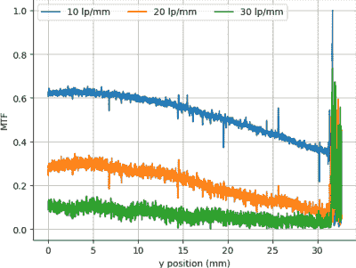

# 扫描仪窥探揭露焦点闹剧

> 原文：<https://hackaday.com/2021/01/20/scanner-snooping-uncovers-focus-farce/>

从他对嘈杂的图像和有限的控制的评论来看，我们要大胆假设[Andrew Jeddeloh]并不热衷于使用他的 Epson V550 扫描胶片。但是真的无可救药吗？这是他最近在博客上发表的一系列文章中着手确定的，从我们可以看出，这对旧的爱普生来说并不乐观。

第一篇文章[试图通过确定扫描仪](https://jeddelog.com/posts/scanner-mtf/)的调制传递函数(MTF)、点扩散函数(PSF)并比较其水平和垂直分辨率来量化扫描仪的光学能力。正如您所料，这些测量的细微差别超出了普通用户的理解范围。简而言之，他的分析是，扫描仪的滑动框架确实似乎将物体固定在了这个特定图像传感器的适当“最佳位置”;这意味着与他在网上看到的建议相反，购买定制胶片或幻灯片支架不会有任何好处。

MTF versus height of film from bed.

在研究扫描仪的光学特性时， [[Andrew]对他正在使用的 VueScan 软件](https://jeddelog.com/posts/vuescan-autofocus/)提供的自动对焦选项产生了好奇。无论他选择什么选项，产生的图像似乎都是一样的，他开始怀疑这个功能实际上没有任何作用。为了证实他的理论，他编写了一个填补程序，位于专有的 VueScan 程序和 V550 驱动程序之间，记录它们之间传递的所有数据。

在调整了各种选项并比较了捕获的数据流后，[Andrew]确定在 VueScan 中启用自动对焦没有任何作用。至少用他的扫描仪不行。他确实注意到根据所选择的聚焦选项，有一些额外的字节被发送到驱动程序，但是来自扫描仪的响应没有改变。他认为该程序可能有某种通用框架，可以在受支持的硬件上实现这种功能，只是错误地为不支持它的扫描仪显示了自动对焦选项。

如果你想将一些胶片数字化，但你有 V550 这样的扫描仪，[你可以用相机代替](https://hackaday.com/2020/04/12/8mm-film-scanner-grows-into-a-masterpiece/)来完成。你甚至可以[用乐高](https://hackaday.com/2020/12/11/still-got-film-to-scan-this-lego-and-raspberry-pi-scanner-is-for-you/)组装一个还过得去的电影扫描仪。