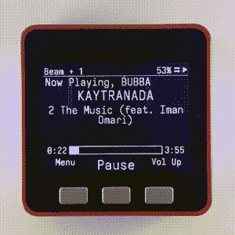

# 使用 IPod 风格的点拨轮在 ESPHome 中滚动

> 原文：<https://hackaday.com/2022/09/08/scroll-through-esphome-with-ipod-style-click-wheel/>

虽然你很难找到一个对 iPod 帮助引入的 DRM 废话感到怀旧的黑客作家，但我们不得不承认，我们想念那个点击轮。在长长的列表中旋转是一件轻而易举的事，触觉反应让你很容易准确地停在你想要的地方。如今，我们只能在触摸屏界面上摸索前进，这使得一些简单的任务，比如寻找歌曲或视频中的某个特定位置，几乎不可能准确无误地完成。

如果你也渴望再次感受拇指下那种微妙的重击，那么[看看来自【Landon r】](https://github.com/landonr/esphome-remote)的这个项目。从技术上讲，这个手持小工具旨在用作由 ESPHome 供电的家庭自动化系统的无线遥控器，但这只是这种现成组件的特定组合的一种可能应用。

If you must, there’s a version with buttons.

构建自己版本的手持设备非常简单，只需安装一个 LILYGO ESP32 T-Display TTGO、一个 Adafruit 的 ANO 旋转导航编码器和一个电池组。我们可能会考虑 3D 打印一个箱子，让它不那么……笨重，但这取决于你。结果实际上与苹果的标志性媒体播放器非常相似，但没有讨厌的围墙花园来阻止你。

如前所述，[landonr]编写固件的目的是控制家庭自动化系统。所以里面有很多关于开灯之类的东西。但是也有一些看起来很有前途的媒体播放功能。不管你最终在上面运行什么软件，有一件事是肯定的:浏览菜单会感觉像做梦一样。

这些年来，我们已经讨论了其他几种家庭自动化遥控器。这个[帅气的木制模型让事情变得简单](https://hackaday.com/2019/12/26/handheld-mqtt-remote-for-home-automation/)只有几个物理按钮，而这个[有点古怪的方法重新利用了任天堂的 Zapper 光枪](https://hackaday.com/2021/08/07/nintendo-zapper-reborn-as-home-automation-remote/)。

 [https://www.youtube.com/embed/Tg7Op2hr42o?version=3&rel=1&showsearch=0&showinfo=1&iv_load_policy=1&fs=1&hl=en-US&autohide=2&wmode=transparent](https://www.youtube.com/embed/Tg7Op2hr42o?version=3&rel=1&showsearch=0&showinfo=1&iv_load_policy=1&fs=1&hl=en-US&autohide=2&wmode=transparent)

感谢[Tushar]的提示。