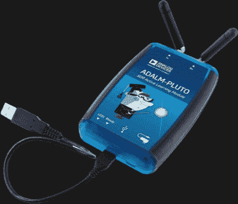
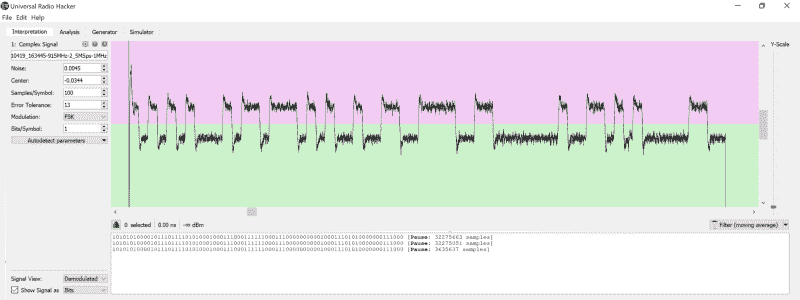

# SDR 工具包让气象站屈从于黑客的奇思妙想

> 原文：<https://hackaday.com/2021/12/17/sdr-toolkit-bends-weather-station-to-hackers-whims/>

我们可能不必告诉大多数黑客读者，为什么当前这波低成本软件定义无线电(SDR)对寻求探索广阔无线信号世界的黑客来说如此重要。但是如果你*确实*需要复习一下你的锦囊妙计里应该有什么样的 SDR 硬件和软件，那么[这篇来自【RK】的关于他如何黑掉他的 La cross WS-9611 u-IT 气象站](https://spuriousemissions.com/making-it-rain-with-software-defined-radio/)的极其详细的报道就是一个完美的例子。

 为了提高自己的无线电黑客技术，[RK]开始使用 ADI 公司的 ADALM-PLUTO 软件定义无线电来拦截拉克罗斯基站及其各种无线传感器之间的信号。他指出，如果您只想接收，一个 20 美元的 RTL-SDR 加密狗也可以，但由于他的最终目标是欺骗温度传感器并将虚假数据引入系统，他需要一个具有传输功能的 SDR。

不管你的硬件，通用无线电黑客(URH)是软件将做的重任。在他的文章中，[RK]引导读者找到、捕获并最终解码来自 TX29U 无线温度传感器的传输所需的每个步骤。虽然具体细节会根据你个人想要监听的设备而有所变化，但总体工作流程大致相同。

最终，[RK]不仅能够接收到来自无线传感器的数据，还能传输自己伪造的数据，气象站认为这些数据是合法的。到达那里需要一些额外的努力，因为他必须找出正确的 CRC 算法。但幸运的是，他找到了几年前的一篇黑客文章，讲述了如何做这件事，这帮助他走上了正确的道路。现在，他可以让气象站屏幕上的动画小家伙在七月中旬穿上冬衣。下面的视频展示了这种特殊的无线电变戏法。

Demodulating the waveform in Universal Radio Hacker.

虽然我们经常在讲座中看到像 URH 这样的工具的威力，但没有什么比一步步讲述某人 T2 如何使用现代黑客工具包中的软件和硬件来实现他们的目标更好的了。如果阅读这篇文章没有让你最终想要扣动廉价 RTL-SDR 的扳机并开始在电波中巡航，也许没有什么会。

 [https://www.youtube.com/embed/YhYOdZaubVg?version=3&rel=1&showsearch=0&showinfo=1&iv_load_policy=1&fs=1&hl=en-US&autohide=2&wmode=transparent](https://www.youtube.com/embed/YhYOdZaubVg?version=3&rel=1&showsearch=0&showinfo=1&iv_load_policy=1&fs=1&hl=en-US&autohide=2&wmode=transparent)

