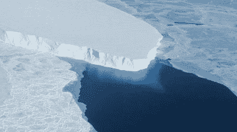
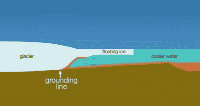
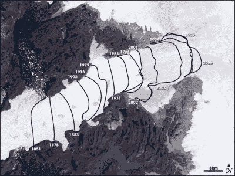

# 冰盖融化导致的海平面上升可能很快就会被锁定

> 原文：<https://hackaday.com/2022/06/23/sea-level-rise-from-melting-ice-sheets-could-soon-be-locked-in/>

今天，我们广泛地谈论气候变化及其各种影响，而对话曾经更简单。我们称之为“全球变暖”,并担心夏季户外烹饪和海平面上升会吞噬我们最喜爱的许多城市。

科学家们现在担心海平面上升可能会被锁定，因为冰盖和冰川将超过“临界点”，超过这个临界点，它们的损失将无法停止。研究正在进行，以确定我们如何才能最好地避免这些不归路。

# 冰，冰，宝贝

气候变化怀疑论者经常忽视由于冰融化导致的海平面上升的威胁。常见的引用是，由于位移原理，漂浮的冰块在融化时不会改变水位。然而，这并没有说明南极的大部分冰实际上位于陆地之上。当这些冰融化时，会直接导致海平面上升，幅度可能会很大。

While the loss of floating ice won’t directly cause sea level rise, worries are that the loss of the ice shelf will increase the melt rate of the Thwaites Glacier it’s holding back. Credit: NASA, public domain

最令人担忧的是斯韦茨冰川，科学家们称其为“末日冰川”，因为它带来了危险。冰川被一个巨大的漂浮冰架挡住了，尤其是在东部。这减缓了冰川的流动，有助于保持冰川的稳定。浮动冰架在这项任务中得到了进一步的帮助，因为它靠着一座巨大的水下山峰，充当着支柱的角色。

最近，科学家们注意到，浮冰架正显示出令人担忧的恶化迹象。冰层上出现了蜘蛛网状的大裂缝，引发了人们对冰架长期稳定性的担忧。这种效果类似于窗户上的裂缝；一旦它们到达某一点，整个玻璃就会破碎。更复杂的问题是，随着温暖的海水从下面融化冰盖，冰架似乎正在失去对水下山脉的控制。

When land ice sits on ground beneath sea level, it can let seawater in underneath if the ice sheet isn’t heavier than the denser seawater it would otherwise displace. This water then melts the ice from below at an increasing rate as the grounding line moves further inland. Credit: NASA, public domain

思韦茨冰川已经造成了每年约 4%的全球海平面上升。令人担忧的是，随着浮动冰架的消失，冰川可能会增加其流向海洋的流量，仅在短期内就将海平面升高 5%。科学家目前预计冰架将在未来 5 年左右的时间内破裂。

长期影响是深远的，尽管目前还不确定。如果更广阔的斯韦茨冰川破裂并融化，科学家预计这一过程可能在短短几个世纪内发生，这将导致全球海平面上升 65 厘米。如果更广阔的南极西部冰盖消失，全球海平面将上升 3.3 米，世界地图将完全改变。

## 我们更喜欢冰雪覆盖的格陵兰，而不是绿色的

Many glaciers, like the Jacobshavn Isbrae glacier, have been retreating since the Industrial era. The concern is that soon, their loss may be locked in regardless of future reductions in greenhouse gas emissions. Credit: NASA, public domain

这也不仅仅是南半球的问题。科学家认为，无论我们现在做什么，格陵兰岛的冰川似乎都会融化，海平面上升 1-2 米可能会被锁定。 140 年来有关雅各布港流域冰盖高度和冰川融化速度的记录表明，可能存在一种反馈效应，导致冰快速流失。随着冰盖变薄，它更多地暴露在低海拔的暖空气中，加速了这种效应。

融化的冰也在破坏海洋循环。融化的格陵兰冰形成的较冷的海水减缓了负责将热量输送到世界各地海洋的水流。人们担心这可能会破坏关键地区的降雨，造成更多的干旱，并使南部海洋变暖，进一步加速南极西部冰盖的融化。

至少对现在活着的人类来说，在预测的融化时间尺度上有一些安慰。预计雅各布港冰川融化导致的 1-2 米的上升将需要几个世纪的时间，即使我们现在不能阻止它。也不能确定临界点已经过去，然而，随着全球气温和温室气体浓度仍在上升，这一点可能没有意义。无论如何，研究人员认为，由于没有恢复到工业化前的温度，冰的大量流失以及相应的海平面上升几乎是必然的。

最令人痛心的预测表明，格陵兰冰盖的消失可能会锁定在变暖 1.5 摄氏度，最快可能在 2030 年达到这一温度。如果模型是正确的，一旦达到这一点，减少排放和稳定全球温度将不足以拯救冰盖，冰盖将在很长一段时间内继续融化并缓慢升高海平面。

## 未来展望

孤立地看，这两个冰川都不会在未来十年对我们的沿海城市构成直接威胁。然而，如果多个气候系统继续被推向不归路，正如我们在之前所探索的那样，我们可能会在能够减少排放和稳定气候之前锁定重大的负面变化。

[横幅图片:美国地质勘探局拍摄的“[惊奇冰川](https://www.flickr.com/photos/27784370@N05/14126332131)”。美国宇航局戈达德在佩里托莫雷诺产犊。]