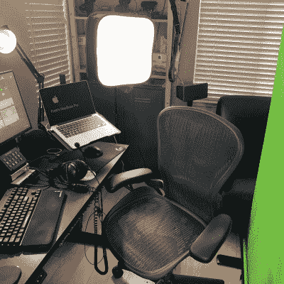

# 了解如何在有限的空间内有效使用绿色屏幕

> 原文：<https://hackaday.com/2022/06/09/see-how-to-effectively-use-a-green-screen-in-a-limited-space/>

虚拟绿色屏幕非常整洁，但就结果而言，没有什么能打败真实的东西。但是如果你的空间有限呢？[Fred Emmott]在他的桌子后面有大约 30 英寸的工作空间，[分享了如何在有限的空间内使绿色屏幕可靠地工作。](https://fredemmott.com/blog/2018/11/21/green-screen-in-limited-space.html)

Even (and consistently deployable) lighting is even more important than the camera.

说到底，相机工作的基本原理(照明、角度等)是不变的，但在办公桌后仅 30 英寸的地方挂一个绿色屏幕确实让在正确的环境下拨号变得更具挑战性。此外，[Fred]想要一个可以轻松部署和打包的解决方案，并且不占用太多存储空间。他最终使用了一种可折叠的绿色屏幕，可以直接从容器中拉出，类似于贸易展会上使用的便携式直立横幅。

至于相机方面，[弗雷德]发现可靠、高质量的照明至关重要，甚至比所用的相机更重要。为了获得可重复的结果，他建议禁用任何自动功能(如弱光增强，或自动白平衡，以及这种性质的设置)，并在“日光”范围内使用 LED 照明进行照明和填充。良好的绿色屏幕效果的关键是均匀地照亮物体，当在如此狭小的空间工作时，这有点更具挑战性。

为了解决这个问题，[Fred]建议使用容易重新定位的灯，尽可能远离物体。获得尽可能均匀的照明，然后调整你的软件来匹配([Fred]使用 [OBS Studio](https://obsproject.com/) )以获得最佳效果。一旦这样做了，它可以更容易地建立和拆除最少的摆弄。

电脑确实让这一切比过去容易得多，如果你好奇，这里有关于数字时代之前绿屏是如何实现的。