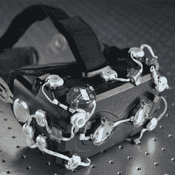

# 了解虚拟现实显示设计背后的科学，以及是什么让一个问题变得重要

> 原文：<https://hackaday.com/2020/08/03/see-the-science-behind-vr-display-design-and-what-makes-a-problem-important/>

VR 头戴设备越来越普遍，但它们并不是完美的设备。这意味着几年前当道格拉斯·兰曼加入脸书现实实验室时，他可以选择要解决的问题。从一开始，他就察觉到了一个似乎没有人在研究的问题:虚拟现实中的物体越靠近人的脸，它就越不“真实”。这有几个原因，但它呈现的一般方式是，虚拟对象离观看者越近，它就显得越模糊和失焦。[Douglas] [在今年早些时候举行的电子成像研讨会上的一次精彩演讲中谈到了它和相关问题](https://www.youtube.com/watch?v=LQwMAl9bGNY) (YouTube 视频)，该研讨会总结了 VR 显示技术的最新发展，同时展示了识别和解决新问题的艰苦科学工作。

Early varifocal prototype

[道格拉斯]选择解决人类眼睛和大脑如何感知物体和推断深度的看似次要的方面，这样做有两个原因:一个是没有好的解决方案，另一个是它很重要，因为这些线索在近距离虚拟现实交互中起着重要作用。在触摸或投掷距离内的东西是交互式虚拟现实内容的最佳位置，目前的技术水平并没有真正提供人类眼睛和大脑期望看到的东西。这导致了多年来对变焦距和多焦距显示器的设计和测试工作，这些显示器能够在各种逼真的焦平面而不是单一的平面上呈现图像。不仅如此，由于人眼期望不在正确焦平面上的事物看起来模糊不清(这本身就是一种深度暗示)，精确模拟也是事物的一部分。

整个演讲充满了有趣的细节和原型。如果你对 VR 成像和耳机设计感兴趣，并且有一个小时的空闲时间，请在下面嵌入的视频中观看。

 [https://www.youtube.com/embed/LQwMAl9bGNY?version=3&rel=1&showsearch=0&showinfo=1&iv_load_policy=1&fs=1&hl=en-US&autohide=2&wmode=transparent](https://www.youtube.com/embed/LQwMAl9bGNY?version=3&rel=1&showsearch=0&showinfo=1&iv_load_policy=1&fs=1&hl=en-US&autohide=2&wmode=transparent)

自从基于手机的虚拟现实耳机出现以来，事情已经有了很大的发展，显示器并不是唯一受到关注的东西。[摄像机需要自己的调整](https://hackaday.com/2020/02/28/building-cameras-for-the-immersive-future/)，以便为虚拟现实和增强现实景观提供最大的价值。