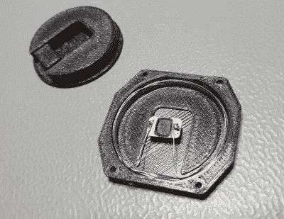

# 看到这个卡西欧了吗？看它解锁我的特斯拉！

> 原文：<https://hackaday.com/2020/09/04/see-this-casio-watch-it-unlock-my-tesla/>

为我们的汽车获得远程解锁能力的全部目的是让我们免受站在雨中、在食品被淋湿时用钥匙开锁的屈辱。[Mattia Dal Ben]报道说，即使 Teslas 也有忧郁，并且不总是可靠地解锁，尽管有价格标签。

【Mattia】认为身边有一张备用钥匙卡可能会很好，并且[将它内置到他的卡西欧 F-91W 手表中会将钥匙放在尽可能近的地方](http://hackaday.io/project/174548)而无需植入。

在编写了一个新的 J3A040-CL 钥匙卡来匹配汽车后，取出芯片是很容易的一部分——只需将它浸泡在丙酮中，直到你可以剥离层。然后[Mattia]为它建造了一个新的天线，并将其缠绕在 3D 打印背板的内部。

最难的部分似乎是将手表天线调谐到汽车侧天线预期的谐振频率。[Mattia]发现很多东西都会扰乱谐振频率——手表的 PCB、外壳，甚至是将东西固定在一起的小螺丝都会使谐振频率稍微偏离一点。

由于现在手表不太舒适，[Mattia]想到了用透明树脂制作一个新的背面，这在我们听起来很可爱。看起来新的计划是把它移到手表的前面，用一个树脂窗口来展示芯片。听起来也很不错。休息后查看秘密解锁力量。

卡西欧手表很棒，尽管我们更喜欢计算器型号。有人非常喜欢他们的 F-91W，以至于他们制作了一个巨型挂钟版本。

 [https://www.youtube.com/embed/F56g4I_a7yU?version=3&rel=1&showsearch=0&showinfo=1&iv_load_policy=1&fs=1&hl=en-US&autohide=2&wmode=transparent](https://www.youtube.com/embed/F56g4I_a7yU?version=3&rel=1&showsearch=0&showinfo=1&iv_load_policy=1&fs=1&hl=en-US&autohide=2&wmode=transparent)

