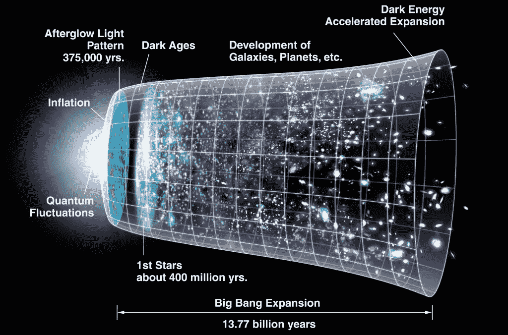

# 在月球的黑暗面再见:中国的月球射电天文台

> 原文：<https://hackaday.com/2019/12/23/see-you-on-the-dark-side-of-the-moon-chinas-lunar-radio-observatory/>

几乎自从有了无线电，就有天线对准天空，用不同于传统天文学的角度观察宇宙。射电天文学家使用他们的敏感设备研究太阳、行星、遥远的星系和来自宇宙边缘的奇怪物体，如脉冲星和类星体。甚至宇宙最早期的时刻也已经被探索过，在微波辐射中描绘了大爆炸的残余。

然而，在所有这些观测中，有一大部分射电频谱对射电天文学家来说仍然是个谜。由于我们星球的电离层，大多数低于 30 MHz 的信号都无法通过地面射电望远镜观测到。但现在，由于中国雄心勃勃的月球探测计划提供的机会，人类现在可以听到更多宇宙的声音，而且是从一个新的有利位置:月球的远端。

## 双向弹跳

正如任何业余无线电操作员可以告诉你的那样，直接全球无线电通信的关键是地球的电离层——那些在我们头顶上方 50 至 600 英里(80 至 1000 公里)处涨落的带电粒子层。电离层是由来自太阳的持续辐射流和地球磁场相互作用产生的，长期以来一直被认为可以折射无线电波。无线电波的折射程度取决于电离层的结构(它每天都在变化)以及无线电波撞击带电粒子层的角度等因素。但是折射也很大程度上取决于入射波的波长，通常认为 10 米波段或 28 兆赫是有用的电离层反射的上限。

低于 30 兆赫左右的无线电波的折射是地基低频射电天文学的核心问题。(术语注释:虽然商业和业余无线电运营商出于历史原因将 3 MHz 和 30 MHz 之间的空间视为“高频”(HF)波段，但电离层反射的频率对于地基射电天文学来说非常低。)电离层对来自太空的无线电波的反射率几乎与对来自地球的无线电波的反射率一样高，因此它就像一张毯子，将我们与宇宙在这些波长上告诉我们的信息隔离开来。为了能够在 30 MHz 以下进行任何有用的观测，射电天文学家需要摆脱这种束缚，而最简单的方法就是建造一架天基射电望远镜。

## 鹊桥

中国的嫦娥四号月球任务为测试低频射电天文学的可能性提供了一个绝佳的机会，并有可能为未来更大规模的努力铺平道路。作为雄心勃勃、持续数十年的中国月球探测计划(CLEP)的一部分，嫦娥四号可能会在 21 世纪 30 年代完成载人任务，这是一项复杂的任务，因为它旨在探索月球的远端。

*Queqiao* relay satellite at Earth-Moon L[2], showing its vantage point for line-of-sight to both Earth and the far side of the moon. Note the NCLE package with three antennas deployed on the top. Source: [China Academy of Space Technology](http://www.cast.cn/item/list.asp?id=1561).

多亏了[潮汐锁定](https://en.wikipedia.org/wiki/Tidal_locking)，月球绕轴旋转的周期与它绕地球旋转的周期完全相同，这意味着它只会向我们展示一张脸。所以任何在远处的东西都将被切断与地球的无线电联系。因此，实际的远地任务必须包括某种中继系统，以允许地球和月球之间的通信。虽然这可以通过月球轨道上的卫星来实现，该卫星能够缓冲远端信号，直到它回到地球地面站的视野中，但中国的任务规划者提出了一个更有趣的想法:他们将放置中继卫星，以便全时通信成为可能。

为了实现这一目标，嫦娥四号任务的策划者将他们的中继卫星瞄准了拉格朗日点 L[2]，这是一个位于地球和月球之间的点，但距离月球 65，000 公里(40，000 英里)。*鹊桥*在 halo 轨道中围绕 L [2] 点运行，halo 轨道是一条围绕该点的椭圆形路径，但轨道平面或多或少垂直于地球和月球之间的直线。这使得这颗卫星，凭借其巨大的 4.2 米碟形天线，对月球远侧的*嫦娥*着陆器和*玉兔-2* 月球车具有全天候视线，并能够与地球上的地面站保持连接。这也使它完全暴露在阳光下，允许它由太阳能电池板而不是 RTGs 供电。

鹊桥的字面意思是“鹊桥”，源于中国的一个神话，即每年一次，喜鹊成群结队地搭起一座桥，这样天上女神的女儿就可以穿越银河与她的丈夫在一起。很有诗意，不是吗？)

## 轻微卡住

自 2018 年 6 月以来，鹊桥一直在履行其作为通信中继站的主要使命。但是*鹊桥*的独特位置也使它成为做一些科学研究的完美地方。中国科学院与荷兰拉德布大学的天文学家合作设计了[荷兰-中国低频探测器](https://www.ru.nl/astrophysics/radboud-radio-lab/projects/netherlands-china-low-frequency-explorer-ncle/)，即 NCLE。这个 10 公斤重的包包括一个敏感的宽带软件定义无线电(SDR)接收器和数字信号处理能力，由三个单极天线馈送，每个单极天线可以扩展到 5 米长。

 [https://www.youtube.com/embed/hca3MeX-8rw?version=3&rel=1&showsearch=0&showinfo=1&iv_load_policy=1&fs=1&hl=en-US&autohide=2&wmode=transparent](https://www.youtube.com/embed/hca3MeX-8rw?version=3&rel=1&showsearch=0&showinfo=1&iv_load_policy=1&fs=1&hl=en-US&autohide=2&wmode=transparent)

天线的部署本应在任务的早期进行，但“鹊桥”号的主要任务有优先权，天线在过去 18 个月的大部分时间里一直存放着。展开天线的命令是最近才发出的，当一个天线展开到 5 米长时，另外两个天线似乎被卡住了，只露出约 2.5 米。可能延长的装载时间导致了润滑问题，就像困扰[的*伽利略*探测器](https://en.wikipedia.org/wiki/Galileo_(spacecraft)#Main_antenna_problem)的高增益天线一样，但无论问题是什么，NCLE 在这一点上能够做的科学是有限的。

如果 NCLE 能够完全部署所有的天线，那么将会有大量的科学工作等着我们去做。天文台完全准备好监听 21 厘米氢线上剧烈红移的排放物。通常在光谱的超高频部分的 L 波段部分，H 线是宇宙中最丰富元素的特征光谱，从而提供了其分布图。大爆炸最早期的 h 线发射，即所谓的“黑暗时代”，发生在宇宙只有 8 亿岁的时候，是极其红移的，将其频率降低到电离层和地球干扰使地球观测不切实际的程度。NCLE 在太空中的“鹊桥号”上的安静位置将让宇宙学家以前所未有的方式监听宇宙大爆炸的最早期。

Schematic of the evolution of the universe. Fully deployed, NCLE will be able to see back to the “Dark Ages” period, and beyond. Source: [NASA/WMAP team](https://map.gsfc.nasa.gov/media/060915/index.html).

宇宙的音乐不是 NCLE 唯一会听的东西。利用波束控制，NCLE 天线将能够观测太阳、木星——一个极其明亮的射电源——和地球。天文学家将有一个有利的位置来研究太阳和地球电离层之间的相互作用，其频率比以往任何时候都低，甚至可以描述人造无线电信号通过电离层的“泄漏”特征。所有计划中的观测将为如何改进低频天基射电天文学的决策提供信息，包括可能在月球的远端建立一个永久的天文台，或通过[甚长基线干涉测量法](https://en.wikipedia.org/wiki/Very-long-baseline_interferometry)绕更多的卫星轨道运行以提高分辨率。

鹊桥天文台的设计寿命为五年，所以 NCLE 团队有一段时间来解决天线故障，让天文台正常运行。祝他们在月球黑暗面探索低频领域时好运。