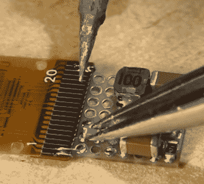

# 看技能不如看项目

> 原文：<https://hackaday.com/2020/08/22/seeing-the-skill-is-better-than-seeing-the-project/>

完成一个华而不实的项目，得到媒体的广泛认可，感觉棒极了。到达那里没有一条容易的路可走，很多时候，进入一个已完成的项目的工艺甚至没有退居二线，而是根本没有被提及。我经常发现我对展示出来的和完成的构建一样突出的技能印象更深刻——或者至少我的注意力被它们更强烈地抓住了。

 本周的一个例子来自【立体布景 111】的铁路模型作品。看到一个有机发光二极管屏幕在一个 HO 比例机车的鼻子就像现实生活中的版本一样令人印象深刻，但有多少人错过了[这个一次性焊接杰作进入这个](https://hackaday.com/2020/08/19/model-railroad-engine-gets-a-tiny-oled-rollsign-while-showing-off-tidy-protoboard-skills/)？你会对这款通孔原板使用的 SMD 技术感到惊讶。

偶尔我们会越过大师的肩膀看过去，因为几十年的技能被分享，目的是为了传承它们。五月份的时候，当我们看着[Leo]在电子工作台上讲述他的原型制作技巧和诀窍时，情况也是如此。这包括许多不明显但很聪明的东西；使用铜带焊接总线的技巧，使用特氟隆管裸线代替剥离 PVC 绝缘线，并深入研究覆铜原型。

所以，当你想要讲述你的项目时，请记住我们这些硬件极客。我们想知道它是如何做到的，至少和做了什么一样多。曾经有一段时间，电子设计师是一个独立于电子技术人员的工作团队(哇，[那些技术人员属于他们自己的联盟](https://hackaday.com/2020/01/29/soviet-soyuz-clock-teardown/))。如今，我们的工作台上都挂着技术人员的帽子，而我总是对包装另一项未学过的技能感兴趣。扔给我们一块骨头！

This article is part of the Hackaday.com newsletter, delivered every seven days for each of the last 200+ weeks. It also includes our favorite articles from the last seven days that you can see on [the web version of the newsletter](https://mailchi.mp/hackaday.com/hackaday-newsletter-649368). Want this type of article to hit your inbox every Friday morning? [You should sign up](http://eepurl.com/gTMxQf)!