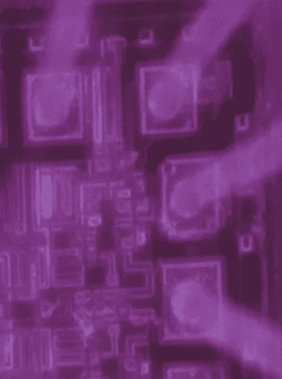

# 看到红外线中的晶体管开关

> 原文：<https://hackaday.com/2019/06/20/seeing-transistors-switch-in-infrared/>

在黑客和 DIY 社区中，有些人拥有非凡的知识和神奇的工具。这些人能够做其他人只能梦想的事情，而其他人只能浏览易贝寻找他们需要的工具来完成工作。约翰·麦克马斯特就是其中之一。他是集成电路内部的常驻专家。他把酸滴在芯片上，就能告诉你芯片内部是如何工作的。

在[hardware . io](https://hardwear.io/)大会上，【John】分享了他的一项集成电路逆向工程技术。他只是通过观察晶体管和它们发出的光来做到这一点。他也看到了骰子的反面。

[约翰]正在使用的技术被恰当地称为背面分析，或者观察电子复合的红外辐射。这发生在每个晶体管激活时的结上，这些光子以硅的带隙发射，大约 1088 纳米，远至红外。这种事情以前已经由 CCC 的[【nedos】在 2013 年](https://media.ccc.de/v/30C3_-_5459_-__-_saal_1_-_201312282145_-_security_of_the_ic_backside_-_nedos)做过，但我们很少看到深入研究查看 IC 背面并看到光子发射所需的工具和技术。

An IC, seen in infrared

有几个工具[John]用于这项工作，他实际上对用于成像集成电路红外光子发射的不同相机技术进行了很好的比较。InGaAs 相机价格昂贵，但灵敏度高。新的背照式 CMOS 相机和通常用于天体摄影的冷却 CCD 也进行了测试，一如既往，物有所值；最贵的相机效果最好，但是有办法让便宜的相机也能工作。

和任何摄影工作一样，准备照明是最重要的。这包括一个红外滤光器，在实验室中只使用 LED 照明，房间中没有阳光、白炽灯或卤素灯泡——毕竟，你不想要任何红外。显微镜中的 NIR 物镜来自易贝，价格约为正常价格的 1/10，因为物镜有一个小的、不明显的划痕。使用这种近红外物镜可以使图像比其他方法亮两倍。你可以用它成功地成像一个芯片，而且[John]在 CD4050 芯片内部的一个电阻上测试了这个设置；电阻器发出轻微的紫色光，这是红外传感器的颜色。但它能在更现代的芯片中与 I/O 级一起工作吗？还有，是的。它需要一些 Photoshop 来处理，并将 12 位或 16 位色彩空间拉伸到 8 位色彩空间，但它确实有效。

最后，做背面红外分析的最高成就。这种最小的设置可能吗？这需要一些准备；IC 中的硅衬底在 IR 中是透明的，但是存在衰减，当衬底厚度为 300 um 时，这一点尤其重要。这需要削薄到大约 25 微米厚，令人惊讶的是最好用细砂纸和手指来完成。

虽然通过背面发射很少观察到红外辐射，但最初的计划并不是完全分析芯片，而只是做一些平面规划。为此，它成功了。要看到硅芯片的内部，工作量相当大。